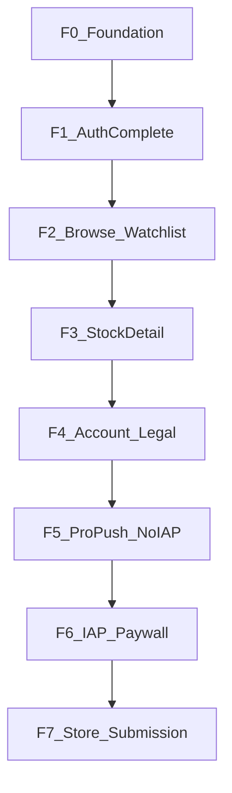

# LOTLOT.NET Mobile — Agent Kılavuzu

> Bu dosya agent’ın çalışma kılavuzudur. **Her anlamlı değişiklikten sonra güncellenir.**
> Son güncelleme: 2026-08-20 (paywall 3.1.2 binary; 1.0.0+101)

---

## 0. Mobil ürün yol haritası

### 0.1 Kararlar (kilitli)

| Konu | Karar |
|------|--------|
| Yol haritası yazım yeri | **Yalnızca bu handbook (§0)**; Android detay takip: [`ANDROID_HANDBOOK.md`](ANDROID_HANDBOOK.md) |
| API sözleşmesi | [`docs/MOBILE_API_INTEGRATION_GUIDE.md`](MOBILE_API_INTEGRATION_GUIDE.md) + web [ersinarikan/BIST](https://github.com/ersinarikan/BIST) — **salt okuma**. Web ekibi günceller; mobil ekip guide’ı fork’lamaz / §0 oraya yazmaz. |
| Ürün sırası | **Önce uygulamayı tam geliştir** (auth + **guest keşif** → watchlist → hisse → hesap → Pro yüzey/push). **IAP / paywall en sonda** (F6). |
| Monetization kanalı | Yalnızca **StoreKit / Play Billing**. Garanti / WebView checkout **asla** (App Store 3.1.1). |
| İstemci rolü | Thin client: tier, kota, sinyal, ML kararlarını **yeniden hesaplama**; API’yi render et. |
| Guest browse | **Evet.** Kayıt/login zorunlu olmadan public keşif (arama, BIST özet, hisse teaser). Watchlist / Pro özellikler auth ister. |
| Admin yüzey | **Asla.** Web admin panel alanları / `/api/admin/*` / `/api/internal/*` / HPO **kullanıcı mobil veya web dashboard’a açılmaz** (2026-08-05 kilit). |

**Neden IAP sonda:** Auth + watchlist + hisse deneyimi doğrulanmadan paywall scope ve Review riskini büyütür. IAP API CANLI olsa da ürün değeri önce kanıtlanır.

### 0.2 API guide nasıl kullanılır

1. Faz işine başlamadan ilgili **§ numaralarını** guide’dan oku (aşağıdaki tablolarda işaretli).
2. Guide veya BIST değiştiyse: bu §0’daki **API referansları / acceptance** satırlarını güncelle; guide dosyasını bu repoda “düzelterek” sahiplenme.
3. Çelişki: canlı `https://lotlot.net` + BIST kaynak > eski handbook satırı; handbook’u düzelt.
4. Lokal web klonu (isteğe bağlı): `_ref_bist/` — **gitignore**; commit etme.

### 0.3 Faz özeti



| Faz | İsim | Durum | IAP? |
|-----|------|--------|------|
| **F0** | Temel / kalite iskeleti | Tamam (tema web hizalı; INTERNET; display name) | Hayır |
| **F1** | Auth tamam | Tamam (e-posta+Turnstile+Google+Apple E2E; `/me` tier okuma) | Hayır |
| **F2** | Keşfet + Watchlist (+ guest) | Tamam (shell + browse + watchlist) | Hayır |
| **F3** | Hisse detay | Tamam (+ ufuk/ML/formasyon durum parity) | Hayır |
| **F4** | Hesap / yasal / bütünlük | Tamam (AccountSettings + PATCH prefs + legal URLs) | Hayır |
| **F5** | Pro yüzey + push (satın alma yok) | Tamam (çekirdek + wizard/AI) | Satın alma yok |
| **F6** | IAP paywall | İstemci + prod Apple; **I1/I2 Sandbox PASS** (2026-08-05, USB +58) | **Evet** |
| **F7** | Mağaza teslimi | **+101** paywall 3.1.2 binary (önce +100 EULA metadata; Remove+yeniden submit) | TF + review |

Guide §29 P0–P6 ile ilişki: P1 ≈ F1; P4 ≈ F2–F5; P2/P3/P6 ≈ F6–F7 (IAP sona kaydırıldı).

### 0.4 Faz detayları

#### F0 — Temel / kalite iskeleti

- **Amaç:** iOS+Android ortak iskelet, marka, kalite/git ritüeli.
- **Ekranlar:** Splash (marka), minimal home (geçici).
- **API:** — (config `baseUrl` = `https://lotlot.net`).
- **Skills / kurallar:** `project-manager`, `clean-mobile-dev`, `android-ios-parity`, `quality-gate-pre-push`, `agent-handbook`, `risk-integrity-mobile`.
- **Acceptance:**
  - [x] Flutter iskelet, Provider, secure storage, tema
  - [x] Brand CDN logo + launcher ikon
  - [x] analyze + sonar + tag akışı
  - [x] Release `INTERNET` main manifest
  - [x] Display name **LOTLOT.NET** (Android label + iOS `CFBundleDisplayName`)
  - [x] `LotlotColors` / tema web `brand.css` token’larıyla hizalı (`brand-visual-parity`)
- **Dışı:** Yeni ürün ekranı şişirme.
- **Risk:** Release build’de network yoksa tüm fazlar kırılır.

#### F1 — Auth tamam

- **Amaç:** Üç kanal + oturum yaşam döngüsü (guide §4–§8).
- **Ekranlar:** Splash bootstrap; Login/Register; e-posta doğrulama bekleyen; şifre sıfırlama isteği **mobil JSON** + mail → web reset formu → `lotlot://` handoff.
- **API (guide):** §5–§6 login/register; §6.1 `POST /api/auth/forgot-password` (`client:"mobile"`) + lazy Turnstile; yeni şifre yalnızca web formunda; §8.4–§8.5 Google/Apple mobile; §8.6 Turnstile; §7 refresh; §8 logout / `DELETE /me`.
- **Skills:** `cybersecurity-expert`, `android-fullstack-developer`, `ios-fullstack-developer`, `test-engineer`.
- **Acceptance:**
  - [x] E-posta + Turnstile lazy köprü (register/login)
  - [x] Google + Apple native SDK → `google-mobile` / `apple-mobile` (Client ID’ler `OauthLocal` / dart-define)
  - [x] Splash: token → `/me` → gerekirse refresh → home | login
  - [x] Logout revoke (`refresh_token`) + local wipe; hesap silme UI
  - [x] Token log’larda yok
  - [x] Register → `pending_verification` + resend UX
  - [x] `email_not_verified` → doğrulama bekleyen ekran
  - [x] Apple native E2E (prod `APPLE_MOBILE_CLIENT_IDS=com.lotlot.lotlotnetMobile` + web `APPLE_CLIENT_ID`)
  - [x] Şifremi unuttum → `POST /api/auth/forgot-password` + Turnstile; mail → web reset → `lotlot://…password_reset=1` (FP1–FP6)
- **Dışı:** Web session cookie auth; mobil JSON ile yeni şifre POST’u (bilinçli — §6.1). Guest shell F2’de.
- **Risk / web:** Prod `GOOGLE_MOBILE_CLIENT_IDS` (iOS+Android), `APPLE_MOBILE_CLIENT_IDS`, `TURNSTILE_SITE_KEY`. Reset: enumeration yok, hash’li token, rate/Turnstile.

#### F2 — Keşfet + Watchlist (+ guest browse)

- **Amaç:** Ana shell: **kayıtsız keşif** + (auth ise) izleme listesi / tahmin özeti (guide §10–§12, §17 stocks / public).
- **Ekranlar:** Guest/Auth ortak shell — Search/Browse; BIST 30/100 özet; Home/Watchlist (auth); kota göstergesi (auth); login/register CTA (guest).
- **API (guest, Bearer yok):** `GET /api/stocks/search`; `GET /api/stocks`; `GET /api/public/index-screener`; (F3’e köprü) public chart/valuation teaser linkleri.
- **API (auth):** `GET/POST/PATCH/DELETE /api/watchlist*`; `GET /api/watchlist/predictions`; `/me` quota alanları.
- **Skills:** `project-manager`, `clean-mobile-dev`, `ux-expert`.
- **Acceptance:**
  - [x] **Guest browse:** oturum yokken **Landing** açılır (zorunlu login yok); BIST Hisseleri → tam katalog arama; hisse teaser public API ile
  - [x] Guest → hisse satırına dokununca F3 detay açılır
  - [x] Guest’te watchlist mutation / predictions → net “Giriş yap” / kayıt CTA (sessiz 401 yok)
  - [x] Auth: watchlist CRUD + hata/403/kota mesajları sunucudan
  - [x] Auth: predictions hydrate **tek kartta** (ikinci “Tahmin özeti” listesi yok — web parity v39)
  - [x] Auth: Detay sheet → spark → büyük grafik (Öngörü + AI footer)
  - [x] Email verified gate uyumu (watchlist yazma)
  - [x] Splash: bootstrap → **Landing**; logout → Landing; shell **İzleme | Keşfet** (+ AppBar katalog arama)
- **Dışı:** Admin cache-report UI (zorunlu değil); Pro gated kartlar (F5).
- **Risk:** Aylık mutation kotası client’ta uydurulmaz; guest’te Bearer gönderme.

#### F3 — Hisse detay

- **Amaç:** Public teaser (**guest OK**) + auth analiz; Adil Değer ayrı (guide §17.2, §22).
- **Ekranlar:** Stock detail (özet + kartlar + sade grafik).
- **API (guest):** `/api/public/stocks/<sym>/valuation|fundamentals|corporate`; `/api/public/chart-data`.
- **API (auth):** `/api/pattern-analysis`, `/api/chart-data` (levels).
- **Skills:** `seo-expert` (deep link hazırlığı F7), Android/iOS FS.
- **Acceptance:**
  - [x] Guest hisse detay: public kartlar + grafik teaser; auth-only bloklarda “Giriş yap” CTA
  - [x] Valuation ayrı çağrı; yoksa kart gizli
  - [x] Mum + MA20 + hacim pane + bar chip (Sade); Detaylı: EMA50/BB/RSI/öngörü; Pro formasyon shade (soft gate); web drawing suite **yok**
  - [x] Pattern/signal alanları olduğu gibi (auth); `pending` → loading/empty
  - [x] Sezgisel rozet + haber sheet; formasyonlar + görsel onay (`pattern-analysis`)
  - [x] Ufuk chip’leri + `signals_by_horizon` Genel Sinyal Gücü + `ml_unified` tahmin özeti
  - [x] Formasyon durum etiketleri (web `_patternStatus` hizası) + sıralama
  - [x] Hacim segmenti + ort. hacim (`/volume-tier`) + `volatility_regime` meta kartı (yoksa gizli)
  - [x] Auth chart `forecasts` polyline (Free’de sunucu boş — client uydurmaz)
  - [x] Free prune boş → Pro soft gate CTA (auto-pop yok)
  - [x] Disclaimer görünür
  - [x] Browse / watchlist / prediction satırı → `StockDetailScreen`; placeholder kaldırıldı
- **Pre-dev not (2026-08-03):** Public chart `ohlcv[]` + `time` (unix); valuation/fundamentals/corporate alanları guide ile uyumlu (THYAO canlı GET).
- **Post-dev matris:** S1 guest THYAO public+CTA; S2 valuation unavailable gizli; S3 auth pattern+levels; S4 pending crash yok; S5 watchlist tap; S6 public `auth:false`; S7 disclaimer; M1–M3 volume-tier; G1–G3 hacim/bar.
- **Dışı:** Fib/Gann/Elliott çizim motoru; chart-alerts (F5); deep link aasa (F7).
- **Risk:** Cache/`pending` analiz — loading/empty states.

#### F4 — Hesap / yasal / bütünlük

- **Amaç:** Settings, yasal, iOS↔Android parity smoke.
- **Ekranlar:** `AccountSettingsScreen`; Legal **dış tarayıcı** (`url_launcher`); `push_notifications` / `email_notifications` → `PATCH /me`.
- **API:** §8 `PATCH /api/auth/me`; legal: `/gizlilik`, `/privacy`, `/terms`.
- **Skills:** `cybersecurity-expert`, `project-manager`, `seo-expert` (ASO), `ux-expert`.
- **Acceptance:**
  - [x] Quota + subscription **okuma** (`/me`) — `subscription.label` + watchlist limit / mutation remaining
  - [x] Privacy/terms/KVKK erişimi (dış tarayıcı)
  - [x] Kritik ekranlarda yatırım tavsiyesi değildir (hesap ekranı + mevcut auth/detail)
  - [x] iOS + Android smoke checklist (aşağıda)
  - [x] Ayarlarda `push_notifications` + `email_notifications` toggle (OS/FCM **yok** — F5)
- **Pre-dev (2026-08-03):** `/gizlilik` `/privacy` `/terms` → 200; `/me` Bearer zorunlu.
- **Post-dev matris:** S1 auth hesap `/me`; S2–S3 toggle PATCH; S4 hata geri al; S5 yasal; S6 guest bilgi; S7 çıkış/sil.
- **Smoke checklist (manuel):**
  - [ ] iOS: Hesap aç → label görünür → toggle → yasal tarayıcı → çıkış
  - [ ] Android: aynı
  - [ ] Guest: Bilgi ikonu → yasal + Giriş; PATCH yok
- **ASO (erken taslak):** Başlık “LOTLOT.NET — BIST Analiz”; kısa: “BIST hisseleri, adil değer ve izleme listesi. Yatırım tavsiyesi değildir.” Anahtar: BIST, hisse, adil değer, lotlot.
- **Dışı:** IAP satın alma UI; FCM token kaydı (F5).

#### F5 — Pro yüzey + push (satın alma yok)

- **Amaç:** Tier’a göre gated özellikler + **Premium gerçek zamanlı / push bildirimleri**; **satın alma F6’da**.
- **Bu turda (çekirdek):** Soft gate; Chart alerts; watchlist `alert_enabled`; OS izni + FCM register; Socket `actionable_alert`; `deep_link` → hisse detay.
- **Dilim (wizard/AI):** Hisse Sihirbazı UI; AI commentary UI — **tamam**.
- **API:** §18.1–18.3; §25 `device/register|unregister`; Socket.IO.
- **Firebase:** `android/app/google-services.json` + `ios/Runner/GoogleService-Info.plist` **gitignore**. Yoksa init no-op + hesap uyarısı (S7).
- **Acceptance (çekirdek):**
  - [x] `pro_required` / `premium_required` → soft gate (IAP yok)
  - [x] OS bildirim izni akışı (context’li; Premium + push)
  - [x] FCM register (Premium + push on); logout unregister; `onTokenRefresh` → re-register
  - [x] Foreground FCM `onMessage` → SnackBar; Socket `actionable_alert` banner
  - [x] Deep link (`data.deep_link` → StockDetail); cold-start kuyruk + splash flush
  - [x] `resolveDeepLink`: FCM `/dashboard?symbol=` **ve** guide `lotlot://symbol/{SYM}` → StockDetail; auth `password_reset` handoff; birim test matris
  - [x] AI commentary **async poll** (`async: true` + `GET .../jobs/<job_id>`); `job_id` session state; loader wakelock + ~100s progress; `model_public`
  - [x] Push badge P0 (open/resume/tap → 0) + inbox §25.4 (Gelen bildirimler; summary → unread badge); alarm kur `add_alert`
  - [x] Free chart-alerts: soft gate otomatik pop yok (boş + Detay)
  - [x] Hesap push aç → Premium soft gate; watchlist alert + push kapalı → Hesap yönü
  - [x] Tier `/me` — client uydurmaz
  - [x] Privacy Manifest / Data safety notu (aşağı)
- **Acceptance (dilim):**
  - [x] Pro: hisse detay CTA → `POST /api/ai/commentary` → `text`; Free soft gate
  - [x] 429 rate_limited/busy + 502 anlaşılır
  - [x] Premium: Sihirbaz (`AL`/`SAT`/`TUT`, horizons prod) → `results` → detay
  - [x] 400 `invalid_selection` + `details`
- **Firebase ekleme:** Console’dan iOS app → `GoogleService-Info.plist` → `ios/Runner/` (gitignore; project `lotlotnet-8c348`). Kurulum: `tool/ios_push_bootstrap.sh`. APNs Auth Key → Firebase Cloud Messaging (dev+prod).
- **Prod FCM:** HTTP v1 + service account (`FCM_SERVICE_ACCOUNT_FILE`, `FCM_PROJECT_ID=lotlotnet-8c348`, `FCM_ENABLED=1`). Legacy `FCM_SERVER_KEY` fallback. Secrets: `.secrets/` (commit yok).
- **APNs entitlements:** Debug `Runner.entitlements` (`development`); Release/Profile `RunnerRelease.entitlements` (`production`).
- **Privacy / Data safety:** FCM registration token = cihaz tanımlayıcı; App Privacy / Play Data safety’de bildirim + identifiers. Token loglanmaz.
- **Post-dev matris:** S1–S10 (plan); wizard W1–W7.
- **Dışı:** StoreKit/Play purchase; VAPID/web-push.
- **Risk:** Entitlement fake yok; Free/Pro `device/register` client guard.

#### F6 — IAP paywall

- **Amaç:** Tek mobil satış kanalı (guide §9, §25–§28, §29 P2–P3).
- **Ekranlar:** `PaywallScreen`; Restore; mağaza abonelik yönetimi URL; soft gate → paywall.
- **API:** `GET /api/billing/iap/config`; `POST .../verify`; `POST .../restore`; sonra `/me`.
- **Prod config (2026-08-04 doğrulandı):**
  ```json
  {"iap":{"enabled":true,"platforms":{"apple":true,"google_play":false},
   "products":{"lotlot_premium_monthly":"premium","lotlot_pro_monthly_v2":"pro","lotlot_pro_monthly":"pro"},
   "verify_ready":true},"status":"success"}
  ```
- **Client Product ID:** `lotlot_pro_monthly_v2`, `lotlot_premium_monthly` (`iap_service.dart`). Eski `lotlot_pro_monthly` ASC silindi (ID reuse yok); backend map’te her iki Pro ID `pro` olabilir.
- **StoreKit local:** `ios/Configuration.storekit` (Xcode Scheme → StoreKit Configuration).
- **Skills:** `ios-fullstack-developer`, `cybersecurity-expert`, `test-engineer`.
- **Acceptance:**
  - [x] Config/ürün yokken çökme yok (`purchaseBlockedReason`; I3)
  - [x] Garanti/WebView checkout yolu yok (I4)
  - [x] Restore UI + API; soft gate → paywall
  - [x] **I1 cihaz:** Sandbox Apple ID → satın al → verify → `/me` tier
  - [x] **I2 cihaz:** Restore → tier
- **Sandbox E2E prosedür (cihaz / TestFlight):**
  1. Settings → App Store → Sandbox Account (ASC Users and Access → Sandbox).
  2. Uygulama: soft gate veya Hesap → Planlar → Pro/Premium satın al.
  3. Başarı: snackbar + `/me` tier; Hesap’ta plan etiketi.
  4. Aboneliği iptal / yeni hesap → Restore → aynı tier.
  5. Play SA / Google Billing **bu dilimde dışı** (`platforms.google_play=false`).
- **Kod:** `lib/features/billing/`; receipt client’ta sahte yok; token log yok.

#### F7 — Mağaza teslimi

- **Amaç:** Store submission (guide §9.9, §28.5, §29 P6). Yeni büyük özellik yok.
- **ASC app:** **LotLot.net** — `com.lotlot.lotlotnetMobile` (Apple ID `6797657717`). Eski LotLotNet app ile karıştırma.
- **Skills:** `seo-expert` (ASO), `project-manager` (go/no-go), platform FS.
- **Acceptance:**
  - [x] App Privacy / age rating / iPhone+iPad 13" screenshot seti (ASC)
  - [x] Restore + hesap silme UI görünür (Hesap)
  - [x] Export Compliance: `ITSAppUsesNonExemptEncryption=false`
  - [x] Review notes taslağı (§0.7) + subscription Review Screenshot/Notes
  - [x] Build **63** + Pro `lotlot_pro_monthly_v2` / Premium ASC + prod map
  - [x] **Add for Review** → **Waiting for Review** (2026-08-05; Submission ID ASC’de)
  - [ ] App Review sonucu (Approved / Rejected)
- **Go/no-go (PM):** I1/I2 **PASS** sonrası gönderildi. Sonraki: onay veya red Resolution Center.
- **Kod notu:** Review’daki binary **63**; iPad boş kart fix’i **+64** (accent borderRadius) — onay/red sonrası TF/patch.
- **Dışı:** Admin/HPO; aasa/deep link (web ekibine not); Android/Play (hesap yok).

### 0.5 Tüm fazlarda bilinçli dışı

- `/api/admin/*`, `/api/internal/*`, `/api/automation/*`, HPO, admin dashboard
- **Admin panel UI/alanlarının** kullanıcıya (mobil veya normal web dashboard) taşınması — **yasak** (§0.1 kilit)
- Garanti / in-app WebView checkout
- Web chart drawing suite kopyası
- `MOBILE_API_INTEGRATION_GUIDE.md` dosyasına mobil ekibinin “sahiplenerek” edit’i

### 0.6 Faz bitiş ritüeli

1. Risk analizi (`risk-integrity-mobile`) — iOS+Android
2. Minimal kod + skills
3. Bu §0’da faz **Durum** / acceptance checkbox güncelle
4. `flutter analyze` → `sonar-scanner` → **QG OK** → commit → tag `vN` → push (`bistmobile-git-flow`)
5. Ship istenirse (TF/IPA): **yalnızca QG OK sonrası** `flutter build ipa` → Transporter Deliver — Sonar’sız TF **yasak**

### 0.7 F7 mağaza paket notları (ASC)

**App Privacy (özet):**
- Hesap: e-posta (auth); cihaz ID / push token (bildirim).
- Kullanım verisi: uygulama etkileşimi (analiz/API çağrıları — ürün işlevi).
- Satın alma: App Store işlem geçmişi (IAP).
- Takip (tracking) için üçüncü taraf reklam SDK’sı **yok**.
- Veri sunucuya (`lotlot.net`) ürün işlevi için; satılmaz.

**Screenshot checklist:**
- 6.5" (iPhone 15 Pro Max / 14 Plus sınıfı): Landing veya İzleme; Keşfet BIST; Hisse Detaylı grafik; Paywall (Planlar).
- Marka: LaunchImage / App Icon ile aynı yeşil-koyu palet; generic stock foto yok.

**Review notes (kopyala-yapıştır):**

```text
LOTLOT.NET — BIST market analysis (subscription app).

Digital goods / subscriptions are sold ONLY via Apple IAP
(product IDs: lotlot_pro_monthly_v2, lotlot_premium_monthly).
No external payment / Garanti / in-app WebView checkout.

Account deletion: Hesap (Account) → Hesabı sil.
Restore purchases: Hesap → Aboneliği geri yükle (also on Planlar paywall).

Sandbox / TestFlight: use Sandbox Apple ID for IAP.
Export compliance: app uses only HTTPS; ITSAppUsesNonExemptEncryption=false.

Guest can browse Keşfet / BIST catalog; watchlist and Pro features require login.
```

**ASO kısa:**
- Subtitle: BIST analiz & sinyaller
- Keywords (TR odaklı, boşluk yok ASC kurallarına uy): bist,hisse,analiz,sinyal,borsa,…

### 0.8 Free / Pro / Premium yetki matrisi (web parity)

Kaynak: `subscription.is_pro` / `is_premium` (`GET /me`); client uydurmaz.

| Özellik | Free | Pro | Premium |
|---------|------|-----|---------|
| İzleme CRUD + muted AL/SAT | Evet | Evet | Evet |
| Kart sinyal bildirimi (`alert_enabled`) | Ekleme + salt metin; Detay Switch; ON Premium | Aynı | Toggle Detay’da |
| Hesap Push ON | Yok (CTA / soft gate Premium) | Soft gate Premium | Evet (+ FCM) |
| E-posta bildirimi (grafik alarm) | Yok (CTA / soft gate Pro) | Evet | Evet |
| AI yorum / Öngörü / Formasyon shade | Soft gate Pro | Evet | Evet |
| Chart alerts | Soft gate Pro | Evet (e-posta) | Evet (+ push kanalı) |
| Hisse Sihirbazı | Soft gate Premium | Soft gate Premium | Evet |
| Pattern formasyon / Sezgisel / ML kart | Gizli + CTA | Evet | Evet |

Matris T-F1…T-D1 (v41); W-B1…W-A2 (v43).

---

### 0.9 TF42 mağaza yolu — cihaz koşu sayfası (2026-08-04)

**Build (kod):** `1.0.0+76` · Pro IAP ID `lotlot_pro_monthly_v2` (ASC silinen ID reuse yok).  
**Review binary:** `1.0.0+63` · tag `v56` · **Waiting for Review**.  
**Son kod tag:** `v70` (+77 Android Apple/Google auth parity; önceki `v69` = +76).  
**ASC:** LotLot.net `com.lotlot.lotlotnetMobile` (6797657717).

**F6 preflight (2026-08-05 agent):**
- `GET /api/billing/iap/config` → `enabled=true`, `verify_ready=true`, `platforms.apple=true`, ürün map OK
- Product ID client/ASC: `lotlot_pro_monthly_v2`, `lotlot_premium_monthly`
- USB release `1.0.0+58` → iPhone 14 Plus (`00008110-0009384E1A46201E`)
- Play Billing bu dilimde dışı (`google_play=false`)

**I1 / I2 cihaz koşu (Sandbox — 2026-08-05 PASS):**
1. Yeni e-posta kayıt → hesabı ücretsiz → Pro satın al → OK (verify 200).
2. Premium’a yükselt → OK.
3. Aboneliği geri yükle → tek `POST /iap/restore` + tier güncellendi (grup seviyesi Pro görünebilir).
4. Aktif planda ilgili satın alma butonu kapalı; `already_subscribed` / pending queue → `completePurchase` her yolda.

#### P1 smoke (cihaz TF 42)

| ID | Senaryo | Sonuç |
|----|---------|--------|
| T1 | Splash → auth shell İzleme\|Keşfet | _bekliyor_ |
| T2 | İzleme: ufuk → pill / Δ% / güç | _bekliyor_ |
| T3 | Hisse: Detaylı EMA/BB/RSI | _bekliyor_ |
| T4 | Keşfet BIST → detay | _bekliyor_ |
| T5 | Soft gate Free/Pro (auto-pop yok) | _bekliyor_ |
| T6 | Guest Landing + Keşfet | _bekliyor_ |
| T7 | Hesap: restore / silme görünür | _bekliyor_ |

#### Tier smoke (cihaz TF 42)

| ID | Senaryo | Beklenen | Sonuç |
|----|---------|----------|--------|
| T-F1 | Free: Bildirim tercihleri; Push/E-posta ON denemesi | Switch yok + Plan CTA; soft gate Pro/Premium | _bekliyor_ |
| T-F2 | Free: muted AL/SAT; AI/Öngörü/Formasyon/Wizard | Soft gate | _bekliyor_ |
| T-P1 | Pro: AI/Öngörü/Formasyon/chart alerts OK; Wizard+push gate | OK / Premium gate | _bekliyor_ |
| T-M1 | Premium: alert toggle + Push + Wizard | OK | _bekliyor_ |
| T-D1 | Downgrade alert OFF | Gate yok | _bekliyor_ |

#### F6 Sandbox (USB 58+)

| ID | Senaryo | Sonuç |
|----|---------|--------|
| I1 | Sandbox Apple ID → satın al → verify → tier | **PASS** (Pro + Premium yükseltme) |
| I2 | Restore → tier | **PASS** (tek restore POST; tier güncellendi) |

**F7 go/no-go:** P1 + I1/I2 yeşil olmadan Add for Review yok (bilinçli sandbox notu yalnızca PM kararı). I1/I2 **PASS** — sıradaki: F7 checklist / TF upload.

### 0.10 Onay sonrası — billing teknik borç (2026-08-20)

**Şimdi yapma:** Play grace değiştirme, RTDN açma, yeni AAB/IPA, Remove from Review.  
**Ne zaman:** App Store onay + Play üretime geçiş (veya 14 gün + üretim başvurusu) **sonra**.  
**Kaynak (prod, salt okuma 2026-08-20):** `/etc/cron.d/bist-pattern-billing-sync` (`*/15` + 03:15 `billing_sync.sh`); `bist_pattern/billing/constants.py`.

Bilinçli hiza (bozma): Play Console grace **2 gün** = Garanti `BILLING_KNOWN_FAILURE_GRACE_HOURS` **48**. Google’ın 7 gün önerisi **uygulanmaz** — backend 48s değişmeden Play’i 7 yapmak kanalları ayırır. `BILLING_RENEWAL_HOLD_HOURS` **36** (sonuç bilinmiyorken tutuş). `BILLING_GRACE_DAYS=3` settings’e yazılıyor, düşürme yolunda **kullanılmıyor** (BIST cila).

Store IAP siparişi 15 dk cron’da banka poll’a girmez; erişim `subscription_expires_at` + verify/restore (Play `IN_GRACE_PERIOD` kabul; `ON_HOLD` değil). RTDN Play Console’da kapalı.

| ID | Konu | Nerede | İş |
|----|------|--------|-----|
| TD-B1 | Grace hizasını doğrula / belgele | Play `monthly` + BIST Garanti | 2 gün / 48s kalsın. 7’ye çekmek = önce backend + her kanal. Play **askı 58 gün** LOTLOT erişimini uzatmaz. |
| TD-B2 | Play RTDN | Play + GCP Pub/Sub + `POST /webhooks/google/play` | İptal / yenileme / grace bitişi anlık. Kutuyu Pub/Sub + backend hazır olmadan açma. |
| TD-B3 | Apple ASN + Billing Grace | ASC Subscription Group + `/webhooks/apple/iap` | Grup grace (6/16?) vs 48s. Webhook v1 (`EXPIRED` / `GRACE_PERIOD_EXPIRED`) cilası. |
| TD-B4 | Android IAP E2E | Tablet +100, license tester | §7.3: I1b Premium yükseltme, I2 restore, TA7c yönet. iOS I1/I2 Sandbox PASS (2026-08-05). |
| TD-B5 | Fiyat kararı | Web 89/129 vs store 99/149 (Apple=Play) | Ürün: komisyon mu, web’e çekme mi. İncelemede oynatma. |
| TD-B6 | ~~Paywall 3.1.2 in-app~~ | `PaywallScreen` + `PaywallSubscriptionTerms` | **+101:** aylık süre, 24s yenileme metni, Kullanım/Gizlilik (+ iOS Apple EULA). Metadata EULA +100’de kaldı. |
| TD-B7 | `BILLING_GRACE_DAYS` ölü sabit | BIST `constants.py` | 3 gün mü 48s mi tek kaynak; kullanılmıyorsa sil veya bağla. Mobil işi değil. |

Mobil client grace uydurmaz; `/me` `tier` okur.

---

## 1. Proje özeti

| | |
|---|---|
| Uygulama | LOTLOT.NET Flutter mobil (Android + iOS) |
| Bu repo (yerel) | `lotlotnet_mobile` |
| GitHub remote | https://github.com/ersinarikan/bistmobile |
| Web/API | https://lotlot.net (sunucu: www.lotlot.net) |
| Web kaynak kod | https://github.com/ersinarikan/BIST |
| API sözleşmesi (salt okuma) | `docs/MOBILE_API_INTEGRATION_GUIDE.md` — web ekibi günceller |
| Yol haritası | **§0** (bu dosya) |
| SonarCloud | https://sonarcloud.io/dashboard?id=ersinarikan_bistmobile |

## 2. Cursor kuralları (`.cursor/rules/`)

> **Local only:** `.cursor/` gitignore’da; GitHub’a commit edilmez. Makinede agent için kalır.

Hepsi `alwaysApply: true` (özet):

1. **web-server-ssh** — Canlı sunucu www.lotlot.net; SSH ile teşhis (yazma/restart izinsiz yok). Kod referansı için önce BIST repo.
2. **clean-mobile-dev** — Temiz kod; gereksiz kod yok; anlaşılır “neden” comment’leri; yazınca test/review.
3. **post-change-refactor** — Değişiklik sonrası ilgili dosyalarda refaktör fırsatını değerlendir.
4. **web-bist-repo** — Web kodu: ersinarikan/BIST.
5. **bistmobile-git-flow** — İş bitince: kalite (QG OK) → commit → tag → push; ship’te IPA/TF yalnızca QG sonrası.
6. **quality-gate-pre-push** — Commit/push/**ship/TF** öncesi: test+review + `flutter analyze` + `sonar-scanner` + **QG OK API kanıtı**. QG kırmızıysa IPA/Deliver yok.
7. **risk-integrity-mobile** — Kod öncesi risk/etki analizi; iOS+Android bütünlüğü; yan etkiyi kırma.
8. **agent-handbook** — Bu kılavuzu her değişiklik sonrası güncelle (özellikle §0 faz durumu).
9. **brand-visual-parity** — Renk/tema/font/logo web (`brand.css` / lotlot.net) ile aynı; görsel işi siteden doğrula.
10. **test-and-review** — **Web incele → geliştir → test/parity**; analyze yetmez.
11. **android-ios-parity** — Android işi iOS Google/Apple/push/IAP yollarını bozmaz; OAuth ID’leri platforma göre ayır.

## 2b. Agent skills (`.cursor/skills/`)

> **Local only** — `.cursor/skills/` repoda yok; yalnızca geliştirme makinesinde.

Her skill: `SKILL.md` + detay `reference.md`. İlgili konuda otomatik / istenince uygula.

| Skill | Rol |
|-------|-----|
| `seo-expert` | Teknik SEO, içerik, ASO, deep link / web tutarlılığı |
| `android-fullstack-developer` | Android native + Play + Billing + FCM + Flutter embedding |
| `ios-fullstack-developer` | iOS native + StoreKit + APNs + Privacy + Flutter embedding |
| `project-manager` | Kapsam, faz, risk, bağımlılık, go/no-go |
| `cybersecurity-expert` | Appsec, token, OWASP Mobile, secret, sertleştirme |
| `ux-expert` | Hedefe odaklı UX; jargon/geliştirici notunu UI’dan uzak tut; heuristic review |
| `test-engineer` | **Pre-dev:** web davranışı; **post-dev:** matris + parity; analyze ≠ test |

## 3. Mimari (mevcut)

```
lib/
  main.dart                 # LotlotApp, Provider tree
  core/
    api/api_client.dart     # HTTP + Bearer + refresh
    brand/brand_assets.dart # CDN logo URL + BrandLogo
    config/api_config.dart  # baseUrl = https://lotlot.net
    storage/token_storage.dart
    theme/app_theme.dart    # LotlotColors / dark tema
  features/
    splash/                 # bootstrap → Landing | MainShell
    landing/                # guest hero (web landing parity)
    stocks/                 # BIST Hisse Merkezi (`GET /api/stocks`)
    auth/                   # login/register/OAuth + SessionController
    shell/                  # İzleme (+ arama)
    billing/                # IAP paywall / verify / restore
    browse/                 # (legacy screener; shell’de yok)
    watchlist/              # auth list + predictions
```

State: **Provider**. Token: **flutter_secure_storage**.

### Skills notu (2026-08-03)

- `test-engineer`: web parity zorunlu; prod PREDEPLOY §3 + register matrisi (reference B1–B5)
- Kayıt: `email_already_registered` + `invalid_email` / `weak_password` / `rate_limited` map
- `verification_email_sent` → pending ekran kopyası + resend banner
- Kural `test-and-review`: yazınca senaryo + self-review zorunlu

## 4. Yapılanlar (kronoloji)

### v86 (2026-08-20) — Paywall 3.1.2 binary
- Plan kartı: “Aylık · otomatik yenilenir”
- Satın alma altında 24s yenileme metni + Kullanım koşulları / Gizlilik (+ iOS Apple EULA)
- Build **1.0.0+101** — ASC’de +100’ü review’dan çıkar, yeni IPA + IAP paketi

### Handbook — onay sonrası billing borç (2026-08-20)

- §0.10 TD-B1…B7: grace 2g/48s, RTDN, Apple ASN/grace, tablet E2E, fiyat 99/149, paywall 3.1.2, ölü `BILLING_GRACE_DAYS`
- Market checklist (Play profil/banka, license tester, Premium `monthly`, Apple Paid Apps+TRY banka, royalty USD) yeşil
- ASC +100 EULA Description resubmit → Waiting for Review

### v85 (2026-08-19) — İzleme limit kopyası (web v655)
- Satır: “Limit doldu — analiz kapalı”
- Banner: “Canlı izleme N hisse. Diğerleri listenizde duruyor — yer açın veya planı yükseltin.”
- iOS + Android aynı Flutter; store rebuild **1.0.0+100**
- git tag **v85**

### v84 (2026-08-19) — Ücretsiz planda pasif izleme (web v654)
- Web `9d7a5fb`: `active=false` + `disabled_reason=tier_limit` tam kart değil; kısa satır
- Kota: `watchlist_active_count / watchlist_limit`; mutation taşınca “önceki plandan”
- Banner + “Plan limitinde bekliyor — analiz ve detay kapalı” + Plan yükselt
- Grafik alarm: kota/`paused` = `status === active` (sunucu plan düşünce pause)
- Ortak Flutter — iOS + Android aynı
- Build **1.0.0+91** · git tag **v84**

### v78 (2026-08-08) — Google ilk kayıt Turnstile
- Yeni Google e-posta: `signup_turnstile_required` → lazy `/mobile/turnstile` → `turnstile_token` retry
- Mevcut Google girişi / Apple: Turnstile yok
- Guide §8.4 / §8.6 / §8.8 (backend v619)
- Android FCM tray: `ic_stat_lotlot` marka loupe silüeti (`tool/generate_notification_icon.py`); backend yok
- Build **1.0.0+90** · git tag **v82** (Play closed Alpha; 89 versionCode already used)
- Build **1.0.0+89** · git tag **v81** (progressive watchlist: §10 erken liste → §14/pattern enrich)
- Build **1.0.0+88** · git tag **v80** (watchlist rate-limit UX: nginx HTML 429 → friendly; liste korunur)
- Build **1.0.0+87** · git tag **v79** (Play closed Alpha AAB; store listing / App content)

### docs (2026-08-07) — Android handbook kickoff
- [`docs/ANDROID_HANDBOOK.md`](ANDROID_HANDBOOK.md): kod envanteri, gap (G1–G12), A0–A5, Apple-on-Android ürün kararı, iOS-güvenli kurallar
- Ana handbook §0.1 + README işaretçi; iOS Review beklerken Android takip buradan

### v76 (2026-08-07) — FCM cihaz token tek hesap
- Backend **v612**: `device/register` aynı token’ı diğer kullanıcılardan reclaim eder
- Mobil: `SessionController.beforeLogout` → unregister (access token silinmeden önce)
- Prod token dedupe (aynı FCM iki hesapta kalmasın)
- Unit: `test/session_logout_unregister_test.dart`
- Build **1.0.0+76** · git tag **v69**

### v75b (2026-08-07) — Ship ritüeli: Sonar’sız TF yasak
- Kural güncellemesi: `quality-gate-pre-push` + `bistmobile-git-flow` — “ship/TF/IPA” için **QG OK API kanıtı** zorunlu; atlama yok
- Öğrenilen: +75 IPA Sonar atlanarak üretilmişti; bundan sonra QG kırmızı/unknown iken Deliver yok
- Handbook §0.6 / §2 yansıtıldı (`.cursor/` gitignore — kural local)

### v75 (2026-08-07) — In-app okunmamış rozetleri
- AppBar profil ikonu + Hesap → Gelen bildirimler çanı: `UnreadCountBadge` (kırmızı sayı, 99+)
- Kaynak: `InboxController.unreadCount` (summary/inbox API); Hesap açılışında summary yenilenir
- Unit: `test/unread_count_badge_test.dart`
- Build **1.0.0+75** · git tag **v68**

### v74 (2026-08-07) — Push badge + bildirim inbox
- P0: `app_badge_plus` — open/resume/FCM tap/deep link → badge clear
- P1: §25.4 `GET inbox` / summary / read / delete / clear; Hesap → Gelen bildirimler (`Icons.notifications`)
- Splash/resume: Premium+pushOn → `unread_count` rozet; grafik alarm `Icons.add_alert_outlined`
- Unit: `test/inbox_controller_test.dart`
- Kanon: BIST/prod guide §25.4 (lokal kopya geride olabilir — fork yok)
- Build **1.0.0+74** · git tag **v67**

### v73 (2026-08-07) — AI commentary async poll
- `POST /api/ai/commentary` her zaman `async: true`; cache 200 veya 202 + `job_id` poll
- `AiCommentarySession` (Provider): job_id dialog’a bağlı değil; resume’da poll; logout clear
- Loader: wakelock + ~100 sn progress + “ekranı kapatmayın”; meta `model_public` (lotlotLLMv16)
- Unit: `test/ai_commentary_session_test.dart`
- Not: lokal guide §18.1 kopyası geride olabilir — kanon BIST/prod v607+
- Build **1.0.0+73** · git tag **v66**

### v72 (2026-08-06) — Deep link path `lotlot://symbol/`
- `resolveDeepLink` pure hedef: auth login, `lotlot://symbol/{SYM}`, query `symbol`/`sembol`
- `lotlot://` artık `https://lotlot.net/lotlot://…` olarak yeniden yazılmıyor (eski no-op bug)
- Unit: `test/deep_link_router_test.dart` (FCM kanon + guide örneği YEŞİL)
- Build **1.0.0+72** · git tag **v65**

### v71 (2026-08-06) — IAP currency debug cleanup
- SK1 fallback / `IAP_PRICE_DEBUG` / buy re-query kaldırıldı (TF fiyat sapması Apple sandbox davranışı; sonra bakılacak)
- Build **1.0.0+71** · git tag **v64**

### v70 (2026-08-06) — IAP paywall USD vs sheet TRY (denendi)
- Sandbox TR + SK1 denemesi; TF’de paywall hâlâ USD olabiliyor
- Not: TestFlight/Sandbox fiyat/para birimi Apple tarafında güvenilmez olabilir; prod’da doğrula
- Build **1.0.0+70** · git tag **v63**

### v69 (2026-08-06) — Formasyon seçim çakışması
- Aynı mum aralığındaki farklı formasyonlar (source/pattern/signal) artık ayrı `normIdx`
- Önce: üst+orta birlikte seçiliyordu; alt tek başına OK
- Build **1.0.0+69** · git tag **v62**

### v68 (2026-08-06) — Google Super G + prod FCM SA perms
- `GoogleLogoMark`: yay yaklaşımı → klasik 4 renkli Super G path + widget test
- Prod sunucu: `firebase-adminsdk.json` `root:root` → `bist-pattern:bist-pattern` (gunicorn FCM okuyamıyordu)
- TF +67 push E2E OK; +68 ship (Google ikon düzeltmesi)
- Build **1.0.0+68** · git tag **v61**

### v67 (2026-08-06) — OAuth brand logos + Sonar coverage
- Giriş: Material `Icons.apple` / `g_mobiledata` → `AppleLogoMark` / `GoogleLogoMark`
- Push: `waitForApnsToken` + `PushService` unit test; `LotlotAccentCard` widget test
- `tool/lcov_to_sonar_generic.py`; Sonar QG `new_coverage` OK (~89.7%)
- Build **1.0.0+67** · git tag **v60**

### v66 (2026-08-06) — iOS APNs token → FCM register E2E
- `AppDelegate`: `registerForRemoteNotifications` + `Messaging.apnsToken` (ImplicitEngine swizzle boşluğu)
- `PushService.fetchToken`: iOS APNs hazır olana kadar retry
- Hesap Push toggle sonrası `syncRegistration` zorla
- Cihaz E2E: register 200; foreground + uygulama kapalı push OK
- Build **1.0.0+66** · git tag **v59**

### v65 (2026-08-05) — iOS push Firebase + FCM HTTP v1
- `GoogleService-Info.plist` lokal (gitignore) + Xcode Resources; project `lotlotnet-8c348`
- Release/Profile: `RunnerRelease.entitlements` (`aps-environment=production`)
- Hesap push status metinleri (plist / FCM token) netleştirildi
- `tool/ios_push_bootstrap.sh` + `.secrets/fcm.env.example`
- Prod: service account + FCM HTTP v1 (`FCM_SERVICE_ACCOUNT_FILE` / `FCM_PROJECT_ID`)
- Build **1.0.0+65** · git tag **v58**

### v64 (2026-08-05) — LotlotAccentCard iPad boyama fix
- Non-uniform `Border` + `borderRadius` → Flutter paint exception; izleme kartları boş kutuya düşüyordu (iPad 13" repro)
- Sol accent şerit ayrı `ColoredBox`; uniform `RoundedRectangleBorder`
- Debug: Runner scheme → `Configuration.storekit` (LaunchAction; Archive etkilemez)
- F7: ASC **Waiting for Review** (build 63) handbook’a işlendi
- Build **1.0.0+64** · git tag **v57**

### v63 (2026-08-05) — Pro IAP Product ID v2
- ASC’te silinen `lotlot_pro_monthly` reuse edilemez → client `lotlot_pro_monthly_v2`
- StoreKit config + handbook; backend `IAP_PRODUCT_TIERS_JSON`’a `lotlot_pro_monthly_v2:pro` eklenmeli
- Build **1.0.0+63** · git tag **v56**

### v62 (2026-08-05) — Bugbot follow-up
- Restore: `already_subscribed` soft-success + `refreshMe` (diğer 409 hata kalır)
- Formasyon shade açıkken mum bar penceresi ≥ spark `estimateSparkDisplayCount`
- Build **1.0.0+62** · git tag **v55**

### v61 (2026-08-05) — Formasyon chart index hizası + iOS 15
- Spark ↔ büyük mum: ortak `data_points` offset (`formation_range_math.dart` / `localizeFormationShades`)
- Çift `_patternRangesFrom` kaldırıldı; candle `pattern` payload alır
- Eligibility spark ile aynı (ML/FINGPT, INVALID/STALE); renk semantiği bilinçli aynı (spark kırmızı, mum sinyal)
- TF feedback: formasyon aydınlatma tarih kayması
- `IPHONEOS_DEPLOYMENT_TARGET` / Podfile **15.0** (ASC 90068)
- Matris FR1–FR6 unit; Build **1.0.0+61** · git tag **v54**

### v59 (2026-08-05) — Native forgot-password (BIST v602 §6.1)
- Guide senkron: `POST /api/auth/forgot-password` + `client:mobile` + lazy Turnstile
- Yeni şifre web formunda; başarı → `lotlot://auth/login?…&password_reset=1`
- Matris: FP1 generic 200 UX; FP2/3 Turnstile; FP4 rate_limited; FP5 invalid_email (prod 400 doğrulandı); FP6 handoff snackbar; FP7 login/register regresyon
- Build **1.0.0+59**

### v58 (2026-08-05) — F6 Sandbox I1/I2 PASS
- ASC abonelik yayılımı sonrası Pro+Premium StoreKit OK; USB **1.0.0+58**
- Restore single-flight (tek `POST /iap/restore`); JWS dedupe
- `already_subscribed` / verify hata yolunda `completePurchase` (pending queue kilidi)
- Buy stream race: unhandled poll + daha kısa timeout
- Aktif planda satın alma butonu kapalı
- Handbook §0.9 I1/I2 **PASS**; analyze + SonarCloud OK

### v54 (2026-08-05) — Mobil kayıt → verify → app handoff
- Register/resend API: `client: mobile` → mail `?src=mobile`
- Confirm sonrası web: `lotlot://auth/login?email=` (web kayıt `/user` aynı)
- Mobil: `app_links` + `lotlot` scheme; Auth email prefill; pending metin
- Build **1.0.0+54**

### v53 (2026-08-04) — Kayıt Turnstile köprüsü (takılma)
- Root cause: prod `invalid_turnstile` → bridge; HTML `postMessage(object)` + top-level WKWebView’da `parent !== window` false → Flutter kanalına token gitmiyordu; ekran “Güvenlik doğrulaması”nda kilitleniyordu
- Fix: `turnstileBridge` objeyi JSON string’e çevir; widget’ı `appearance: always` ile remount + `JSON.stringify` deliver; iptalde snackbar
- Build **1.0.0+53**

### v52 (2026-08-04) — Landing/BIST cila + şifre sıfırlama UX
- BIST katalog: Keşfet dilinde accent satırlar; boş/hata shell
- Landing guest: **Keşfet CTA kaldırıldı** (menü dahil); shell **Keşfet tab** kalır
- BIST Hisseleri outline **Giriş’ten kalın** (2.1 vs 1.2)
- Şifremi unuttum: bilgilendirme + **in-app browser** (WEB_ONLY; mobil JSON forgot yok — §6.1)
- Progressive hisse detay (chart öncelikli) önceki oturumda cihaza gitti
- Build **1.0.0+52**

### v51 (2026-08-04) — Guest public hisse (`/hisse` parity)
- Guest detay: Pattern/AI “Giriş yap” kartları kaldırıldı; tek **Daha Detaylı Analiz** paneli (`Analiz İçin Tıklayın` → login)
- Public grafik: view-only + tap → login (Planlar soft gate yok); overlay “Detaylı analiz için giriş yapın”
- Auth: Pattern + AI + Formasyon/Öngörü Pro soft gate aynı
- Build **1.0.0+51**

### v50 (2026-08-04) — İlk giriş yönlendirme + Keşfet premium
- Auth boş izleme: web `İlk 3 dakika` paneli (hero + 3 adım + CTA → Hisse Ekle sheet)
- Liste 0→1: `İlk bakılacaklar` dialog (ufuk / Genel Sinyal Gücü / Detay); wizard eklemede de
- Ortak `LotlotAccentCard`; izleme kartı DRY; guest CTA accent + BrandLogo
- Keşfet: accent satırlar, ₺ fiyat, skor/etiket; boş/hata accent shell
- Geliştirici ufuk yardım metni kaldırıldı
- Build **1.0.0+50**

### v49 (2026-08-04) — Hisse Ekle + kart CTA cila
- İzleme: yeşil **+ Hisse Ekle** (web `#addStockModal` sheet: ara + Ekle + bildirim diyaloğu)
- Kart **Detay**: full-width primary buton; rozet→AL boşluk 20
- Build **1.0.0+49**

### v48 (2026-08-04) — Marka / kart / Tahmin özeti cila
- AppBar: ikon + `lotlot-wordmark` yatay (wide stacked bug kapandı); tap → Landing
- İzleme kartı: sol 5px accent şerit; rozet→AL boşluk 16
- Tahmin özeti: sol çerçeve delta yönü (alım yeşil / satım kırmızı); bar rengi `confidence_bar_type`
- Matris B-W2 / W-C1 / W-G1 / D-M1 / D-B1
- Build **1.0.0+48**

### v47 (2026-08-04) — Marka header + grafik tarih/dokunuş
- AppBar: `BrandWordmark` (CDN `lotlot-wide`) → Landing; Landing header aynı
- Büyük grafik: alt tarih etiketleri; dokunuşta OHLCV kartı + çapraz çizgi/fiyat etiketi
- Build **1.0.0+47**

### v46 (2026-08-04) — Büyük grafik / Detay spark cila
- Büyük grafik: Hacim/EMA20/EMA50/BB/RSI/S/R/Formasyon/Öngörü tek tek toggle; Sade/Detaylı preset (web)
- Legend: açık katmanların renk anlamı
- Spark: Y etiketleri + Bar/min/max; formasyon index universe web parity (`fullBarsLength` bug kapandı)
- Formasyon satırına dokun → spark’ta sarı vurgu; diğerleri soluk
- YOLO `görsel onay`: case-insensitive + tooltip (yalnız `confirmation_sources`’da VISUAL_YOLO olan TA satırları; kaynak VISUAL_YOLO ise yalnız “Görsel”)
- Build **1.0.0+46**

### v45 (2026-08-04) — Büyük grafik uyarı + Detay görünürlük
- Büyük grafik AppBar: grafik uyarısı (Pro; sembol + son kapanış dolu) — web alarm parity
- İzleme Detay: Adil değer + Temel spark’ın hemen altında (Pattern uzunluğundan kaçış)
- Progressive public load notify; Detaylı legend: EMA20/EMA50/Öngörü renkleri
- Build **1.0.0+45**

### v44 (2026-08-04) — İzleme Detay web UX parity
- Detay sheet: `ValuationCard` + `FundamentalsCard` (mevcut `StockDetailController` verisi)
- Sıra web `#detailModal`: spark → PatternSection → adil değer → temel/bilanço → MarketMeta
- Kart bildirim: salt metin (zil yok; v43 korunur); Detay Switch Premium ON
- Matris D-V1 / D-F1 / D-O1 / D-A1
- Build **1.0.0+44**

### v43 (2026-08-04) — Web izleme kart / Öngörü / bildirim parity
- Öngörü: `target_price` + sağa projeksiyon (history %72 / future); kesikli çizgi
- Kart rozetleri: formasyon/Sezgisel (≤4 +N), ufuk chip, best-model, likidite/kanıt
- Bildirim: eklemede Açık/Kapalı; kart salt metin; Detay Switch (Premium ON)
- Pattern hydrate (chunked `pattern-analysis`); matris W-B1…W-A2
- Build **1.0.0+43**

### TF42 upload dilimi (2026-08-04)
- `flutter build ipa` → **1.0.0 (42)** App Store IPA (`build/ios/ipa/LOTLOT.NET.ipa`)
- Transporter Deliver **başarılı** (işleme bitti); cihaz §0.9 smoke + I1/I2 sırada

### v42 (2026-08-04) — Yetki UX cila
- Free/Pro kapalı zil → “Bildirim (Premium)” TextButton (toggle yanılsaması yok)
- Soft gate CTA: “Detay” → “Planları gör” (AI / Pattern / chart alerts)
- Soft gate kopya: Pro → Öngörü/formasyon; Premium → izleme sinyal bildirimi
- Detaylı grafik legend: Free’de “öngörü” iddiası yok
- Build **1.0.0+42**

### v41 (2026-08-04) — Free/Pro/Premium yetki web parity
- İzleme zili: Premium toggle; Free/Pro ON → soft gate; downgrade OFF serbest
- Stock detail Öngörü: Pro gate (Detaylı chip); Free’de forecast çizilmez
- PatternSection: Free’de formasyon/Sezgisel/ML gizli + Pro CTA; sinyal özeti kalır
- Hesap push ON Premium (doğrulandı); handbook §0.8 matrisi
- Build **1.0.0+41**

### v40 (2026-08-04) — Detay spark formasyon cila
- Küçük chart: web Chart.js parity — dolgu + Pro/Premium formasyon segment (kırmızı) + bant overlay
- Index normalize (`data_points` / range offset); ML/FINGPT hariç
- Spark yüksekliği ~200; Free: düz accent çizgi (web gibi formasyon kapalı)
- Build **1.0.0+40**

### v39 (2026-08-04) — İzleme web tek-kart + Detay/grafik
- Kök neden: Listem + Tahmin özeti → N hisse = 2N kart
- Tek kart / sembol; `predictions` yalnız hydrate; 1G…30G teaser
- **Detay** → sheet (spark, meta, PatternSection / tahmin özeti)
- Spark → büyük grafik; **Öngörü** (Pro soft gate); **lotlot.net Yorumu** footer
- Keşfet/katalog → `StockDetailScreen` aynı
- Matris W1a–W3b; build **1.0.0+39**

### v38 (2026-08-04) — Şifre sıfırlama 405 düzeltmesi
- Kök neden: mobil `GET /forgot-password` açıyordu → **405** (Allow: POST)
- Düzeltme: `AuthWebUrls.forgotPassword` → `https://lotlot.net/login?panel=forgot-password` (sistem tarayıcısı)
- Guide §6.1 WEB_ONLY; mobil JSON reset yok; token log yok
- Matris: R1 panel açılır / R2–R3 web form+mail / R4 no log
- Build **1.0.0+38**

### v37 (2026-08-04) — Post-P3 UX cila
- Hesap/push: FCM/Firebase kullanıcı kopyası kaldırıldı
- Keşfet: hata + boş özet → **Yeniden dene**; boş arama ipucu
- İzleme: boş → **Hisse ekle**; `lastError` → Yeniden dene
- Soft gate: fayda dili; **Şimdilik değil**; Planları gör birincil
- Paywall: “IAP” jargon yok; Pro/Premium madde listeleri
- Guest Hesap: **Ücretsiz başla**; Landing “BIST’i keşfet” + CTA hiyerarşisi
- Matris C1–C6; build **1.0.0+37**

### v36 (2026-08-04) — TF smoke P1 + F6/F7 hazırlık
- **P1 T6 blocker:** Guest Landing → **Keşfet** (`MainShell(initialTab: 1)`); menü + CTA
- Chart `SegmentedButton` boş seçim koruması
- **P1 matris (kod + web parity; cihaz teyidi TestFlight):**

| ID | Senaryo | Sonuç |
|----|---------|--------|
| T1 | Splash → auth shell İzleme\|Keşfet | PASS (kod) |
| T2 | İzleme: ufuk → pill / Δ% / güç bar | PASS (kod; v33–34) |
| T3 | Hisse: MarketMeta + hacim + Detaylı EMA/BB/RSI | PASS (kod) |
| T4 | Keşfet BIST 30/100 → detay | PASS (kod) |
| T5 | Soft gate Free/Pro (auto-pop yok) | PASS (kod) |
| T6 | Guest Landing + Keşfet | PASS (v36 fix) |
| T7 | Hesap: restore / silme görünür | PASS (kod) |

- **P2:** Prod IAP config doğrulandı; `purchaseBlockedReason`; `ios/Configuration.storekit`; I1/I2 cihaz sandbox prosedürü handbook F6
- **P3:** F7 Review notes / App Privacy özet / screenshot checklist §0.7; go/no-go: Add for Review cihaz I1/I2 veya bilinçli not sonrası
- Build **1.0.0+36**

### v35 (2026-08-04) — TestFlight + LaunchImage + export compliance
- App Store Connect uygulaması **LotLot.net** (`com.lotlot.lotlotnetMobile`); Transporter upload build **1.0.0 (35)**
- Internal Testing grubu `serdarersin`; ikon processing sonrası görünür
- LaunchImage marka ikonundan üretildi; `ITSAppUsesNonExemptEncryption=false` (HTTPS-only)
- `ios/ExportOptions.plist` (app-store-connect, team `86RM3QTWCS`)
- F6 sandbox E2E ve F7 Review checklist hâlâ açık (sıradaki dilimler)

### v34 (2026-08-03) — Post-login parity polish
- Splash: auth → MainShell; Premium mute; EMA20/50; bar chip’leri web hizası; build numarası 34

### v33 (2026-08-03) — Web↔mobil full parity (A–E)
- **A** İzleme: `WatchlistSignalTile` — AL/SAT pill, Δ%, Genel Sinyal Gücü, Free muted `display_state`
- **B** Detay: `MarketMetaCard` + `GET /api/stocks/<sym>/volume-tier` + pattern `volatility_regime`
- **C1** Grafik: hacim pane + bar chip’leri (60/120/200/300); Sade varsayılan
- **D** `MainShell`: İzleme | Keşfet (`BrowseScreen`); AppBar → katalog arama
- **C2–C3** Detaylı: EMA50, Bollinger, RSI mini, `forecasts` polyline, Pro formasyon shade (soft gate)
- Bilinçli dışı: Fib/Gann/Elliott drawing; Garanti/WebView
- Plan: `docs/WEB_MOBILE_FULL_PARITY_PLAN.md`; handbook §7.3 güncellendi

### v28 (2026-08-03) — Web↔mobil analiz parity
- Hisse detay `PatternSection`: ufuk chip’leri, Genel Sinyal Gücü (`confidence_bar_type`), `ml_unified` tahmin özeti
- Formasyon durum etiketleri + web sıralama (`formation_status.dart`); ortak `HorizonChips`
- İzleme satırı: predictions’tan fiyat + seçili ufuk sinyal teaser
- Prod IAP (önceki tur): Apple-only açıldı — handbook F6 notu güncellendi

### v27 (2026-08-03) — F6 IAP paywall (istemci)
- `in_app_purchase` + `BillingController` / `PaywallScreen`
- Soft gate → Planları gör → paywall; Hesap: planlar + geri yükle
- Config kapalıyken satın alma kilitli (Garanti/WebView yok); sonra prod Apple `enabled=true`
- E2E: App Store sandbox + (sonra) Play SA/ürünleri

### v26 (2026-08-03) — Landing, BIST arama, auth + chart cila
- Splash → `LandingScreen` (Ücretsiz Başla / Giriş / BIST Hisseleri; Özellikler/Metodoloji yok)
- `StocksSearchScreen`: `GET /api/stocks` + sektör + BIST 30/100; satır → detay
- Birleşik `AuthScreen` (web modal parity: Apple/Google, kayıt↔giriş, geri/kapat)
- `MainShell`: Keşfet kaldırıldı — İzleme + arama; logout → Landing
- Chart: CustomPainter mum + MA20 + S/R + OHLCV dokunma; `overall_signal` Map parse (G9)
- `analysis_options.yaml`: `build/**` exclude (Problems flood)

### v25 (2026-08-03) — Watchlist build-phase fix
- Guest `clear()` / auth `refresh()` post-frame (setState during build yok)

### v24 (2026-08-03) — UX cila (Sezgisel + metin)
- Sezgisel sheet: haber kaynağı + yön; formasyon sinyal Türkçe; çift Görsel rozet yok
- Predictions/overall Türkçe; AI ham exception yok; wizard likidite `unknown` → Bilinmiyor
- Handbook P13 / F2 predictions metni güncellendi

### v23 (2026-08-03) — Pattern yüzeyi + parity audit
- Hisse detay: Sezgisel sheet, formasyonlar, görsel onay (`pattern-analysis` cache)
- Handbook §7.2 guide↔prod; §7.3 F0–F5 parity matrisi
- Free boş pattern → Pro soft gate CTA

### v22 (2026-08-03) — F5 cila + predictions
- Wizard: izlemeye ekle; `email_not_verified` mesajı
- AI: uzun bekleme kopyası; watchlist: confidence bar, ham `display_state` kaldırıldı

### v21 (2026-08-03) — F5 dilim: wizard + AI
- Hisse detay: CTA → `POST /api/ai/commentary` → `text` (Pro soft gate)
- Hisse Sihirbazı: Premium form (AL/SAT/TUT, prod horizons) → results → detay
- Hesap + İzleme girişleri; prod şema (guide `bullish` örneği kullanılmaz)

### v20 (2026-08-03) — F5 cila
- Soft gate auto-pop kaldırıldı; push toggle Premium gate; FCM foreground SnackBar
- `onTokenRefresh` re-register; deep_link cold-start kuyruk; Türkçe chart form etiketleri
- `push_disabled` / kota alanları / `channels_allowed` yoksa sunucuya bırak

### v19 (2026-08-03) — F5 Pro + push çekirdek

- Soft gate; chart alerts CRUD; watchlist `alert_enabled`
- Firebase optional (gitignore configs); FCM register; Socket actionable_alert; deep_link
- Privacy/Data safety notu; wizard/AI ertelendi

### v18 (2026-08-03) — F4 cila

- Hesap: auth geçişinde `refreshMe`; yasal `launchUrl` try/catch; yüzey kartları
- Çıkışta shell Keşfet’e dönüş; “Gizlilik (EN)” etiketi

### v17 (2026-08-03) — F4 hesap / yasal

- `AccountSettingsScreen`: `/me` label+kota; push/e-posta PATCH; yasal dış tarayıcı
- `url_launcher` + `LegalUrls`; shell Hesap / Bilgi; logout-sil ayarlarda
- Post-dev S1–S7; ASO taslak; smoke checklist

### v16 (2026-08-03) — F3 cila

- Login `popOnSuccess`: detay/watchlist/shell’den girişte ekran korunur
- Hisse detay: auth geçişinde pattern/levels yeniden yükleme; dispose-safe notify
- SMA etiketi; destek/direnç jargonsuz; Adil Değer bar ±5 hizası; guest bookmark → giriş

### v15 (2026-08-03) — F3 hisse detay

- `StockDetailScreen` + controller: public valuation/fundamentals/corporate/chart paralel; auth pattern + chart levels
- `fl_chart` mum + SMA(20) overlay; boş kartlar gizli; disclaimer
- Browse / watchlist / prediction → detail; placeholder sheet kaldırıldı
- Post-dev: S1–S7 matris; public `auth:false`; P7 fixed

### v1 (2026-08-03) — ilk push

- Flutter iskelet: auth/session, splash, login, home
- Marka: lotlot.net PWA ikonu → launcher (`flutter_launcher_icons`); in-app logo CDN (`BrandLogo`)
- Cursor kuralları 1–5 (SSH, temiz kod, refaktör, BIST repo, git flow)
- Remote: `git@github.com:ersinarikan/bistmobile.git`, tag **v1**
- GitHub SSH key bu Mac’te: `~/.ssh/id_ed25519_bistmobile`

### v2 (2026-08-03) — kalite + kılavuz

- Kalite kapısı kuralı + `sonar-project.properties` + Homebrew `sonar-scanner`
- SonarCloud projesi `ersinarikan_bistmobile`; analiz yeşil
- Risk/bütünlük kuralı (`risk-integrity-mobile`)
- Agent kılavuzu: `docs/AGENT_HANDBOOK.md` + güncelleme kuralı (`agent-handbook`)
- `.scannerwork/` gitignore

### v3 (2026-08-03) — rol skills

- Beş proje skill’i eklendi (SEO, Android FS, iOS FS, PM, siber güvenlik)
- Her birinde kapsamlı `SKILL.md` + `reference.md`

### v5 (2026-08-03) — F0 kural uyumu

- `LotlotColors` ← web `brand.css` (#19e38a, #0b2018, …)
- Splash/login web `.brand-dark` radial gradient
- Android `INTERNET` + label `LOTLOT.NET`; iOS display name; launch `#071610`

### v6 (2026-08-03) — ikon, UX, push roadmap

- Launcher ikon: net vektör-tarzı marka (`tool/generate_app_icon.py` + `flutter_launcher_icons`); bg `#071610`
- Login/home: iç billing/sprint metinleri kaldırıldı (UX)
- Skill: `ux-expert` (Nielsen heuristic + mobil keskinleştirme)
- F4/F5: Free/Pro/Premium + Premium FCM/Socket/OS izni akışı handbook’ta netleştirildi

### v7 (2026-08-03) — F1 e-posta auth (Google/Apple hariç)

- Register + lazy Turnstile WebView (`/mobile/turnstile`)
- Verify-email pending + resend; login `email_not_verified` / `captcha_required`
- Logout `refresh_token` revoke; `DELETE /me` hesap silme
- `webview_flutter` eklendi

### v8 (2026-08-03) — F1 Google / Apple native

- `google_sign_in` + `sign_in_with_apple` → `POST .../google-mobile` / `apple-mobile`
- iOS Sign in with Apple entitlement; Bundle ID `com.lotlot.lotlotnetMobile`
- `OauthConfig` / `OauthLocal` — Google iOS client dolu; Apple E2E prod (`APPLE_MOBILE_CLIENT_IDS`)

### Handbook — guest browse (2026-08-03)

- §0.1 karar: **Guest browse = evet** (kayıtsız public keşif)
- F2 acceptance: guest shell, public search/screener, auth CTA; splash token yok → browse
- F3: guest hisse teaser + auth-only CTA
- F1 durumu: Tamam (Apple E2E OK)

### v9 (2026-08-03) — F2 guest browse + watchlist

- `MainShell`: Keşfet | İzleme; splash → shell (zorunlu login yok)
- Public: `stocks/search`, `public/index-screener`; auth: watchlist CRUD + predictions
- Guest İzleme CTA; hisse satırı F3 placeholder sheet; kota / `email_not_verified` mesajları
- F1 `HomeScreen` stub kaldırıldı (hesap menüsü AppBar’da)

### v4 (2026-08-03) — yol haritası §0 + görsel parity

- Handbook **§0 Mobil ürün yol haritası** (F0–F7); API guide salt-referans politikası
- Ürün önce, IAP sonda; README işaretlendi
- Kural **brand-visual-parity**: renk/font/görsel web’den doğrulanır

## 5. Çalışma ritüeli

1. İstek → **risk analizi** (platform + çapraz etki)
2. Hangi **§0 faz**? Acceptance’a bak
3. **`test-engineer` pre-dev:** web/prod/guide incele → davranış + matris iskeleti (kod yok)
4. Minimal / temiz kod; API guide **oku** (yazma); thin client
5. **`test-engineer` post-dev** + kural `test-and-review` → bulguları düzelt
6. Refaktör değerlendirmesi + **§0 durum güncelle**
7. `flutter analyze` → `sonar-scanner` → **QG OK API kanıtı** → commit → tag `vN` → push
8. Ship/TF istenirse: QG OK değilse **DUR**; yeşilse `flutter build ipa` → Transporter Deliver

```bash
# Döngü: web anla → kod → davranış testi → sonra:
flutter analyze
flutter test --coverage && python3 tool/lcov_to_sonar_generic.py
export SONAR_TOKEN='…'   # ortama; commit etme
sonar-scanner -Dsonar.token="$SONAR_TOKEN"
# QG: projectStatus.status == OK (yoksa commit/push/IPA yok)
# sonra git commit + tag + push
# ship: flutter build ipa → Deliver
```

## 6. Marka / ikon / tema

| Kullanım | Kaynak |
|---|---|
| In-app logo | `https://lotlot.net/static/img/brand/lotlot-icon-transparent.png` (`BrandAssets`) |
| Launcher | `tool/generate_app_icon.py` → `assets/branding/app_icon*.png` + `dart run flutter_launcher_icons` (marka #071610 / #19e38a) |
| Tema token’ları | Web `static/css/brand.css` → `LotlotColors` (`brand-visual-parity`) |
| Not | CDN `immutable` cache (~1 yıl); aynı URL’de değişince istemci gecikebilir |

## 7. Bilinen / ertelenen

- [x] lotlot.net SSH (`~/.ssh/id_ed25519_lotlot` → `root@lotlot.net`)
- [x] F2: guest browse + watchlist — bkz. **§0**
- [x] F3: hisse detay (public + auth pattern) — bkz. **§0**
- [x] F4: hesap / yasal / bildirim prefs — bkz. **§0**
- [x] F5 çekirdek: soft gate + chart alerts + push/socket — bkz. **§0**
- [x] F5 dilim: wizard / AI commentary
- [x] F6 istemci + prod Apple config + I3/I4 + **I1/I2 cihaz sandbox PASS** — bkz. **§0**
- [x] Native forgot-password JSON + web reset handoff (BIST v602 / §6.1) — bkz. **§0 F1**
- [x] F7 Add for Review → Waiting for Review (build 63, 2026-08-05)
- [ ] F7 App Review sonucu + gerekirse patch TF
- [ ] **Android:** [`ANDROID_HANDBOOK.md`](ANDROID_HANDBOOK.md) A0–A4 (Play; Google+Apple auth parity; FCM; Billing)
- [ ] Web: `/metodoloji` 404 (landing link kırık olabilir; web ekibi)
- [x] Admin panel alanları kullanıcıya açılmaz (§0.1 / §0.5 kilit, 2026-08-05)

### 7.1 Parity review (2026-08-03) — F0–F2

Kaynak: prod `api_auth_routes.py` / `login_protection.py` / `api_watchlist_routes.py` + mobil `lib/features/**`.

| ID | Sev | Alan | Web/API beklenen | Mobil | Durum |
|----|-----|------|------------------|-------|-------|
| P1 | High | Login Turnstile retry | Token sonrası hata görünür | Tekrar `needsTurnstile` / fail sessiz kalabilirdi | **fixed** — login_screen (register ile aynı) |
| P2 | High | Bootstrap 401 | Geçersiz oturum wipe | 401’de token clear eksikti | **fixed** — `bootstrap` `_tokens.clear()` |
| P3 | Med | Bootstrap 5xx/ağ | Soft retry / “yeniden dene” | Guest shell + token kalır; splash retry yok | **fixed** — splash Yeniden dene + Misafir |
| P4 | Med | Login `invalid_credentials`+`captcha_required` | Guide: köprü aç | Köprü açılır; yanlış şifre metni bazen atlanır | **fixed** — mesaj korunur + köprü |
| P5 | Med | `email_already_registered` CTA | Web: girişe yönlendir | Mesaj var, tek tık Giriş butonu yok | **fixed** — Giriş yap CTA + SnackBar |
| P6 | Med | Watchlist alert/PATCH | Web alert alanları | `alert_enabled` UI + soft gate | **fixed** (F5) |
| P7 | Med | Hisse detay | Web `/hisse/...` | `StockDetailScreen` + public/auth API | **fixed** (F3) |
| P8 | Low | `oauth_failed` / `token_issue_failed` map | Anlaşılır mesaj | Ham/genel | **fixed** — friendly map |
| P9 | Low | Browse yoğunluk | Web `/stocks` zengin | Screener+search yeterli F2 | OK / F3 zenginleştirir |
| P10 | — | Guest Bearer | Public `auth:false` | search/screener `auth:false` | OK |
| P11 | — | Register error map | §5 kodları | invalid_email/weak/409/sent bayrağı | OK (v11) |
| P12 | — | Logout | Session wipe | Shell’de kalır (guest) | OK (F2) |
| P13 | — | Predictions | Render-only label/güç | `label` + confidence bar; ham `display_state` yok | **ok** (v22/v24) |
| P14 | — | Token log | Yok | Grep temiz | OK |

**Critical:** yok.

**Bu turda düzeltilen:** P7 (F3 hisse detay).

### 7.2 Guide ↔ prod fark kaydı (2026-08-03)

Kaynak: SSH `/opt/bist-pattern` (salt okuma) vs `docs/MOBILE_API_INTEGRATION_GUIDE.md`. **Guide’a mobil edit yok** — web ekibine iletilecek maddeler.

| ID | Sev | Konu | Guide iddia | Prod gerçek | Mobil etki / öneri |
|----|-----|------|-------------|-------------|-------------------|
| G1 | High | Wizard `signal_types` | Örnek `["bullish"]` | `AL` / `SAT` / `TUT` (`SIGNAL_KEYS`) | Mobil prod enum kullanıyor; **guide örneğini düzelt** |
| G2 | Med | Wizard horizons | Kısmi örnek `1d`,`7d` | `1d,3d,7d,14d,30d` | Mobil tam set; guide tabloya yaz |
| G3 | Med | Wizard 400 | `validation_errors` vurgusu | `error: invalid_selection` + `details[]` | Mobil `invalid_selection` mapli; guide hizala |
| G4 | Med | AI success body | Yok | `status,symbol,model,text,cached,duration_s` | Mobil `text` okuyor; **guide’a success örneği ekle** |
| G5 | Med | AI 429 | `rate_limited` / `busy` | rate 6/60s + busy→429 | OK; guide metinleri netleştir |
| G6 | Med | Sezgisel / görsel onay | `news_context` kısmen; UI adı yok | FINGPT + `news_context` + `confirmation_sources` | Mobil UI eklendi; guide’a Sezgisel/görsel onay notu |
| G7 | Low | `user/predictions`, `pattern-summary` | §18.1 listeli | Prod API var; **web dashboard UI yok** (çağıran JS yok) | Mobil client **yok** — admin/özel yüzey değil; ihtiyaç doğarsa ayrı ürün kararı |
| G8 | Low | Batch pattern | §15.1 | Prod var | Mobil yok (bilinçli) |
| G9 | Med | `overall_signal` | Örnek string `BUY` | Nesne `{signal,confidence,strength,reasoning,signals[]}` veya string | Mobil her iki şekli parse eder; **guide örneğini güncelle** |

**Web ekibine özet:** G1–G6, G9 guide düzeltme; G7–G8 isteğe bağlı mobil sonraki faz.

### 7.3 F0–F5 web ↔ mobil parity matrisi (2026-08-03, v33)

| Alan | Web | Mobil | Durum |
|------|-----|-------|--------|
| Auth e-posta + Turnstile | Lazy köprü | Aynı | **ok** |
| Google/Apple | Native → mobile endpoints | Var | **ok** |
| Guest browse | Public stocks / screener | Keşfet sekmesi + Landing | **ok** (v32) |
| Watchlist CRUD + kota | Dashboard | İzleme | **ok** |
| Watchlist satır teaser | Pill + Δ% + güç + fiyat + 1G…30G | `WatchlistSignalTile` + Detay | **ok** (v39 tek kart) |
| Predictions hydrate | Aynı kart (`pred-{SYM}`) | Aynı kart; ikinci liste **yok** | **ok** (v39; eski çift liste bug kapandı) |
| Detay modal | `#detailModal` spark→ML→adil→temel→meta | Spark→adil→temel→pattern→meta (v45; Pattern mobil uzun) | **ok** (v39–45) |
| Büyük grafik + Öngörü + AI | `#chartModal` + alarm + checkbox | Toggle + legend + AppBar uyarı (v46) | **ok** (v39–46) |
| Hisse public kartlar | valuation/fund/corporate | Var | **ok** |
| Hacim / volatilite meta | volume-tier + regime | `MarketMetaCard` | **ok** (v30) |
| Chart + levels | Lightweight Charts | Sade: mum+MA20+hacim+S/R; Detaylı: +EMA50/BB/RSI/öngörü | **ok** (v31–v33) |
| Chart formasyon highlight | range shade | Detaylı + Pro soft gate; spark↔big `data_points` index | **ok** (v61) |
| Sezgisel + haber sheet | 💡 portal | Rozet + bottom sheet | **ok** |
| Ufuk + Genel Sinyal | Detay modal ufuk | Chip + `signals_by_horizon` | **ok** (v28) |
| ML / öngörü özeti | `detailMlUnified` + chart forecasts | `ml_unified` kart + chart polyline | **ok** (v28/v33) |
| Formasyonlar + görsel onay | Liste + durum badge | Durum + `görsel onay` + sıralama | **ok** (v28) |
| AI commentary | Pro | CTA → `text` | **ok** |
| Hisse Sihirbazı | Premium modal | Form + izlemeye ekle | **ok** |
| Chart alerts | Pro+ | Hesap → ekran | **ok** |
| Soft gate / IAP | Web paywall | Soft gate → `PaywallScreen` (prod Apple enabled) | **istemci ok** |
| FCM push | — | Optional Firebase | **ok** / no-op configsız |
| `pattern-summary` UI | Var/özet | Yok | **gap** (backlog) |
| Drawing suite | Fib/Gann/Elliott | — | **bilinçli dışı** |
| Kart bildirim zili | Salt metin Açık/Kapalı | Kart salt metin; ekleme + Detay Switch (v43) | **ok** (v43) |
| Stock Öngörü çizimi | Pro; `end_time`/`target_price` sağa | Aynı semantik CustomPainter (v43) | **ok** (v43) |
| Pattern Free savunma | Server prune | Client gizle + Pro CTA | **ok** (v41) |
| Kart formasyon/Sezgisel rozet | `#patt-*` ≤4 +N | `WatchlistBadgeStrip` | **ok** (v43) |
| Ufuk chip + best-model | pred satırı | Kart strip | **ok** (v43) |
| Likidite / kanıt ikon | header icons | `WatchlistMetaIcons` | **ok** (v43) |

### 7.3.1 Tier gate smoke matrisi (v41)

| ID | Senaryo | Beklenen |
|----|---------|----------|
| T-F1 | Free: kart zili ON denemesi; Hesap Push ON | Premium soft gate (v43: kartta zil yok; Detay Switch) |
| T-F2 | Free: AL/SAT muted; AI / Öngörü / Formasyon / Wizard | Soft gate |
| T-P1 | Pro: AI / Öngörü / Formasyon / chart alerts | OK; Wizard + sinyal push → Premium gate |
| T-M1 | Premium: Detay alert + Push + Wizard | OK |
| T-D1 | Downgrade alert OFF | Detay Switch OFF serbest |

### 7.3.2 Web kart / Öngörü matris (v43)

| ID | Senaryo | Beklenen |
|----|---------|----------|
| W-B1 | Kartta formasyon/Sezgisel ≤4 +N; ML kart rozeti yok | PASS (kod) |
| W-B2 | Ufuk chip + best-model; likidite/kanıt | PASS (kod) |
| W-F1 | Öngörü Pro: çizgi son mumun sağında; target_price | PASS (kod) |
| W-A1 | Eklemede Bildirim; kart salt metin; Detay Premium ON | PASS (kod) |
| W-A2 | Free muted AL/SAT | PASS (kod) |

### 7.3.3 İzleme Detay valuation/fundamentals (v44)

| ID | Senaryo | Beklenen |
|----|---------|----------|
| D-V1 | Detay: Adil değer (`fair_value` varsa) web alanları | PASS (kod) |
| D-F1 | Detay: Temel/banka bilanço özeti satırları | PASS (kod) |
| D-O1 | Sıra: spark → pattern → valuation → fundamentals → meta | PASS (kod) |
| D-A1 | Kart salt Bildirim metni; zil yok | PASS (kod) |

### 7.3.4 Büyük grafik uyarı / legend (v45–v46)

| ID | Senaryo | Beklenen |
|----|---------|----------|
| C-A1 | Büyük grafik AppBar → Yeni uyarı (Pro; sembol/fiyat dolu) | PASS (kod) |
| C-L1 | Legend: açık katman renkleri; Öngörü kırmızı kesikli | PASS (kod) |
| C-T1 | EMA/RSI/BB/Hacim/S/R tek tek aç-kapa; Sade/Detaylı preset | PASS (kod) |
| D-O2 | Detay: spark → valuation → fundamentals → pattern → meta | PASS (kod) |
| D-S1 | Spark: Bar/min/max + Y etiketleri | PASS (kod) |
| D-P1 | Formasyon tık → sarı vurgu; spark↔big aynı index bandı | PASS (kod FR6) |
| D-Y1 | `görsel onay` yalnız VISUAL_YOLO confirmation; tooltip | PASS (kod) |
| C-D1 | Büyük grafik alt tarih etiketleri + dokunuş OHLCV kartı | PASS (kod) |
| B-W1 | AppBar wordmark → Landing | PASS (kod; v48 yatay) |
| B-W2 | AppBar yatay wordmark (stacked wide yok); tap → Landing | PASS (kod) |
| W-C1 | İzleme kartı sol 5px yeşil | PASS (kod) |
| W-G1 | Rozet → AL arası ≥16px | PASS (kod) |
| D-M1 | Tahmin özeti sol çerçeve alım/satım | PASS (kod) |
| D-B1 | Genel Sinyal Gücü bar = `confidence_bar_type` | PASS (kod) |

## 8. Dokunulmaması gerekenler

- Secret / `.env` / `SONAR_TOKEN` / private key commit yok
- Üretim sunucusunda izinsiz yazma / restart / migrate yok
- Force push / tag silme yalnız açık kullanıcı isteğiyle
- API integration guide’ı mobil “master” sayıp bu repoda sahiplenerek rewrite yok

## 9. Hızlı dosya haritası

| Ne | Nerede |
|---|---|
| Agent kılavuzu + **yol haritası §0** | `docs/AGENT_HANDBOOK.md` (bu dosya) |
| API rehberi (salt okuma) | `docs/MOBILE_API_INTEGRATION_GUIDE.md` |
| Sonar config | `sonar-project.properties` |
| Cursor rules | `.cursor/rules/*.mdc` |
| Skills | `.cursor/skills/*/SKILL.md` |
