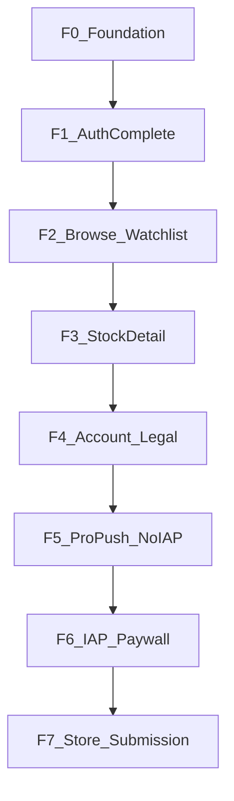

# LOTLOT.NET Mobile — Agent Kılavuzu

> Bu dosya agent’ın çalışma kılavuzudur. **Her anlamlı değişiklikten sonra güncellenir.**
> Son güncelleme: 2026-08-03 (F1 e-posta auth + Turnstile / v7)

---

## 0. Mobil ürün yol haritası

### 0.1 Kararlar (kilitli)

| Konu | Karar |
|------|--------|
| Yol haritası yazım yeri | **Yalnızca bu handbook (§0)** |
| API sözleşmesi | [`docs/MOBILE_API_INTEGRATION_GUIDE.md`](MOBILE_API_INTEGRATION_GUIDE.md) + web [ersinarikan/BIST](https://github.com/ersinarikan/BIST) — **salt okuma**. Web ekibi günceller; mobil ekip guide’ı fork’lamaz / §0 oraya yazmaz. |
| Ürün sırası | **Önce uygulamayı tam geliştir** (auth → keşif → watchlist → hisse → hesap → Pro yüzey/push). **IAP / paywall en sonda** (F6). |
| Monetization kanalı | Yalnızca **StoreKit / Play Billing**. Garanti / WebView checkout **asla** (App Store 3.1.1). |
| İstemci rolü | Thin client: tier, kota, sinyal, ML kararlarını **yeniden hesaplama**; API’yi render et. |

**Neden IAP sonda:** Auth + watchlist + hisse deneyimi doğrulanmadan paywall scope ve Review riskini büyütür. IAP API CANLI olsa da ürün değeri önce kanıtlanır.

### 0.2 API guide nasıl kullanılır

1. Faz işine başlamadan ilgili **§ numaralarını** guide’dan oku (aşağıdaki tablolarda işaretli).
2. Guide veya BIST değiştiyse: bu §0’daki **API referansları / acceptance** satırlarını güncelle; guide dosyasını bu repoda “düzelterek” sahiplenme.
3. Çelişki: canlı `https://lotlot.net` + BIST kaynak > eski handbook satırı; handbook’u düzelt.
4. Lokal web klonu (isteğe bağlı): `_ref_bist/` — **gitignore**; commit etme.

### 0.3 Faz özeti



| Faz | İsim | Durum | IAP? |
|-----|------|--------|------|
| **F0** | Temel / kalite iskeleti | Tamam (tema web hizalı; INTERNET; display name) | Hayır |
| **F1** | Auth tamam | İlerliyor (e-posta login/register/Turnstile/verify/silme; Google/Apple yok) | Hayır |
| **F2** | Keşfet + Watchlist | Bekliyor | Hayır |
| **F3** | Hisse detay | Bekliyor | Hayır |
| **F4** | Hesap / yasal / bütünlük | Bekliyor | Hayır |
| **F5** | Pro yüzey + push (satın alma yok) | Bekliyor | Satın alma yok |
| **F6** | IAP paywall | Bekliyor | **Evet** |
| **F7** | Mağaza teslimi | Bekliyor | Hazır olmalı |

Guide §29 P0–P6 ile ilişki: P1 ≈ F1; P4 ≈ F2–F5; P2/P3/P6 ≈ F6–F7 (IAP sona kaydırıldı).

### 0.4 Faz detayları

#### F0 — Temel / kalite iskeleti

- **Amaç:** iOS+Android ortak iskelet, marka, kalite/git ritüeli.
- **Ekranlar:** Splash (marka), minimal home (geçici).
- **API:** — (config `baseUrl` = `https://lotlot.net`).
- **Skills / kurallar:** `project-manager`, `clean-mobile-dev`, `quality-gate-pre-push`, `agent-handbook`, `risk-integrity-mobile`.
- **Acceptance:**
  - [x] Flutter iskelet, Provider, secure storage, tema
  - [x] Brand CDN logo + launcher ikon
  - [x] analyze + sonar + tag akışı
  - [x] Release `INTERNET` main manifest
  - [x] Display name **LOTLOT.NET** (Android label + iOS `CFBundleDisplayName`)
  - [x] `LotlotColors` / tema web `brand.css` token’larıyla hizalı (`brand-visual-parity`)
- **Dışı:** Yeni ürün ekranı şişirme.
- **Risk:** Release build’de network yoksa tüm fazlar kırılır.

#### F1 — Auth tamam

- **Amaç:** Üç kanal + oturum yaşam döngüsü (guide §4–§8).
- **Ekranlar:** Splash bootstrap; Login/Register; e-posta doğrulama bekleyen; (opsiyonel) şifre sıfırlama → web.
- **API (guide):** §5–§6 login/register; §8.4–§8.5 Google/Apple mobile; §8.6 Turnstile `https://lotlot.net/mobile/turnstile`; §7 refresh; §8 logout / `DELETE /me`.
- **Skills:** `cybersecurity-expert`, `android-fullstack-developer`, `ios-fullstack-developer`.
- **Acceptance:**
  - [x] E-posta + Turnstile lazy köprü (register/login)
  - [ ] Google + Apple native; Bundle ID = `APPLE_CLIENT_ID` aud
  - [x] Splash: token → `/me` → gerekirse refresh → home | login
  - [x] Logout revoke (`refresh_token`) + local wipe; hesap silme UI
  - [x] Token log’larda yok
  - [x] Register → `pending_verification` + resend UX
  - [x] `email_not_verified` → doğrulama bekleyen ekran
- **Dışı:** Web session cookie auth.
- **Risk / web:** Prod `GOOGLE_MOBILE_CLIENT_IDS`, `APPLE_CLIENT_ID`, `TURNSTILE_SITE_KEY`.

#### F2 — Keşfet + Watchlist

- **Amaç:** Ana shell: ara, izleme listesi, tahmin özeti (guide §10–§12, §17 stocks).
- **Ekranlar:** Home/Watchlist; Search/Browse; kota göstergesi.
- **API:** `GET/POST/PATCH/DELETE /api/watchlist*`; `GET /api/watchlist/predictions`; `GET /api/stocks/search`; `/me` quota alanları.
- **Skills:** `project-manager`, `clean-mobile-dev`.
- **Acceptance:**
  - [ ] CRUD + hata/403/kota mesajları sunucudan
  - [ ] Predictions listesi render-only (`display_state`, horizons)
  - [ ] Email verified gate uyumu
- **Dışı:** Admin cache-report UI (zorunlu değil).
- **Risk:** Aylık mutation kotası client’ta uydurulmaz.

#### F3 — Hisse detay

- **Amaç:** Public teaser + auth analiz; Adil Değer ayrı (guide §17.2, §22).
- **Ekranlar:** Stock detail (özet + kartlar + sade grafik).
- **API:** `/api/public/stocks/<sym>/valuation|fundamentals|corporate`; `/api/public/chart-data`; auth: `/api/pattern-analysis`, `/api/chart-data`, batch uçları.
- **Skills:** `seo-expert` (deep link hazırlığı), Android/iOS FS.
- **Acceptance:**
  - [ ] Valuation ayrı çağrı; yoksa kart gizli
  - [ ] Mum + MA (sade); web drawing suite **yok**
  - [ ] Pattern/signal alanları olduğu gibi
  - [ ] Disclaimer görünür
- **Dışı:** Fib/Gann/Elliott çizim motoru.
- **Risk:** Cache/`pending` analiz — loading/empty states.

#### F4 — Hesap / yasal / bütünlük

- **Amaç:** Settings, yasal, iOS↔Android parity smoke.
- **Ekranlar:** Account/Settings; Legal (WebView veya dış tarayıcı); hesap bildirimi tercihleri (`push_notifications` / `email_notifications` → `PATCH /me`).
- **API:** §8 `PATCH /me`; legal URL’ler web.
- **Skills:** `cybersecurity-expert`, `project-manager`, `seo-expert` (ASO metin taslağı erken), `ux-expert`.
- **Acceptance:**
  - [ ] Quota + subscription **okuma** (`/me`) — `tier` / `is_pro` / `is_premium` (Free / Pro / Premium)
  - [ ] Privacy/terms/KVKK erişimi
  - [ ] Kritik ekranlarda yatırım tavsiyesi değildir
  - [ ] iOS + Android smoke checklist yeşil
  - [ ] Ayarlarda `push_notifications` toggle (OS izni F5’te; toggle backend tercihi)
- **Dışı:** IAP satın alma UI; FCM token kaydı (F5).

#### F5 — Pro yüzey + push (satın alma yok)

- **Amaç:** Tier’a göre gated özellikler + **Premium gerçek zamanlı / push bildirimleri**; **satın alma F6’da**.
- **Ekranlar:** Soft gate (“Pro/Premium gerekir”); Chart alerts; AI commentary; Hisse Sihirbazı; **OS bildirim izni + push onboarding**.
- **API:** guide §13–§16, §18, **§25 Premium bildirimler**; `device/register|unregister`; chart-alerts (`channels_allowed.push` yalnız Premium); Socket.IO.
- **Skills:** Android/iOS FS (FCM/APNs), `cybersecurity-expert`, `ux-expert`.
- **Tier özeti (entitlement yalnızca `/me`):**
  | Tier | Mobilde tipik | Push (FCM / Socket) |
  |------|---------------|---------------------|
  | Free | Temel watchlist / public | Yok |
  | Pro | Chart alerts (e-posta), Pro API | Chart `notify_push` **yok**; sinyal push yok |
  | Premium | + wizard, push kanalları | **Evet** — watchlist `alert_enabled` + `push_notifications` |
- **Mobil ne yapar (backend tetikler, istemci dinler/kaydeder):**
  1. OS izni iste (iOS `UNUserNotificationCenter` / Android 13+ `POST_NOTIFICATIONS`) — **context’li** (Premium + uyarı açınca; cold-start spam yok).
  2. Firebase Messaging ile **FCM registration token** al (iOS’ta APNs → FCM köprüsü).
  3. Premium + `push_notifications=true` → `POST /api/notifications/device/register` `{ token, platform: ios|android }`.
  4. **Arka plan / kapalı:** sunucu FCM gönderir → sistem tepsisi; tap → `data.deep_link` ile in-app rota.
  5. **Ön plan (canlı):** Socket.IO `https://lotlot.net` path `/socket.io`, `auth: { token }`, `join_user` → `actionable_alert` dinle (yerel banner/in-app; web push **kullanılmaz**).
  6. Logout / izin iptali / tier düşüşü → `device/unregister`; token yenilenince yeniden register.
- **Acceptance:**
  - [ ] `pro_required` / `premium_required` → net UX (henüz IAP sheet yok)
  - [ ] OS bildirim izni akışı (iOS + Android 13+)
  - [ ] FCM register (Premium); logout / unregister; token refresh
  - [ ] Foreground Socket.IO `actionable_alert` (opsiyonel ama roadmap’te)
  - [ ] Deep link handler (`data.deep_link`)
  - [ ] Web abonelik `/me` ile okunur; client tier uydurmaz
  - [ ] Privacy Manifest / Data safety: push token bildirimi
- **Dışı:** StoreKit/Play purchase sheet; VAPID / web-push subscribe (PWA-only).
- **Risk:** Entitlement client’ta fake “pro yapma”; izinsiz push; Free/Pro’ya register denemek (403).
- **Durum (2026-08-03):** Yol haritasında; **kod yok** (`lib/` FCM/Socket yok). F0–F1 sonrası sırada F5’te uygulanır.

#### F6 — IAP paywall

- **Amaç:** Tek mobil satış kanalı (guide §9, §25–§28, §29 P2–P3).
- **Ekranlar:** Paywall; Restore; abonelik yönetimi yönlendirme (store).
- **API:** `GET /api/billing/iap/config`; `POST .../verify`; `POST .../restore`; sonra `/me`.
- **Skills:** `ios-fullstack-developer`, `android-fullstack-developer`, `cybersecurity-expert`.
- **Acceptance:**
  - [ ] Sandbox/license tester E2E: satın al → verify → tier
  - [ ] Restore çalışır
  - [ ] Garanti/WebView **yok**
  - [ ] Soft gate’ler paywall’a bağlanır
- **Web bağımlılığı:** Product ID’ler, `IAP_ENABLED`, bundle/package env.

#### F7 — Mağaza teslimi

- **Amaç:** Store submission (guide §9.9, §28.5, §29 P6).
- **Ekranlar:** — (metadata, screenshots, privacy forms).
- **API:** Deep link: assetlinks / aasa (web).
- **Skills:** `seo-expert` (ASO), `project-manager` (go/no-go), platform FS.
- **Acceptance:**
  - [ ] Data safety / App Privacy doğru
  - [ ] Restore + hesap silme Review’da görünür
  - [ ] Build notları: dijital abonelik yalnızca IAP
  - [ ] analyze + sonar + smoke yeşil
- **Dışı:** Admin/HPO.

### 0.5 Tüm fazlarda bilinçli dışı

- `/api/admin/*`, `/api/internal/*`, `/api/automation/*`, HPO, admin dashboard
- Garanti / in-app WebView checkout
- Web chart drawing suite kopyası
- `MOBILE_API_INTEGRATION_GUIDE.md` dosyasına mobil ekibinin “sahiplenerek” edit’i

### 0.6 Faz bitiş ritüeli

1. Risk analizi (`risk-integrity-mobile`) — iOS+Android
2. Minimal kod + skills
3. Bu §0’da faz **Durum** / acceptance checkbox güncelle
4. `flutter analyze` → `sonar-scanner` → commit → tag `vN` → push (`bistmobile-git-flow`)

---

## 1. Proje özeti

| | |
|---|---|
| Uygulama | LOTLOT.NET Flutter mobil (Android + iOS) |
| Bu repo (yerel) | `lotlotnet_mobile` |
| GitHub remote | https://github.com/ersinarikan/bistmobile |
| Web/API | https://lotlot.net (sunucu: www.lotlot.net) |
| Web kaynak kod | https://github.com/ersinarikan/BIST |
| API sözleşmesi (salt okuma) | `docs/MOBILE_API_INTEGRATION_GUIDE.md` — web ekibi günceller |
| Yol haritası | **§0** (bu dosya) |
| SonarCloud | https://sonarcloud.io/dashboard?id=ersinarikan_bistmobile |

## 2. Cursor kuralları (`.cursor/rules/`)

Hepsi `alwaysApply: true` (özet):

1. **web-server-ssh** — Canlı sunucu www.lotlot.net; SSH ile teşhis (yazma/restart izinsiz yok). Kod referansı için önce BIST repo.
2. **clean-mobile-dev** — Temiz kod; gereksiz kod yok; anlaşılır “neden” comment’leri.
3. **post-change-refactor** — Değişiklik sonrası ilgili dosyalarda refaktör fırsatını değerlendir.
4. **web-bist-repo** — Web kodu: ersinarikan/BIST.
5. **bistmobile-git-flow** — İş bitince: kalite → commit → sıradaki tag (`vN`) → push bistmobile.
6. **quality-gate-pre-push** — Commit/push öncesi `flutter analyze` + `sonar-scanner` (SONAR_TOKEN).
7. **risk-integrity-mobile** — Kod öncesi risk/etki analizi; iOS+Android bütünlüğü; yan etkiyi kırma.
8. **agent-handbook** — Bu kılavuzu her değişiklik sonrası güncelle (özellikle §0 faz durumu).
9. **brand-visual-parity** — Renk/tema/font/logo web (`brand.css` / lotlot.net) ile aynı; görsel işi siteden doğrula.

## 2b. Agent skills (`.cursor/skills/`)

Her skill: `SKILL.md` + detay `reference.md`. İlgili konuda otomatik / istenince uygula.

| Skill | Rol |
|-------|-----|
| `seo-expert` | Teknik SEO, içerik, ASO, deep link / web tutarlılığı |
| `android-fullstack-developer` | Android native + Play + Billing + FCM + Flutter embedding |
| `ios-fullstack-developer` | iOS native + StoreKit + APNs + Privacy + Flutter embedding |
| `project-manager` | Kapsam, faz, risk, bağımlılık, go/no-go |
| `cybersecurity-expert` | Appsec, token, OWASP Mobile, secret, sertleştirme |
| `ux-expert` | Hedefe odaklı UX; jargon/geliştirici notunu UI’dan uzak tut; heuristic review |

## 3. Mimari (mevcut)

```
lib/
  main.dart                 # LotlotApp, Provider tree
  core/
    api/api_client.dart     # HTTP + Bearer + refresh
    brand/brand_assets.dart # CDN logo URL + BrandLogo
    config/api_config.dart  # baseUrl = https://lotlot.net
    storage/token_storage.dart
    theme/app_theme.dart    # LotlotColors / dark tema
  features/
    splash/                 # bootstrap → home | login
    auth/                   # login + SessionController
    home/                   # basit home + logout
```

State: **Provider**. Token: **flutter_secure_storage**.

## 4. Yapılanlar (kronoloji)

### v1 (2026-08-03) — ilk push

- Flutter iskelet: auth/session, splash, login, home
- Marka: lotlot.net PWA ikonu → launcher (`flutter_launcher_icons`); in-app logo CDN (`BrandLogo`)
- Cursor kuralları 1–5 (SSH, temiz kod, refaktör, BIST repo, git flow)
- Remote: `git@github.com:ersinarikan/bistmobile.git`, tag **v1**
- GitHub SSH key bu Mac’te: `~/.ssh/id_ed25519_bistmobile`

### v2 (2026-08-03) — kalite + kılavuz

- Kalite kapısı kuralı + `sonar-project.properties` + Homebrew `sonar-scanner`
- SonarCloud projesi `ersinarikan_bistmobile`; analiz yeşil
- Risk/bütünlük kuralı (`risk-integrity-mobile`)
- Agent kılavuzu: `docs/AGENT_HANDBOOK.md` + güncelleme kuralı (`agent-handbook`)
- `.scannerwork/` gitignore

### v3 (2026-08-03) — rol skills

- Beş proje skill’i eklendi (SEO, Android FS, iOS FS, PM, siber güvenlik)
- Her birinde kapsamlı `SKILL.md` + `reference.md`

### v5 (2026-08-03) — F0 kural uyumu

- `LotlotColors` ← web `brand.css` (#19e38a, #0b2018, …)
- Splash/login web `.brand-dark` radial gradient
- Android `INTERNET` + label `LOTLOT.NET`; iOS display name; launch `#071610`

### v6 (2026-08-03) — ikon, UX, push roadmap

- Launcher ikon: net vektör-tarzı marka (`tool/generate_app_icon.py` + `flutter_launcher_icons`); bg `#071610`
- Login/home: iç billing/sprint metinleri kaldırıldı (UX)
- Skill: `ux-expert` (Nielsen heuristic + mobil keskinleştirme)
- F4/F5: Free/Pro/Premium + Premium FCM/Socket/OS izni akışı handbook’ta netleştirildi

### v7 (2026-08-03) — F1 e-posta auth (Google/Apple hariç)

- Register + lazy Turnstile WebView (`/mobile/turnstile`)
- Verify-email pending + resend; login `email_not_verified` / `captcha_required`
- Logout `refresh_token` revoke; `DELETE /me` hesap silme
- `webview_flutter` eklendi

### v4 (2026-08-03) — yol haritası §0 + görsel parity

- Handbook **§0 Mobil ürün yol haritası** (F0–F7); API guide salt-referans politikası
- Ürün önce, IAP sonda; README işaretlendi
- Kural **brand-visual-parity**: renk/font/görsel web’den doğrulanır

## 5. Çalışma ritüeli

1. İstek → **risk analizi** (platform + çapraz etki)
2. Hangi **§0 faz**? Acceptance’a bak
3. Minimal / temiz kod; API guide **oku** (yazma); gerekirse BIST
4. Bitince: refaktör değerlendirmesi + **§0 durum güncelle**
5. `flutter analyze` → `sonar-scanner` → commit → tag `vN` → push

```bash
flutter analyze
export SONAR_TOKEN='…'   # ortama; commit etme
sonar-scanner
# sonra git commit + tag + push
```

## 6. Marka / ikon / tema

| Kullanım | Kaynak |
|---|---|
| In-app logo | `https://lotlot.net/static/img/brand/lotlot-icon-transparent.png` (`BrandAssets`) |
| Launcher | `tool/generate_app_icon.py` → `assets/branding/app_icon*.png` + `dart run flutter_launcher_icons` (marka #071610 / #19e38a) |
| Tema token’ları | Web `static/css/brand.css` → `LotlotColors` (`brand-visual-parity`) |
| Not | CDN `immutable` cache (~1 yıl); aynı URL’de değişince istemci gecikebilir |

## 7. Bilinen / ertelenen

- [ ] lotlot.net **SSH** (root/ersin): sunucu yalnız `publickey`; bu Mac’te sunucu key’i yok — sonra
- [ ] F1+: Google/Apple, Turnstile, watchlist, hisse, IAP — bkz. **§0**

## 8. Dokunulmaması gerekenler

- Secret / `.env` / `SONAR_TOKEN` / private key commit yok
- Üretim sunucusunda izinsiz yazma / restart / migrate yok
- Force push / tag silme yalnız açık kullanıcı isteğiyle
- API integration guide’ı mobil “master” sayıp bu repoda sahiplenerek rewrite yok

## 9. Hızlı dosya haritası

| Ne | Nerede |
|---|---|
| Agent kılavuzu + **yol haritası §0** | `docs/AGENT_HANDBOOK.md` (bu dosya) |
| API rehberi (salt okuma) | `docs/MOBILE_API_INTEGRATION_GUIDE.md` |
| Sonar config | `sonar-project.properties` |
| Cursor rules | `.cursor/rules/*.mdc` |
| Skills | `.cursor/skills/*/SKILL.md` |
