# Mobile API Integration Guide

**Son güncelleme:** 2026-06-24  
**Hedef ortam:** Production — `https://lotlot.net` (preprod / HPO host mobil istemci için kullanılmaz)

Bu doküman mobil geliştirici için hazırlanmıştır. Mobil uygulamanın temel görevi backend'den gelen JSON verilerini render etmektir. Kullanıcı yetkisi, üyelik seviyesi, trial, watchlist kotası, aktif/pasif sembol kararı, sinyal ve tahmin hesapları mobilde yapılmaz; backend API response içinde açıkça döner.

**Word sürümü:** `docs/MOBILE_API_INTEGRATION_GUIDE.docx` — `./venv/bin/python scripts/export_mobile_integration_guide_docx.py` ile üretilir.

## 0. Mobil geliştirici okuma rehberi

### 0.1 Durum etiketleri

| Etiket | Anlam |
|--------|--------|
| **CANLI** | Prod backend'de şu an kullanılabilir |
| **PLANLANAN** | Hedef sözleşme; backend henüz ship edilmedi — mobil store kurulumuna paralel hazırlık (IAP verify/restore **CANLI** — §9, §27) |
| **WEB_ONLY** | Yalnızca tarayıcı/WebView; JSON mobil API değil |

### 0.2 Terminoloji — IAP vs cüzdan ödemesi

| Terim | Ne | Lotlot Pro/Premium için |
|-------|-----|-------------------------|
| **Apple IAP / StoreKit** | App Store uygulama içi abonelik | **Birincil mobil kanal (hedef)** |
| **Google Play Billing** | Play Store uygulama içi abonelik | **Birincil mobil kanal (hedef)** |
| **Apple Pay / Google Pay** | Cüzdan (kart token) | Dijital abonelik için **birincil kanal değil** |
| **Garanti web POS** | Web kart ödemesi | Web (`lotlot.net`) — **CANLI** (session checkout) |
| **iOS alternatif ödeme** | Garanti / harici kart / WebView checkout | **App Store’da YASAK** (Guideline 3.1.1) — bkz. §9.3.1 |

### 0.3 Sorumluluk matrisi

| Rol | Sorumluluk |
|-----|------------|
| **Mobil uygulama** | Auth SDK, StoreKit / Play Billing UI, satın alma sonrası token gönderme, **Restore Purchases**, entitlement **okuma** (`GET /api/auth/me`), paywall gösterimi |
| **Apple / Google console** | Subscription product ID, fiyat, sandbox/license tester, (backend hazır olunca) webhook URL |
| **Lotlot backend** | IAP token doğrulama (**CANLI**, `IAP_ENABLED=1`), webhook uçları, `billing_orders`, `users.subscription_tier` — **tek entitlement otoritesi** |
| **Web (Garanti)** | `lotlot.net/billing/checkout` — session cookie (**CANLI** kod; `BILLING_ENABLED` env) |

### 0.4 Önerilen okuma sırası

| Sıra | Bölüm | Konu | Ekran / faz |
|------|-------|------|-------------|
| 1 | §1–§3 | Temel yaklaşım, URL, token | — |
| 2 | §4, §7 | Splash / oturum restore + token refresh | Splash |
| 3 | §5–§6, §8.6 | E-posta kayıt/login + Turnstile köprü | Auth |
| 4 | §8.4–§8.5 | Google / Apple native OAuth | Auth |
| 5 | §8.8 | Tüm auth akışları özeti | Auth QA |
| 6 | §9 | Abonelik okuma + billing/IAP | Paywall |
| 7 | §17, §22 | Public sembol uçları (Adil Değer dahil) + ekran bazlı API planı | Sprint planı |
| 8 | §10–§18 | Watchlist, tahmin, Pro/Premium API | Ana uygulama |
| 9 | §24–§29 | Checklist + contract + mobil istenenler + backend IAP + iOS uyumu + **öncelik tablosu** | Teslim |

### 0.5 Hızlı yol haritası (mobil sprint)

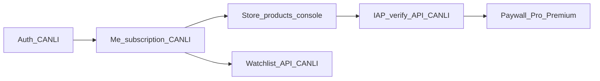

1. **Faz A (CANLI):** Google/Apple/e-posta auth → JWT → `/api/auth/me` → watchlist/tahmin API.
2. **Faz B (paralel):** App Store Connect + Play Console'da subscription ürünleri oluştur.
3. **Faz C (CANLI):** StoreKit / Play Billing satın alma → `POST /api/billing/iap/verify` + Restore → `/me` yenile (`IAP_ENABLED=1` prod).
4. **Faz D:** Paywall, abonelik durumu ekranı, iptal yönlendirmesi (store veya web kanalı). **Greenfield (henüz kod yok):** Garanti / WebView checkout **hiç eklenmez** (§9.3.1, §28, §29). Red almış eski build varsa aynı yasaklar için **kaldırma** gerekir.

### 0.6 Mobil kapsam dışı (bilinçli)

Mobil uygulamada **admin dashboard yoktur**; aşağıdaki yüzeyler mobil sözleşmesine dahil değildir ve üretim mobil istemcisi bu uçlara bağlanmamalıdır:

- `/api/admin/*` — admin panel JSON (stok yönetimi, billing orders, automation report, …)
- `/api/internal/*` — dahili otomasyon, pipeline, HPO, model kalite raporları
- `/api/automation/*` — legacy otomasyon alias'ları (iç yönetim)
- `X-Internal-Token` veya sunucu sırları gerektiren çağrılar
- Web admin HTML (`/admin`, dashboard şablonları)

Operasyonel teşhis uçları (`GET /api/watchlist/cache-report`, isteğe bağlı `GET /api/signals/last`) yalnızca geliştirici/debug modunda kullanılabilir; son kullanıcı UI'sında zorunlu değildir.

### 0.7 Kimlik anahtarı katmanları (karıştırma)

Web OAuth, mobil OAuth ve IAP **ayrı credential setleridir**; birbirinin yerine kullanılmaz.

| Katman | Mobil ne kullanır | Backend env | Not |
|--------|-------------------|-------------|-----|
| Web login (tarayıcı) | Tarayıcı OAuth redirect | `GOOGLE_CLIENT_ID`, Apple web Services ID | Mobil JSON API **değil** |
| Mobil login | Native `idToken` / `identityToken` | `GOOGLE_MOBILE_CLIENT_IDS` (boşsa `GOOGLE_CLIENT_ID` fallback), `APPLE_CLIENT_ID` | Android/iOS client ID ≠ web client ID |
| Apple mobil token `aud` | Bundle ID (native SDK) | `APPLE_CLIENT_ID` **Bundle ID olmalı** | Web Services ID ile karıştırılırsa `invalid_oauth_token` |
| IAP abonelik | StoreKit JWS / Play `purchaseToken` | `IAP_*`, `APPLE_IAP_BUNDLE_ID`, `GOOGLE_PLAY_*` | OAuth client secret IAP için **kullanılmaz** |

Detaylı onboarding sırası: **§26**, öncelik tablosu: **§29**.

### 0.8 Sunucu / arka plan davranışı (master belge)

Mobil uçların **neden** bazen gecikmeli veri döndürdüğünü, fiyatların ne zaman güncellendiğini ve HPO’nun mobil istemciyi nasıl etkilemediğini anlamak için **[Sistem Master Belgesi](system_spec/MASTER_INDEX.md)** okunmalıdır. Word (tam): `docs/LOTLOT_SYSTEM_SPEC_MASTER_FULL.docx` — `./venv/bin/python scripts/export_system_spec_docx.py --full`

| Konu | Master bölüm |
|------|----------------|
| Automation döngüsü, VT yazım saati (~10:00 seans) | Bölüm 10 |
| HPO, model sync, preprod vs prod | Bölüm 11 |
| Cron, env, drop-in | Bölüm 9 |
| VT bütünlüğü, fiyat onarım | Bölüm 13 |
| Web dashboard / PWA (mobil değil) | Bölüm 12 |

## 1. Temel Yaklaşım

Mobil uygulama üç kimlik kanalı destekler:

1. **Google Sign-In (native)** → `POST /api/auth/google-mobile` (`idToken`)
2. **Sign in with Apple (native)** → `POST /api/auth/apple-mobile` (`identityToken`)
3. **E-posta + şifre** → `POST /api/auth/register` / `POST /api/auth/login` (prod'da Turnstile zorunlu; bkz. §5, §8.6)

Mobil uygulama ayrıca:
- Korunan endpointlere her istekte `Authorization: Bearer <access_token>` header'ı gönderir.
- `401` alırsa refresh token ile yeni access token alır.
- `subscription`, `watchlist`, `signals_by_horizon`, `ml_unified` gibi alanları backend'den geldiği haliyle gösterir.
- **Adil Değer** kartını `GET /api/public/stocks/<symbol>/valuation` ile ayrı çeker (§17.2); `pattern-analysis` / `chart-data` içinde gelmez.
- Üyelik/kota/sinyal kararlarını kendi içinde tekrar hesaplamaz.

Backend:

- Kullanıcıyı JWT access token üzerinden tanır.
- Kullanıcının tier/entitlement bilgisini çözer.
- Watchlist limitlerini ve aylık mutation kotasını uygular.
- Watchlist downgrade durumunda fazla kayıtları silmeden pasif işaretler.
- Tahmin, sinyal, skor ve gösterilecek metrikleri API response içinde döndürür.

## 2. Ortam ve Base URL

Production için base URL:

```text
https://lotlot.net
```

Tüm API istekleri JSON olmalıdır:

```http
Content-Type: application/json
Accept: application/json
```

Korunan endpointlerde:

```http
Authorization: Bearer ACCESS_TOKEN
```

## 3. Token Kuralları

Backend iki token verir:

- `access_token`: Kısa ömürlü token. API çağrılarında kullanılır.
- `refresh_token`: Access token süresi dolunca yeni token almak için kullanılır.

Mobil uygulama tokenları güvenli depolamalıdır:

- iOS: Keychain
- Android: EncryptedSharedPreferences / Keystore destekli güvenli storage

Mobil uygulama tokenları düz `localStorage`, log, analytics event, crash report veya URL query string içinde tutmamalıdır.

## 4. İlk Açılış Akışı

Uygulama açıldığında:

1. Güvenli storage içinde `access_token` var mı kontrol et.
2. Yoksa kullanıcıyı giriş/kayıt ekranına yönlendir.
3. Varsa `GET /api/auth/me` çağır.
4. `200` dönerse kullanıcı oturumu geçerlidir; gelen `user` ve `subscription` state'e yazılır.
5. `401` dönerse `POST /api/auth/refresh` ile yeni access token al.
6. Refresh başarılıysa tekrar `/api/auth/me` çağır.
7. Refresh de başarısızsa local tokenları sil ve login ekranına dön.

**Akış diyagramı (splash / oturum):**

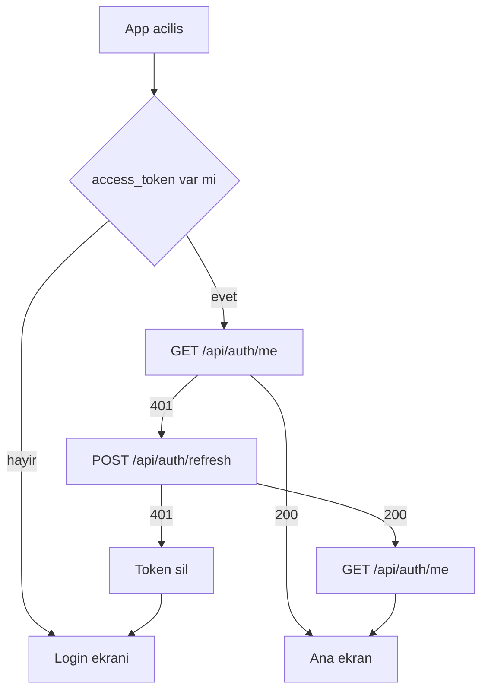

Örnek:

```bash
curl -sS https://lotlot.net/api/auth/me \
  -H "Authorization: Bearer ACCESS_TOKEN"
```

Başarılı response:

```json
{
  "status": "success",
  "user": {
    "id": 123,
    "email": "user@example.com",
    "role": "user",
    "email_verified": true,
    "subscription_tier": "free",
    "trial_started_at": "2026-04-30T10:00:00",
    "trial_ends_at": "2026-05-03T10:00:00",
    "subscription_expires_at": null,
    "created_at": "2026-04-30T10:00:00",
    "last_login": "2026-04-30T11:00:00"
  },
  "subscription": {
    "tier": "free",
    "tier_alias": "standard",
    "label": "Ücretsiz",
    "is_pro": false,
    "is_premium": false,
    "trial_active": false,
    "trial_ends_at": null,
    "subscription_expires_at": null,
    "remaining_seconds": null,
    "watchlist_limit": 10,
    "monthly_watchlist_mutation_limit": 10,
    "chart_alert_limit": 0,
    "billing": {
      "enabled": false,
      "active": false,
      "cancel_at_period_end": false,
      "plan": null,
      "current_period_end": null,
      "payments_completed": 0,
      "recurring_total": 12,
      "status": null,
      "provider_cancel_confirmed": false
    }
  }
}
```

`subscription.billing` alanı `/api/auth/me`, login ve refresh yanıtlarında her zaman döner. Ödeme altyapısı kapalıyken `enabled=false`; canlı POS açıldığında durum buradan okunur (mobil Bearer ile).

## 5. Kayıt Akışı

Endpoint:

```http
POST /api/auth/register
```

Request:

```json
{
  "email": "user@example.com",
  "password": "StrongPassw0rd!",
  "first_name": "Ada",
  "last_name": "Lovelace",
  "turnstile_token": "<gerekirse Cloudflare Turnstile response token>"
}
```

Cloudflare Turnstile production ortamında (`https://lotlot.net`) **her kayıt isteğinde zorunludur** (`REGISTER_TURNSTILE_ALWAYS=1`). Token tek kullanımlıktır.

**Lazy WebView (önerilen mobil akış):**

1. Kullanıcı kayıt formunu doldurur; **ilk** `POST /api/auth/register` çağrısı `turnstile_token` **olmadan** gönderilebilir.
2. Prod'da `REGISTER_TURNSTILE_ALWAYS=1` olduğu için bu ilk deneme beklenen şekilde `400` + `invalid_turnstile` döner — bu hata köprüyü açmak için sinyaldir, kullanıcı hatası değildir.
3. In-app WebView ile `https://lotlot.net/mobile/turnstile` açılır (bkz. §8.6); `postMessage` ile `turnstile_token` alınır.
4. Aynı register gövdesi `turnstile_token` ile **yeniden** POST edilir → `201 pending_verification`.

Köprüyü kayıt ekranı açılır açılmaz göstermek zorunlu değildir; lazy pattern UX'i sadeleştirir.

**Akış diyagramı (e-posta kayıt — lazy Turnstile):**

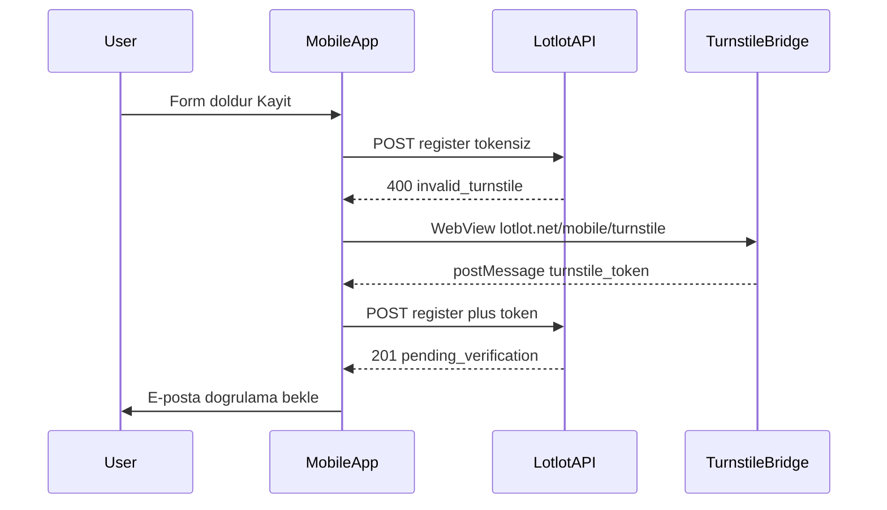

Alternatif alan adı (aynı anlam): `cf_turnstile_response`.

Örnek (Turnstile gerekli olduğunda):

```bash
curl -sS -X POST https://lotlot.net/api/auth/register \
  -H "Content-Type: application/json" \
  -d '{"email":"user@example.com","password":"StrongPassw0rd!","first_name":"Ada","last_name":"Lovelace","turnstile_token":"<TOKEN>"}'
```

Turnstile beklendiği halde eksik veya doğrulanamazsa:

```json
{
  "error": "invalid_turnstile"
}
```

HTTP **400** ile döner.

Başarılı response:

```json
{
  "status": "pending_verification",
  "user": {
    "id": 123,
    "email": "user@example.com",
    "role": "user",
    "email_verified": false
  },
  "verification_required": true,
  "verification_email_sent": true,
  "message": "Kayıt oluşturuldu. Giriş yapmadan önce e-posta adresinizi doğrulayın."
}
```

Önemli:

- Register response token döndürmez (JWT `access_token` değil; kayıt sonrası oturum açılmaz).
- Production'da `turnstile_token` **her** register çağrısında zorunludur; eksik/geçersiz token → `400 invalid_turnstile`.
- Kullanıcı e-posta doğrulamasından sonra login olmalıdır.
- Mobil ekranda "E-posta doğrulama bekleniyor" durumu gösterilmelidir.

Doğrulama mailini tekrar göndermek için:

```http
POST /api/auth/resend-verification
```

Request:

```json
{
  "email": "user@example.com"
}
```

Başarılı yanıt (`200`) — e-posta varlığı **ifşa edilmez** (her zaman aynı mesaj):

```json
{
  "status": "success",
  "message": "Kayıtlı ve doğrulanmamış bir hesap varsa doğrulama e-postası gönderildi.",
  "verification_email_sent": true
}
```

`verification_email_sent: false` — hesap yok, zaten doğrulanmış veya mail gönderilemedi; mobil yine genel başarı mesajı gösterebilir.

Hatalar:

| HTTP | `error` | Anlam |
|------|---------|--------|
| 400 | `email_required` | E-posta boş |
| 400 | `invalid_email` | Geçersiz format |
| 429 | `rate_limited` | Çok sık deneme; `retry_after_seconds` |

Not: JSON `resend-verification` uçunda Turnstile alanı **yoktur** (web formundan farklı). Rate limit Redis penceresi uygulanır.

### 5.1 Kayıt — yaygın hatalar

| HTTP | `error` | Mobil aksiyon |
|------|---------|---------------|
| 400 | `email_and_password_required` | Zorunlu alanları göster |
| 400 | `invalid_email` | E-posta formatını düzelt |
| 400 | `weak_password` | Min **8** karakter (`MIN_PASSWORD_LEN`) |
| 400 | `invalid_turnstile` | Lazy köprüyü aç → token ile retry |
| 409 | `email_already_registered` | Giriş veya şifre sıfırlama öner (OAuth hesabı da dahil) |
| 429 | `rate_limited` | `retry_after_seconds` bekle |
| 500 | `register_failed` / `server_error` | Genel hata mesajı |

### 5.2 E-posta doğrulama akışı (mobil)

E-posta/şifre kaydından sonra oturum **açılmaz**. Akış:

1. `201 pending_verification` → mobil “E-posta doğrulama bekleniyor” ekranı.
2. Kullanıcı maildeki linke tıklar → **web** sayfası açılır:
   ```text
   https://lotlot.net/verify-email/<token>
   ```
   (Tarayıcı veya mail uygulaması; mobil uygulama bu token'ı parse etmek zorunda değildir.)
3. Doğrulama tamamlanınca kullanıcı mobilde `POST /api/auth/login` ile giriş yapar.
4. Mail gelmediyse `POST /api/auth/resend-verification` (§5 üstü).

**Deep link / Universal Link (opsiyonel):** Mail linkini uygulamaya yönlendirmek isteğe bağlıdır; doğrulama işlemi sunucuda web route ile tamamlanır. En basit yol: kullanıcıya “Maildeki linke tıklayın, ardından uygulamaya dönüp giriş yapın” metni.

Doğrulanmadan login denemesi → `403 email_not_verified` + `verification_required: true` (§6).

**Akış diyagramı (e-posta doğrulama):**

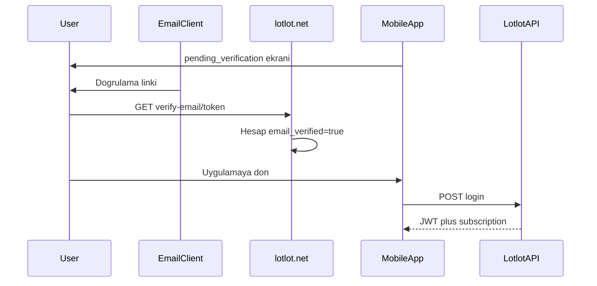

## 6. Login Akışı

Endpoint:

```http
POST /api/auth/login
```

Request:

```json
{
  "email": "user@example.com",
  "password": "StrongPassw0rd!"
}
```

Örnek:

```bash
curl -sS -X POST https://lotlot.net/api/auth/login \
  -H "Content-Type: application/json" \
  -d '{"email":"user@example.com","password":"StrongPassw0rd!"}'
```

Başarılı response:

```json
{
  "status": "success",
  "token_type": "Bearer",
  "access_token": "ACCESS_TOKEN",
  "refresh_token": "REFRESH_TOKEN",
  "expires_in": 3600,
  "refresh_expires_in": 2592000,
  "issued_at": 1777483970,
  "access_expires_at": 1777487570,
  "refresh_expires_at": 1780075970,
  "access_jti": "uuid",
  "refresh_jti": "uuid",
  "user": {
    "id": 123,
    "email": "user@example.com",
    "role": "user",
    "email_verified": true
  },
  "subscription": {
    "tier": "premium",
    "tier_alias": "premium",
    "label": "Premium",
    "is_pro": true,
    "is_premium": true,
    "trial_active": true,
    "watchlist_limit": 100,
    "monthly_watchlist_mutation_limit": null
  }
}
```

Mobil yapılacaklar:

1. `access_token` ve `refresh_token` güvenli storage'a yaz.
2. `user` bilgisini app state'e yaz.
3. `subscription` bilgisini app state'e yaz.
4. Ana ekrana geç.

Hatalar:

- `401 invalid_credentials`: E-posta veya şifre hatalı. Yanıtta `captcha_required: true` olabilir (sonraki denemede Turnstile gerekir).
- `403 email_not_verified`: Kullanıcı e-posta doğrulamamış.
- `400 captcha_required`: Başarısız giriş eşiği aşıldı; gövdeye geçerli `turnstile_token` (veya `cf_turnstile_response`) ekleyin.
- `429 rate_limited`: Çok fazla deneme yapıldı, `retry_after_seconds` gösterilebilir.

Login Turnstile kuralı register'dan farklıdır: **ilk denemelerde zorunlu değildir**. Aynı e-posta/IP için başarısız giriş sayısı `LOGIN_CAPTCHA_AFTER_FAILURES` (varsayılan **5**) eşiğini geçince sonraki isteklerde gövdeye geçerli `turnstile_token` eklenmelidir.

**Lazy WebView (login):** `400 captcha_required` veya `401 invalid_credentials` yanıtında `captcha_required: true` görüldüğünde §8.6 köprüsünü açın, token alın ve aynı email/şifre ile login'i tekrarlayın. OAuth (Google/Apple) akışında Turnstile yoktur.

**Akış diyagramı (e-posta login — lazy captcha):**

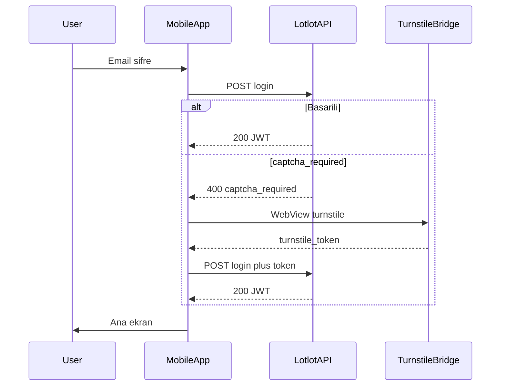

Google veya Apple ile girişte Turnstile **gerekmez**; native SDK token'ı doğrudan ilgili mobil OAuth endpoint'ine gönderilir (§8.4, §8.5).

### 6.1 Şifre Sıfırlama Kapsamı

Şifre sıfırlama akışı backend'de **web form + e-posta linki** olarak desteklenir; **mobil JSON API yoktur**.

Web uçları (HTML — Bearer JWT kullanılmaz):

```http
GET  https://lotlot.net/login
POST /forgot-password          (web form; mobil JSON değil)
GET  https://lotlot.net/reset-password/<token>
POST /reset-password/<token>   (web form)
```

Mobil uygulama için önerilen akış:

1. Login ekranında “Şifrenizi mi unuttunuz?” göster.
2. Sistem tarayıcısı veya in-app WebView ile aç:
   ```text
   https://lotlot.net/login
   ```
   (Sayfada “Şifremi unuttum” sekmesi / formu vardır.)
3. Kullanıcı e-postadaki reset linkini açar → `https://lotlot.net/reset-password/<token>` web formu.
4. Yeni şifre belirlendikten sonra mobil uygulama login ekranına döner; `POST /api/auth/login` ile giriş.

Güvenlik davranışı:

- E-posta varlığı ifşa edilmez; web formu generic mesaj gösterir.
- Yalnızca aktif `provider=email` hesaplara reset maili gönderilir (Google/Apple-only hesapta reset maili gitmez).
- Reset token DB'de hash'li saklanır, tek kullanımlıdır ve 1 saat içinde geçerlidir.
- Password reset isteklerinde Redis tabanlı sayaç kullanılır: 25 sn cooldown, 3 gerçek istekten sonra Turnstile (web form), 6 gerçek istekten sonra geçici blok.
- Mobil istemci reset token'ı loglamamalı, saklamamalı veya API token gibi işlememelidir.

**Akış diyagramı (şifre sıfırlama — WEB_ONLY):**

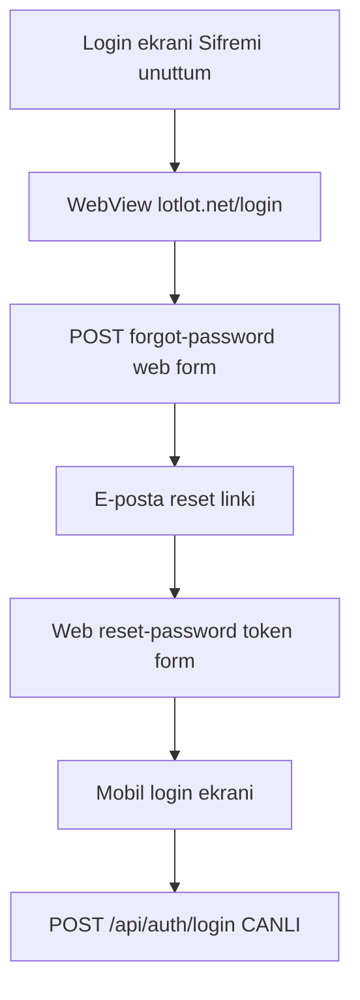

## 7. Token Refresh Akışı

Access token süresi dolunca veya API `401` döndürünce:

```http
POST /api/auth/refresh
```

Request:

```json
{
  "refresh_token": "REFRESH_TOKEN"
}
```

Başarılı response login response'a benzer ve yeni token çifti döndürür:

```json
{
  "status": "success",
  "access_token": "NEW_ACCESS_TOKEN",
  "refresh_token": "NEW_REFRESH_TOKEN",
  "expires_in": 3600,
  "refresh_expires_in": 2592000,
  "user": {},
  "subscription": {}
}
```

Önemli:

- Refresh token tek kullanımlıktır.
- Eski refresh token tekrar kullanılmamalıdır.
- Başarılı refresh sonrası eski tokenları güvenli storage'dan silip yenilerini yaz.
- Refresh `401` dönerse kullanıcı logout kabul edilmelidir.

## 8. Logout, OAuth ve Turnstile

Bu bölüm çıkış ve hesap silmenin yanı sıra OAuth, Turnstile köprüsü ve auth yardımcı uçlarını kapsar. Tüm senaryoların özeti: **§8.8**.

### 8.0 Logout

Endpoint:

```http
POST /api/auth/logout
```

Request:

```json
{
  "refresh_token": "REFRESH_TOKEN"
}
```

Başarılı response:

```json
{
  "status": "success"
}
```

Mobil yapılacaklar:

1. Logout endpointini çağır.
2. Başarılı veya başarısız olsa bile local `access_token` ve `refresh_token` sil.
3. Kullanıcı state'ini temizle.
4. Login ekranına dön.

Not:

- Logout refresh token'ı revoke eder.
- Access token kısa TTL sonuna kadar teknik olarak geçerli olabilir; mobil local tokenı sildiği için tekrar kullanmamalıdır.

### 8.1 Rate limiting (429)

`POST /api/auth/login` ve `POST /api/auth/register` uçlarında aşırı denemede sunucu `429` dönebilir. Gövde örneği:

```json
{
  "error": "rate_limited",
  "message": "Çok sık deneme yapıldı. Lütfen daha sonra tekrar deneyin.",
  "retry_after_seconds": 60
}
```

Mobil uygulama `retry_after_seconds` veya `Retry-After` başlığını kullanıcıya gösterebilir veya süre dolmadan tekrar istek göndermemelidir.

### 8.2 Hesap silme

Endpoint:

```http
DELETE /api/auth/me
Authorization: Bearer ACCESS_TOKEN
Content-Type: application/json
```

Request gövdesi (zorunlu onay):

```json
{
  "confirm": true
}
```

`confirm` tam olarak `true` değilse `400` ve `{"error":"confirm_required"}` beklenir.

Başarılı yanıt: `200`, `{"status":"success"}`. İşlem idempotent: kullanıcı zaten silinmişse yine `200`.

Sonrasında refresh token’lar revoke edilir; kullanıcı kaydı anonimleştirilir. Mobil yerel tokenları temizleyip giriş ekranına dönmelidir.

**Not:** `POST /api/auth/refresh` için Redis tabanlı revocation store kullanılır. Store kullanılamıyorsa `503` ve `token_revocation_store_unavailable` dönebilir; mobil kullanıcıya “sunucu bakımı / sonra tekrar deneyin” mesajı uygun olabilir.

### 8.3 OAuth ve sosyal giriş (genel)

Mobil uygulama **native Google / Apple SDK** ile kimlik kanıtı alır ve backend'e JSON POST eder. Web OAuth (tarayıcı redirect + session cookie) mobil sözleşmesinden ayrıdır; ancak **hesap birleştirme kuralları aynıdır** (§8.7).

Turnstile, OAuth mobil endpoint'lerinde **uygulanmaz** (token = kimlik kanıtı).

### 8.4 Google Mobile — `POST /api/auth/google-mobile`

Native Google Sign-In sonrası `idToken` gönderilir.

Request:

```json
{
  "idToken": "<Google ID token>"
}
```

Alternatif alan (aynı anlam): `id_token`. **camelCase tercih edilir**; yanıt her zaman **snake_case**'dir.

Başarılı yanıt (`200`): `POST /api/auth/login` ile **birebir aynı şema** — `status: success`, `access_token`, `refresh_token`, `user`, `subscription`, token metadata alanları.

Hatalar:

| HTTP | `error` | Anlam |
|------|---------|--------|
| 400 | `id_token_required` | Gövde boş veya token yok |
| 401 | `invalid_oauth_token` | Token geçersiz, süresi dolmuş veya audience uyuşmuyor |
| 403 | `inactive_user` | Hesap devre dışı |
| 429 | `rate_limited` | Çok sık deneme |
| 500 | `token_issue_failed` | JWT üretilemedi |

Örnek başarılı yanıt (kısaltılmış):

```json
{
  "status": "success",
  "access_token": "eyJ...",
  "refresh_token": "eyJ...",
  "token_type": "Bearer",
  "expires_in": 3600,
  "user": {
    "id": 123,
    "email": "user@gmail.com",
    "full_name": "Ada Lovelace",
    "provider": "google",
    "email_verified": true,
    "created_at": "2026-04-30T10:00:00"
  },
  "subscription": {
    "tier": "free",
    "trial_active": true,
    "watchlist_limit": 10,
    "chart_alert_limit": 0,
    "billing": { "enabled": false, "active": false }
  }
}
```

**Yanlış vs doğru (parser):**

| Yanlış (mobil taraf) | Doğru (backend) |
|----------------------|-----------------|
| `user.name` | `user.full_name` |
| `watchlistLimit` | `subscription.watchlist_limit` |
| `trialActive` | `subscription.trial_active` |
| `createdAt` | `user.created_at` |
| `"success": true` (boolean) | `"status": "success"` (string) |

Prod ortamında backend önce `GOOGLE_MOBILE_CLIENT_IDS` (Android + iOS client ID'leri, virgülle) ile audience doğrular. Bu env **boşsa** geçici olarak web `GOOGLE_CLIENT_ID` kabul edilir — prod'da mobil client ID'lerin **ayrı tanımlanması zorunludur**; web ID ile karıştırılmamalıdır.

**Kayıt vs giriş:** Mobilde ayrı “Google kayıt” endpoint'i **yoktur**. Aynı `POST /api/auth/google-mobile` çağrısı hem ilk kez gelen kullanıcıyı **oluşturur** hem mevcut hesaba **giriş yapar** (find-or-create). Başarılı yanıt her zaman JWT + `user` + `subscription` döner. UI'da tek “Google ile devam et” butonu yeterlidir.

**SDK tarafı (mobil ekip):** Android/iOS OAuth client ID'lerini backend ekibine iletin (`GOOGLE_MOBILE_CLIENT_IDS` env). `idToken` audience bu ID'lerden biri olmalıdır.

**Akış diyagramı (Google — kayıt = giriş, CANLI):**

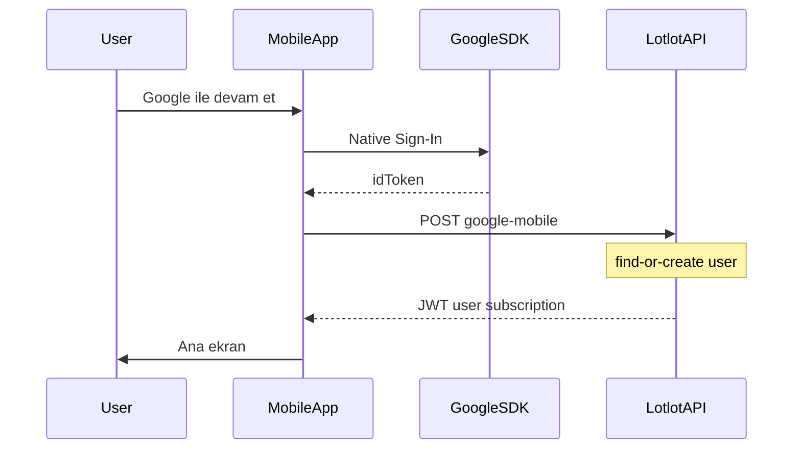

### 8.5 Apple Mobile — `POST /api/auth/apple-mobile`

Native Sign in with Apple sonrası `identityToken` gönderilir. **İlk girişte** Apple yalnızca bir kez isim verir; isteğe bağlı `fullName` gönderin.

Request:

```json
{
  "identityToken": "<Apple identity JWT>",
  "fullName": {
    "givenName": "Ada",
    "familyName": "Lovelace"
  }
}
```

Alternatifler: `identity_token`, `full_name` (snake_case alias).

Başarılı yanıt ve hata kodları §8.4 ile aynı sözleşmededir (`identity_token_required` → 400).

Private relay e-posta (`@privaterelay.appleid.com`) desteklenir; web ile aynı provisioning kuralları uygulanır.

**Kayıt vs giriş:** Google ile aynı — ayrı Apple kayıt endpoint'i yok; `POST /api/auth/apple-mobile` find-or-create + JWT. İlk girişte `fullName` göndermeyi unutmayın (Apple yalnızca bir kez verir).

**SDK tarafı (mobil ekip):** Native iOS token'ının JWT `aud` claim'i **Bundle ID** olmalıdır. Backend `APPLE_CLIENT_ID` bu Bundle ID ile eşleşmelidir — web Sign in with Apple **Services ID** farklıysa mobil auth reddedilir (`invalid_oauth_token`). Deploy: `docs/DEPLOYMENT_GUIDE.md` §28.6.

**Akış diyagramı (Apple — kayıt = giriş, CANLI):**

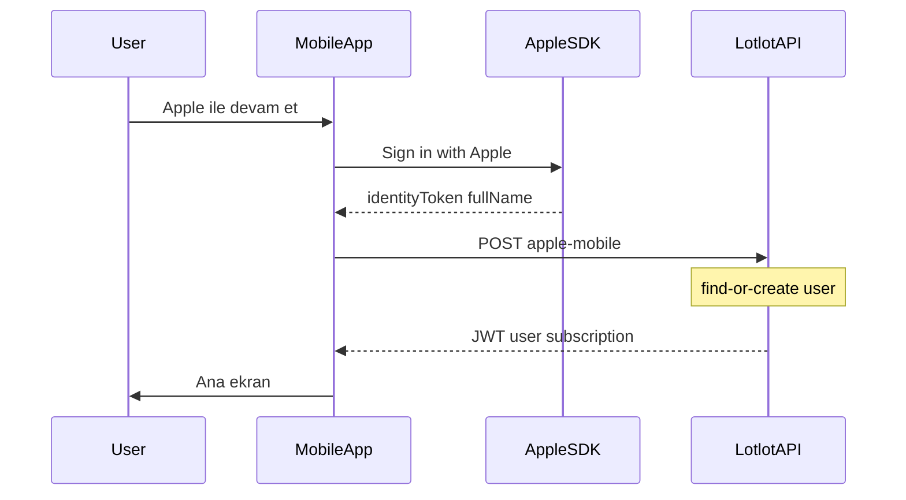

### 8.6 Turnstile WebView köprüsü — `GET /mobile/turnstile`

E-posta/şifre kayıt ve (gerekirse) login için Turnstile token almak üzere in-app WebView açın.

**Akış diyagramı (Turnstile köprüsü — lazy WebView):**

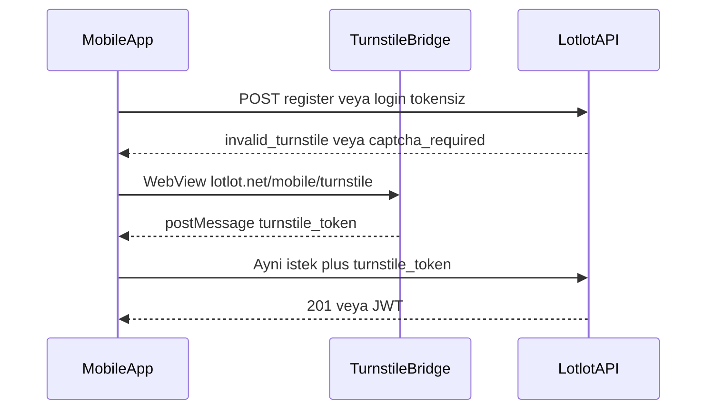

**Prod URL zorunlu:**

```text
https://lotlot.net/mobile/turnstile
```

Cloudflare site key hostname'e bağlıdır. **`localhost`, `127.0.0.1` veya geliştirme portu (`:5000`) ile köprü açmayın** — widget yüklenmez veya token doğrulanmaz. Yerel backend testinde bile köprü URL'si prod hostname olmalıdır.

**Ops notu:** Sunucuda `TURNSTILE_SITE_KEY` tanımlı değilse `GET /mobile/turnstile` **404** döner; prod'da e-posta auth için key zorunludur.

Sayfa Cloudflare Turnstile widget'ını `appearance: interaction-only` ile yükler: çoğu oturumda challenge otomatik tamamlanır; risk skoru yüksekse kullanıcıdan kutuya dokunması istenebilir — bu normal davranıştır, bypass yoktur.

Token **iletimi** otomatiktir (`postMessage`); challenge **her zaman** otomatik değildir.

**React Native WebView:**

```javascript
<WebView
  source={{ uri: 'https://lotlot.net/mobile/turnstile' }}
  onMessage={(event) => {
    const data = JSON.parse(event.nativeEvent.data);
    const token = data.turnstile_token;
    if (!token) return; // expired/error boş string — yok sayın
    // Sonra POST /api/auth/register veya /login gövdesine turnstile_token ekleyin
  }}
/>
```

**postMessage sözleşmesi (JSON string):**

```json
{ "turnstile_token": "<Cloudflare response token>" }
```

Boş `turnstile_token` (süre dolumu/hata) mobil tarafça yok sayılmalıdır; mevcut köprü davranışı korunur.

Ek köprüler: `window.parent.postMessage({ turnstile_token }, '*')` (generic WebView), iOS `webkit.messageHandlers.turnstileBridge`.

Sayfa `noindex` işaretlidir; yalnızca token iletir — oturum açmaz. Google/Apple OAuth akışlarında bu köprü **kullanılmaz**.

### 8.7 Hesap birleştirme (web parity)

- Aynı e-posta ile daha önce **e-posta/şifre** veya **diğer OAuth** ile kayıtlı hesap varsa mobil OAuth **mevcut hesaba giriş yapar** (yeni duplicate hesap oluşturmaz).
- Provider kontrolü zorunlu değildir; e-posta eşleşmesi yeterlidir (web ile aynı).
- Inactive hesap → OAuth mobil endpoint'leri `403 inactive_user` döner.

### 8.8 Auth senaryo özeti (mobil)

Tüm kimlik akışları tek bakışta:

| Senaryo | Endpoint / URL | Turnstile | Başarı sonrası |
|---------|----------------|-----------|----------------|
| **E-posta kayıt** | `POST /api/auth/register` (+ lazy köprü) | Evet (prod her kayıt) | `201 pending_verification` — JWT **yok** |
| **E-posta giriş** | `POST /api/auth/login` (+ lazy köprü eşik sonrası) | Eşik sonrası | JWT + `user` + `subscription` |
| **Google kayıt/giriş** | `POST /api/auth/google-mobile` | **Hayır** | JWT (yeni veya mevcut hesap) |
| **Apple kayıt/giriş** | `POST /api/auth/apple-mobile` | **Hayır** | JWT (yeni veya mevcut hesap) |
| **E-posta doğrulama** | Mail → `GET https://lotlot.net/verify-email/<token>` (web) | Hayır | Sonra mobil `POST /login` |
| **Doğrulama maili tekrar** | `POST /api/auth/resend-verification` | Hayır (JSON API) | `200` generic mesaj |
| **Şifre sıfırlama** | WebView `https://lotlot.net/login` → mail → `reset-password/<token>` | Web form (mobil JSON yok) | Mobil `POST /login` |
| **Oturum kontrolü** | `GET /api/auth/me` | — | State güncelle |
| **Token yenileme** | `POST /api/auth/refresh` | — | Yeni token çifti |
| **Çıkış** | `POST /api/auth/logout` + local token sil | — | Login ekranı |

**OAuth kayıt = giriş:** Google/Apple için ayrı register ekranı veya endpoint gerekmez; backend e-posta eşleşmesiyle hesap birleştirir (§8.7).

**E-posta kayıt ≠ OAuth:** E-posta kayıtta JWT gelmez; e-posta doğrulama zorunludur. OAuth'ta e-posta provider tarafından doğrulanmış kabul edilir.

**Auth genel akış (özet):**

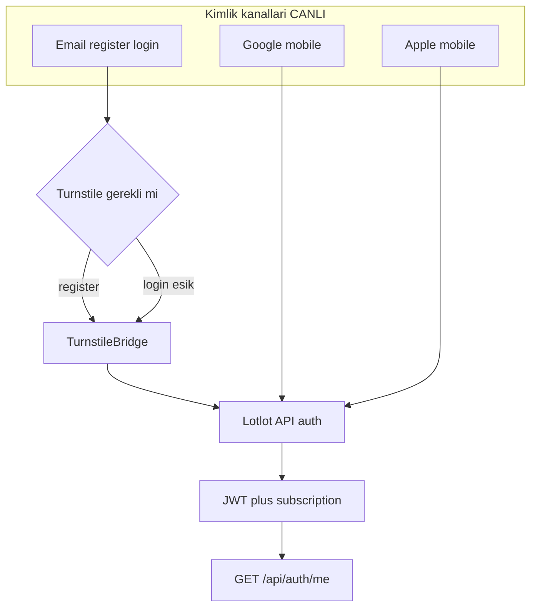

**Logout / hesap silme:**

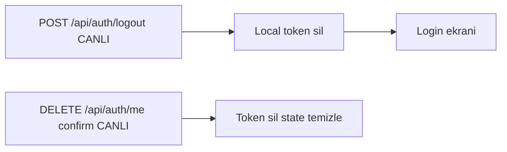

## 9. Kullanıcı ve Subscription Bilgisi

Mobil kullanıcı bilgisini her zaman backend'den almalıdır:

```http
GET /api/auth/me
```

Bu response içindeki `subscription` mobil için ana yetki kaynağıdır. **Login, Google mobile ve Apple mobile** yanıtlarında da aynı `subscription` bloğu döner.

Önemli alanlar:

- `tier`: Backend iç tier değeri. Örnek: `free`, `pro`, `premium`.
- `tier_alias`: Mobil gösterim uyumluluğu. Free için `standard` döner.
- `label`: Kullanıcıya gösterilecek label. Örnek: `Ücretsiz`, `Pro`, `Premium`.
- `is_pro`: Pro ve üzeri özellikler açık mı?
- `is_premium`: Premium özellikler açık mı? (Backend `subscription_expires_at` geçmişse ve geçerli ödenmiş sipariş/tutuş yoksa `false` — yalnız DB `is_premium=true` bayrağı yetmez.)
- `trial_active`: Trial hakkı aktif mi?
- `remaining_seconds`: Varsa kalan süre.
- `watchlist_limit`: Backend'in izin verdiği aktif watchlist limiti.
- `monthly_watchlist_mutation_limit`: Aylık ekleme/çıkarma limiti. `null` ise sınırsız.
- `chart_alert_limit`: Pro+ grafik uyarı kotası (Free: `0`, Pro: `20`, Premium: `40`).
- `billing`: Garanti abonelik durumu (`enabled`, `active`, `plan`, `status`, `payments_completed`, `cancel_at_period_end`, …). Mobil tier kararını **yalnızca** `tier` / `is_pro` / `is_premium` ile verir; ödeme detayı gösterim içindir. Web yenilemede banka history mutabakatı + (sonuç bilinmiyorken) kısa tutuş backend’de çözülür; mobil ekstra mantık eklemez. Son başarılı ödemeden eski veya aynı gün içindeki belirsiz ret kayıtları yenileme reddi sayılmaz.

`user` nesnesinde ( `/api/auth/me`, login, refresh ):

- `full_name`, `avatar_url`, `provider` — profil gösterimi
- `push_notifications` (boolean): Kullanıcı hesabında push kanalları açık mı? `false` ise FCM/socket/web push gönderilmez.
- `email_notifications` (boolean): E-posta bildirim tercihi (mobil yalnızca gösterir/günceller).

Güncelleme:

```http
PATCH /api/auth/me
Authorization: Bearer ACCESS_TOKEN
Content-Type: application/json

{"push_notifications": true}
```

Başarılı yanıt: `{"status":"success","user":{...},"subscription":{...}}`. Desteklenmeyen alanlar → `400` + `no_supported_fields`.

Mevcut uygulama kuralı:

- Ücretsiz: `watchlist_limit = 10`, aylık mutation limiti `10`, `chart_alert_limit = 0`
- Pro: `watchlist_limit = 50`, aylık mutation limiti `100`, `chart_alert_limit = 20`
- Premium: `watchlist_limit = 100`, aylık mutation limiti `null`, `chart_alert_limit = 40`

Mobil bu limitleri sadece gösterir; limit kontrolünü backend yapar.

### Billing ve Abonelik (Pro / Premium)

Bu alt bölüm web (Garanti) ve mobil (Apple IAP / Google Play Billing) ödeme kanallarını açıklar. **Entitlement kararı her zaman backend'dedir** — mobil yalnızca `subscription.tier`, `is_pro`, `is_premium` render eder.

### 9.1 Entitlement okuma — `GET /api/auth/me` **CANLI**

Abonelik durumunu okumak için birincil endpoint:

```http
GET /api/auth/me
Authorization: Bearer ACCESS_TOKEN
```

Mobil **asla** tier hesaplamaz. Paywall kilidi, watchlist limiti, Pro/Premium özellikleri backend'in döndürdüğü alanlara göre gösterilir:

| Alan | Kullanım |
|------|----------|
| `subscription.tier` | `free` / `pro` / `premium` |
| `subscription.is_pro` | Pro+ özellikler |
| `subscription.is_premium` | Premium özellikler |
| `subscription.trial_active` | Trial banner |
| `subscription.billing` | Ödeme kanalı detayı (gösterim) |
| `subscription.billing.purchase_channel` | **CANLI:** `web` \| `apple` \| `google_play` (aktif ödeme kaydı varsa) |

Ödeme sonrası (IAP veya web) mutlaka `/api/auth/me` yenileyin.

### 9.2 Billing mimari — web vs mobil

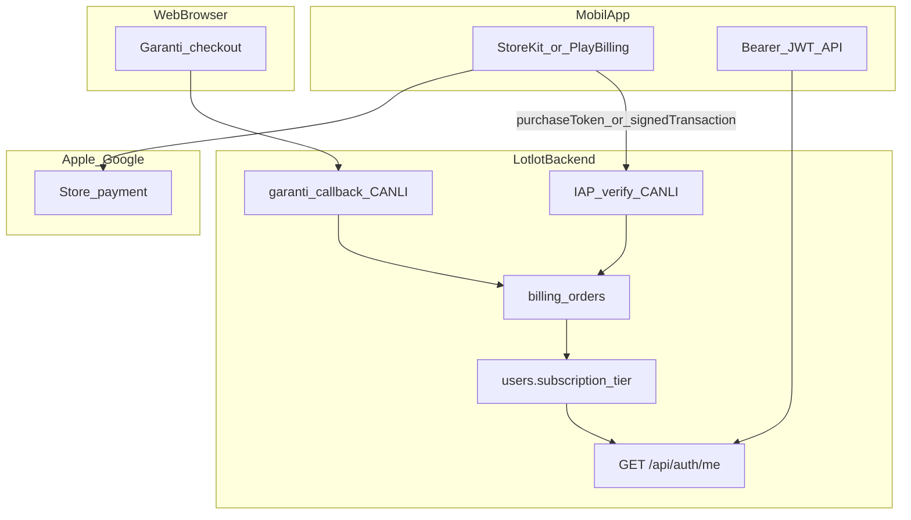

| Kanal | Kim öder | Backend provider | Mobil durum |
|-------|----------|------------------|-------------|
| Web tarayıcı | Garanti kart | `garanti` | Okuma CANLI; checkout yalnızca **web tarayıcı** (mobil uygulama içi **değil**) |
| iOS App Store | Apple IAP | `apple` (**CANLI**) | StoreKit + verify API — **iOS’ta tek satın alma yolu** |
| Google Play | Play Billing | `google_play` (**CANLI**) | Play Billing Library + verify API — Android dijital abonelik |

**App Store (Guideline 3.1.1):** iOS uygulaması içinde Pro/Premium dijital abonelik **yalnızca StoreKit IAP** ile satın alınabilir. Garanti, harici kart, WebView checkout veya “web’de öde” yönlendirmesi **reddedilir** (§9.3.1). Web’de Garanti ile alınmış abonelik, 3.1.3(b) kapsamında uygulama içinde **erişilebilir** olabilir; uygulama içinden **yeni satın alma** yine IAP olmalıdır.

### 9.3 Web Garanti abonelik **CANLI** (kod hazır; `BILLING_ENABLED=1` env)

Web kullanıcıları **tarayıcıda** `lotlot.net` üzerinden Garanti sanal POS ile Pro/Premium satın alır. Mobil uygulama bu kanalı **okuyabilir** (`subscription.billing`) ancak **iOS/Android uygulama içinden Garanti checkout açılmaz**.

#### 9.3.1 iOS — App Store Guideline 3.1.1 (zorunlu)

Apple App Review (**Guideline 3.1.1 — In-App Purchase**) dijital abonelikler için uygulama içinde **yalnızca IAP** kabul eder. Lotlot prod incelemesinde (2026-06-22) aşağıdaki gerekçe ile red alınmıştır:

> *The subscriptions can be purchased in the app using payment mechanisms other than In-App Purchase.*

**iOS uygulamasında YASAK (App Review red sebebi):**

- In-app WebView / Safari View Controller ile `lotlot.net/billing/checkout` veya Garanti POS
- Uygulama içi “kart ile öde”, “web siteden yükselt” veya harici ödeme linki ile **yeni** abonelik satışı
- Garanti / banka kartı / Apple Pay (cüzdan) ile dijital abonelik satışı (abonelik = **StoreKit IAP**)

**iOS uygulamasında İZİNLİ:**

- `GET /api/auth/me` ile mevcut tier okuma (web Garanti, IAP veya trial — backend karar verir)
- Web’de (Safari **dışında**, kullanıcı kendi tarayıcısında) alınmış aboneliğe **giriş yapıp erişim** — Apple [3.1.3(b) Multiplatform Services](https://developer.apple.com/app-store/review/guidelines/#business) (erişim evet; uygulama içi satın alma yine IAP)
- StoreKit ile yeni satın alma + Restore Purchases + `POST /api/billing/iap/verify` (**CANLI**, `IAP_ENABLED=1`)
- Abonelik yönetimi / iptal: iOS Ayarlar → Abonelikler (App Store)

**Mobil ekip:** Paywall’da iOS için **yalnızca StoreKit ürün fiyatları** ve IAP akışı. Garanti / harici kart / `billing/checkout` WebView **kesinlikle yok** (§28).

**Akış diyagramı (web Garanti → VT):**

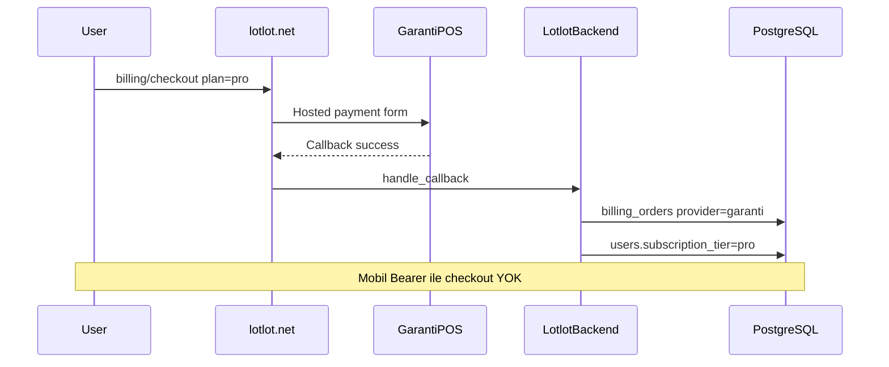

| İhtiyaç | Yöntem | Durum |
|---------|--------|--------|
| Abonelik durumu (mobil) | `GET /api/auth/me` → `subscription.billing` | **CANLI** |
| Plan yükseltme (**web**) | Tarayıcı `https://lotlot.net/billing/checkout?plan=pro` (session) | **WEB_ONLY** — mobil **uygulama içi değil** |
| Plan yükseltme (**iOS app**) | StoreKit IAP → verify API | **CANLI** — Garanti **yasak** |
| Plan yükseltme (**Android app**) | Google Play Billing → verify API | **CANLI** |
| İptal (web) | Web `POST /billing/cancel` veya dashboard | **WEB_ONLY** |

Fiyat referansı (web): Pro 89 TL/ay, Premium 129 TL/ay (`PLAN_AMOUNTS_KURUS` — store fiyatları IAP'te ayrı tanımlanır).

### 9.4 Apple App Store IAP **CANLI** (`IAP_ENABLED=1`)

Mobil iOS uygulaması **StoreKit 2** kullanır. Ödeme Apple üzerinden tahsil edilir; Lotlot backend yalnızca doğrular ve VT günceller.

#### App Store Connect (mobilci + backend koordinasyon)

1. **Subscription Group:** `lotlot_subscriptions`
2. **Product ID eşlemesi (hedef):**

| Product ID | Tier | Süre |
|------------|------|------|
| `lotlot_pro_monthly` | `pro` | 1 ay auto-renew |
| `lotlot_premium_monthly` | `premium` | 1 ay auto-renew |

3. Sandbox tester hesapları oluştur
4. Backend ship sonrası: App Store Server Notifications V2 URL kaydet

#### Satın alma akışı

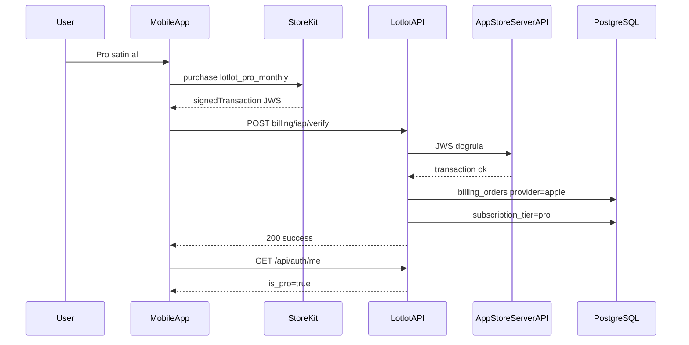

#### API isteği **CANLI**

```http
POST /api/billing/iap/verify
Authorization: Bearer ACCESS_TOKEN
Content-Type: application/json

{
  "platform": "apple",
  "product_id": "lotlot_pro_monthly",
  "signed_transaction": "<StoreKit 2 JWS>"
}
```

Başarılı yanıt: `200`, `{"status":"success","subscription":{...}}` — login / `/me` ile aynı `subscription` bloğu.

Mobil yapılacaklar:
- Satın alma sonrası **hemen** verify çağır
- **Restore Purchases** → `POST /api/billing/iap/restore` (**CANLI**)
- Verify sonrası `GET /api/auth/me` ile UI yenile

### 9.5 Google Play Billing **CANLI** (`IAP_ENABLED=1`)

Android uygulaması **Google Play Billing Library 6+** kullanır.

#### Play Console (mobilci)

1. Subscription oluştur: `lotlot_pro_monthly`, `lotlot_premium_monthly`
2. Base plan + fiyat (TRY)
3. License testers ekle
4. RTDN (Real-time Developer Notifications) → `POST /webhooks/google/play` (**CANLI** uç; Pub/Sub prod kurulumu gerekir)

#### Satın alma akışı

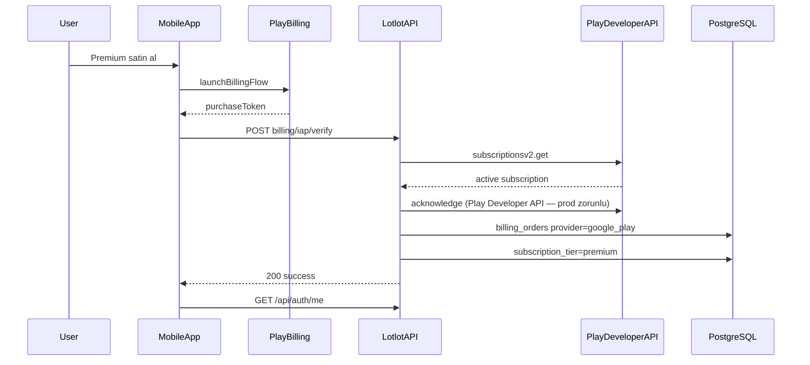

#### API isteği **CANLI**

```http
POST /api/billing/iap/verify
Authorization: Bearer ACCESS_TOKEN
Content-Type: application/json

{
  "platform": "google",
  "product_id": "lotlot_premium_monthly",
  "purchase_token": "<Play purchaseToken>"
}
```

**Google kuralı:** Satın alma sonrası 3 gün içinde backend acknowledge etmezse otomatik refund (Play Developer API ile; prod credential gerekir).

### 9.6 Backend VT rolü (mobilcinin bilmesi gereken minimum)

Backend **tek entitlement otoritesidir**. Mobil VT'ye doğrudan yazmaz.

| VT / API | Rol |
|----------|-----|
| `users.subscription_tier` | `free` / `pro` / `premium` — API'de görünen tier |
| `users.subscription_expires_at` | Süre bitince tier düşer (süresi geçmiş + yalnız legacy `is_premium` bayrağı Premium vermez) |
| `users.subscription_source` | `trial`, `billing`, `apple_iap`, … |
| `billing_orders` | Kanal kaydı: `provider` = `garanti` \| `apple` \| `google_play` |
| `billing_events` | Audit: renewal, refund, cancel, dunning mail |
| `subscription.billing` (JSON) | Mobil gösterim; **karar `tier` ile** |

**Webhook yenileme / iptal (CANLI uç, v1 minimal işleyici):**

Apple / Google webhook uçları prod’da kayıtlı olabilir; v1 sürümü bildirimi kabul eder ve loglar. Otomatik tier düşürme / yenileme senkronizasyonu genişletilebilir — mobil **her zaman** `/me` ile güncel tier okur.

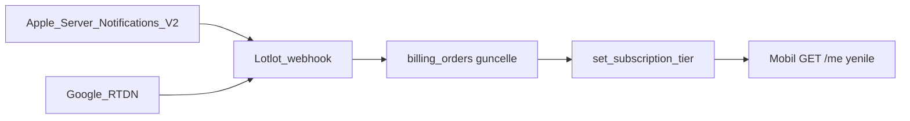

### 9.7 Kanal çakışması politikası (aynı hesap)

Aynı e-posta ile web Garanti + mobil IAP mümkündür. Önerilen kurallar:

| Durum | Davranış |
|-------|----------|
| Web Garanti aktif + IAP satın alma | IAP verify başarılı → tier yükselt; web order `cancel_at_period_end` (**CANLI**) |
| IAP aktif + web checkout | Kullanıcıya "App Store / Play aboneliğinizi yönetin" mesajı |
| İptal IAP | Kullanıcıyı iOS Ayarlar / Play Abonelikler'e yönlendir — mobil JSON cancel yok |
| İptal web | Web `POST /billing/cancel` veya dashboard (**WEB_ONLY**) |

Mobil uygulama çakışmayı **çözmez**; backend yanıtına ve `/me` state'ine güvenir.

### 9.8 IAP API sözleşmesi **CANLI** (`IAP_ENABLED=1`)

| Endpoint | Auth | Açıklama |
|----------|------|----------|
| `GET /api/billing/iap/config` | Yok (public) | Paywall öncesi yapılandırma — yanıt gövdesi aşağıda |
| `POST /api/billing/iap/verify` | Bearer JWT | Satın alma sonrası token doğrula + tier güncelle |
| `POST /api/billing/iap/restore` | Bearer JWT | Mevcut store aboneliklerini hesaba bağla |
| `POST /webhooks/apple/iap` | Apple JWS | Renewal, refund, grace period (v1 minimal — log/accept) |
| `POST /webhooks/google/play` | Pub/Sub push | RTDN olayları (v1 minimal) |

**Config yanıtı (`GET /api/billing/iap/config`):**

```json
{
  "status": "success",
  "iap": {
    "enabled": true,
    "verify_ready": true,
    "platforms": {
      "apple": true,
      "google_play": true
    },
    "products": {
      "lotlot_pro_monthly": "pro",
      "lotlot_premium_monthly": "premium"
    }
  }
}
```

Alanlar `iap` nesnesi altındadır. `platforms.google_play` anahtarı kullanılır (`google` değil). `verify_ready=false` ise satın alma UI gösterilebilir ancak verify 503 dönebilir.

**Verify / restore istek gövdeleri:** snake_case örnekler aşağıdadır; backend ayrıca camelCase alias kabul eder (`signedTransaction`, `purchaseToken`, `productId`, `signedTransactions`).

**Verify hata kodları:**

| HTTP | `error` | Anlam |
|------|---------|--------|
| 401 | `missing_bearer_token` | Authorization header yok |
| 401 | `invalid_token` | JWT geçersiz veya süresi dolmuş |
| 401 | `invalid_token_type` | Refresh token verify'de kullanılmış |
| 400 | `invalid_receipt` | Store token geçersiz / süresi dolmuş |
| 400 | `product_mismatch` | product_id tanınmıyor |
| 409 | `already_subscribed` | Aynı tier aktif |
| 409 | `receipt_owned_by_other_account` | Store makbuzu başka Lotlot hesabına bağlı |
| 503 | `billing_disabled` | `IAP_ENABLED=0` |
| 503 | `iap_provider_unavailable` | Apple/Google credential eksik |
| 503 | `google_acknowledge_failed` | Play acknowledge başarısız |

**Restore isteği:**

```json
{
  "platform": "apple",
  "signed_transactions": ["<JWS1>", "<JWS2>"]
}
```

```json
{
  "platform": "google",
  "purchases": [
    {"product_id": "lotlot_pro_monthly", "purchase_token": "..."}
  ]
}
```

### 9.9 App Store / Play Console checklist (mobilci)

**Apple (App Store Connect):**
- [ ] Subscription group + product ID'ler (§9.4 tablo)
- [ ] Sandbox tester
- [ ] StoreKit 2 entegrasyonu + Restore
- [ ] Paywall ekranı — fiyat store'dan (`Product.displayPrice`)
- [ ] Satın alma sonrası verify + `/me` refresh (prod `IAP_ENABLED=1`)

**Google (Play Console):**
- [ ] Subscription + base plan
- [ ] License testers
- [ ] Billing Library 6+ + acknowledge akışı
- [ ] Play Integrity (önerilir, fraud azaltır)

**Her iki platform:**
- [ ] Paywall: `is_pro` / `is_premium` backend'den; client-side unlock yok
- [ ] Satın alma sonrası loading → verify → `/me` refresh
- [ ] Paywall: Garanti / WebView checkout **yok** (iOS §28)

---

## 10. Watchlist Listeleme

Endpoint:

```http
GET /api/watchlist
```

Header:

```http
Authorization: Bearer ACCESS_TOKEN
```

Başarılı response:

```json
{
  "status": "success",
  "user_id": 123,
  "watchlist": [
    {
      "id": 1,
      "symbol": "THYAO",
      "name": "Türk Hava Yolları",
      "notes": null,
      "alert_enabled": true,
      "alert_threshold_buy": null,
      "alert_threshold_sell": null,
      "active": true,
      "disabled_reason": null,
      "created_at": "2026-04-30T10:00:00"
    },
    {
      "id": 2,
      "symbol": "ASELS",
      "name": "Aselsan",
      "active": false,
      "disabled_reason": "tier_limit",
      "created_at": "2026-04-30T10:05:00"
    }
  ],
  "subscription": {
    "tier": "free",
    "tier_alias": "standard",
    "label": "Ücretsiz",
    "watchlist_limit": 10,
    "watchlist_active_count": 10,
    "watchlist_inactive_count": 2,
    "monthly_watchlist_mutations_used": 3,
    "monthly_watchlist_mutations_remaining": 7
  },
  "disabled_count": 2
}
```

Mobil gösterim önerisi:

- `active=true`: Normal watchlist item.
- `active=false`, `disabled_reason=tier_limit`: Kullanıcı limit düşüşü nedeniyle pasif item. Gri/disabled gösterilebilir.
- `subscription.watchlist_active_count / watchlist_limit`: Kota barı için kullanılabilir.
- `monthly_watchlist_mutations_remaining`: Bu ay kaç ekleme/çıkarma hakkı kaldığını göstermek için kullanılabilir.

## 11. Watchlist Ekleme

Endpoint:

```http
POST /api/watchlist
```

Request:

```json
{
  "symbol": "THYAO",
  "notes": "Takip edilecek",
  "alert_enabled": true,
  "alert_threshold_buy": 250,
  "alert_threshold_sell": 300
}
```

Minimum request:

```json
{
  "symbol": "THYAO"
}
```

Başarılı response:

```json
{
  "status": "success",
  "item": {
    "id": 1,
    "symbol": "THYAO",
    "name": "Türk Hava Yolları",
    "active": true,
    "disabled_reason": null
  },
  "subscription": {}
}
```

Olası hatalar:

- `401`: Token yok/geçersiz.
- `403 email_not_verified`: E-posta doğrulaması gerekli.
- `403 watchlist_limit_exceeded`: Aktif watchlist limiti dolu.
- `403 monthly_watchlist_quota_exceeded`: Aylık ekleme/çıkarma hakkı dolu.
- `404 stock not found`: Sembol bulunamadı.
- `400 stock is not active`: Sembol sistemde var ama aktif değil.

Mobil bu hatalarda backend'den gelen `message` ve `subscription` bilgisini kullanmalıdır.

## 12. Watchlist Güncelleme

Endpoint:

```http
PUT /api/watchlist/<symbol>
PATCH /api/watchlist/<symbol>
```

Request:

```json
{
  "notes": "Yeni not",
  "alert_enabled": false,
  "alert_threshold_buy": 100,
  "alert_threshold_sell": 120
}
```

Başarılı response:

```json
{
  "status": "success",
  "item": {}
}
```

## 13. Watchlist Silme

Endpoint:

```http
DELETE /api/watchlist/<symbol>
```

Başarılı response:

```json
{
  "status": "success",
  "message": "THYAO removed",
  "subscription": {}
}
```

Silme de aylık mutation kotasına dahildir.

## 14. Watchlist Tahminleri

Endpoint:

```http
GET /api/watchlist/predictions
```

Bu endpoint sadece aktif watchlist sembolleri için tahmin döndürür. Pasif semboller prediction hesabına dahil edilmez.

Başarılı response ana alanları:

```json
{
  "status": "success",
  "count": 1,
  "items": [
    {
      "symbol": "THYAO",
      "current_price": 250.5,
      "predictions_by_horizon": {
        "1d": 253.1,
        "3d": 258.2,
        "7d": 265.0
      },
      "confidences_by_horizon": {
        "1d": 0.62,
        "3d": 0.58,
        "7d": 0.55
      },
      "models_by_horizon": {
        "1d": "enhanced",
        "3d": "basic"
      },
      "overall_signal": "BUY",
      "overall_confidence": 0.71,
      "signals_by_horizon": {
        "1d": {
          "delta_pct": 0.0103,
          "model_confidence": 0.62,
          "model_confidence_pct": 62,
          "genel_confidence": 0.71,
          "genel_confidence_pct": 71,
          "action": "AL",
          "action_type": "BULLISH",
          "label": "Yukari yonlu analiz",
          "summary_tr": "Secili ufukta yukari yonlu analiz cikti.",
          "display_state": "actionable_bullish",
          "model_health": {
            "status": "ready",
            "hpo_completed": true
          },
          "analysis_disclaimer_tr": "Genel Sinyal Gucu olasilik veya yatirim tavsiyesi degildir; model, formasyon ve haber katmanlarinin birlesik skor gostergesidir.",
          "reason_code": "actionable"
        }
      },
      "model_health": {
        "status": "ready",
        "primary_horizon_ready": true,
        "hpo_completed_horizons": ["1d"],
        "selected_horizon": "7d"
      },
      "ml_unified": {},
      "stale": false,
      "stale_seconds": 120
    }
  ],
  "params_generated_at": "2026-04-30T10:00:00",
  "thresholds_by_horizon": {
    "1d": {
      "delta_thr": 0.012,
      "conf_thr": 0.5
    }
  }
}
```

Mobil gösterim için önerilen alanlar:

- Kart başlığı: `symbol`
- Güncel fiyat: `current_price`
- Horizon tabları: `1d`, `3d`, `7d`, `14d`, `30d`
- Tahmin fiyatı (hedef): `predictions_by_horizon[horizon]`
- Ham model güveni (0–1): `confidences_by_horizon[horizon]`
- Model güven yüzdesi (0–100): `signals_by_horizon[horizon].model_confidence_pct` (bu alan **`signals_by_horizon` içindedir**, kökte düz `model_confidence_pct` yoktur)
- Genel güven (ML unified kaynaklı): `signals_by_horizon[horizon].genel_confidence` ve `genel_confidence_pct`
- Çubuk rengi tipi (backend): `signals_by_horizon[horizon].confidence_bar_type` — `buy` | `sell` | `warning` | `hold` (mobil kendi %70 kuralı üretmemeli)
- Çubuk eşikleri: `signals_by_horizon[horizon].confidence_bar_thresholds` — `{ "strong_pct": 64, "caution_pct": 45 }`
- Aksiyon etiketi: `signals_by_horizon[horizon].label`
- Aksiyon tipi: `signals_by_horizon[horizon].action_type`
- Kısa gerekçe: `signals_by_horizon[horizon].summary_tr`
- UI durumu: `signals_by_horizon[horizon].display_state`
- Sembol model sağlığı: `model_health.status`, `model_health.selected_horizon`
- Pro/Premium skor detayı: `signals_by_horizon[horizon].confidence_meta` (Free'de yok)
- Birleşik ML özeti: `ml_unified` (backend üretir)
- Bayat veri uyarısı: `stale=true` veya yüksek `stale_seconds`

Geriye dönük uyumluluk için her öğede bazen kök seviyede `predictions` haritası da döner (`1d`, `3d`, … ve `1d_conf` gibi `*_conf` anahtarları); yeni istemciler `predictions_by_horizon` / `confidences_by_horizon` kullanmalıdır.

Mobil şunları hesaplamamalı:

- `delta_pct`
- `action`
- `action_type`
- `label`
- `reason_code`
- `summary_tr`
- `display_state`
- `genel_confidence`
- `confidence_bar_type`
- `ml_unified`

Bu alanlar backend kararıdır.

## 15. Batch Prediction

Birden fazla sembol için tahmin almak için:

```http
POST /api/batch/predictions
```

Request:

```json
{
  "symbols": ["THYAO", "ASELS", "GARAN"]
}
```

Bu endpoint mobilde arama sonucu, portföy ekranı veya watchlist dışı toplu gösterimler için kullanılabilir. Response içinde `results`, `signals_by_horizon`, `ml_unified`, `thresholds_by_horizon` gibi backend hesaplı alanlar bulunur.

### 15.1 `POST /api/batch/pattern-analysis`

Çok sembollü **önbellek-odaklı** analiz; taze `analyze_stock` hesabı yapmaz.

```http
POST /api/batch/pattern-analysis
Authorization: Bearer ACCESS_TOKEN
Content-Type: application/json
```

Request:

```json
{
  "symbols": ["THYAO", "AKBNK", "GARAN"]
}
```

Kurallar:

- 1–50 sembol; aksi `400` ve `Provide 1-50 symbols`.
- Sembol adı `A-Z0-9.` ve en fazla 12 karakter; geçersizler sessizce atlanabilir.
- Her sembol için bellek/Redis, sonra dosya `pattern_cache`, gerekirse `chart_cache` tabanlı düşük maliyetli yedek; hâlâ yoksa `{ "symbol": "X", "status": "pending" }`.
- Pro olmayan kullanıcıda pattern alanları tek sembol uçsundaki gibi budanabilir.
- Pro kullanıcıda `news_context` ve FINGPT pattern alanları dönebilir (ayrıntı §16.1.1).

Başarılı yanıt:

```json
{
  "status": "success",
  "results": {
    "THYAO": { "symbol": "THYAO", "status": "success" },
    "GARAN": { "symbol": "GARAN", "status": "pending" }
  },
  "count": 2,
  "timestamp": "2026-05-01T12:00:00"
}
```

## 16. Pattern Analysis, Chart Data ve OHLC

Bu üç endpoint `Authorization: Bearer` ister (session cookie ile de çalışan web tarayıcı kuralı mobilde geçerli değildir; mobil sadece Bearer kullanmalıdır).

### 16.1 `GET /api/pattern-analysis/<symbol>`

Varsayılan davranış: **ağır hesap yapmaz**; önce bellek/Redis, sonra `pattern_cache` dosya önbelleği okunur. Önbellek yoksa:

```json
{
  "symbol": "THYAO",
  "status": "pending"
}
```

Query parametreleri:

| Parametre | Anlam | Varsayılan |
|-----------|--------|------------|
| `fast` | `1` iken önbellek-only akış; `0` iken cache miss’ta sunucunun hesap açmasına izin verilir (`compute_on_miss`) ancak sunucuda ek güvenlik kapıları vardır | `1` |
| `compute` | `1` iken zorunlu yeniden analiz (cache bypass); production’da çoğu zaman **kapalı**dır — yalnızca `ENABLE_PUBLIC_PATTERN_COMPUTE` ve dahili token ile sınırlıdır | `0` |

Yetki:

- **Standart (free) kullanıcı:** Formasyon / pattern listesi sunucu tarafında budanabilir (`patterns` boş veya kısıtlı).
- **Pro kullanıcı:** Pattern içeriği daha tam döner (sunucu `is_pro_user` ile karar verir).

Mobil bu ayrımı **sunucuya bırakır**; gelen JSON’u render eder.

Başarılı tam analiz gövdesi `analyze_stock` sözleşmesine uyar (ör. `patterns`, `enhanced_predictions`, `ml_unified`, bayatlık meta verileri); tam alan listesi backend versiyonuna göre genişleyebilir.

#### 16.1.1 Pro-only haber katmanı (`news_context` ve FINGPT)

**Standart (free) kullanıcı:** Sunucu `patterns` listesini boşaltır ve `news_context` alanını yanıttan **kaldırır** (`prune_patterns_for_access`).

**Pro kullanıcı:** Her başarılı okumada sunucu `news_analysis_map` dosya önbelleğinden taze `news_context` üretir (Ollama tetiklenmez).

`news_context` örnek gövdesi:

```json
{
  "version": 1,
  "symbol": "THYAO",
  "news_count": 2,
  "display_direction": "bullish",
  "overall_sentiment": "positive",
  "confidence": 0.72,
  "bullish_count": 1,
  "bearish_count": 0,
  "neutral_count": 1,
  "latest_pub_timestamp": 1712500000.0,
  "built_at": "2026-04-07T12:00:00+00:00",
  "ml_evidence_pending": true,
  "news_ml_integration": "preview",
  "items": [
    {
      "title": "THYAO olumlu gelişme",
      "source": "rss",
      "direction": "bullish",
      "confidence": 0.8,
      "reason": "Kısa gerekçe metni",
      "matched_via": "THYAO",
      "published_at": "Mon, 7 Apr 2026 10:00:00 GMT",
      "pub_timestamp": 1712500000.0
    }
  ]
}
```

| Alan | Anlam |
|------|--------|
| `display_direction` | `bullish` / `bearish` / `neutral` — rozet yönü |
| `news_ml_integration` | `applied` (FINGPT pattern var), `preview` (haber var, FINGPT yok), `none` |
| `ml_evidence_pending` | Geriye uyum: `news_ml_integration === "preview"` ile aynı |
| `built_at` | Sunucunun map’ten okuma anı (ISO UTC) |

`patterns[]` içinde `source: "FINGPT"` kaydı varsa haber sinyali **birincil** kaynaktır:

```json
{
  "pattern": "FINGPT_SENTIMENT",
  "source": "FINGPT",
  "signal": "BULLISH",
  "confidence": 0.75,
  "news_count": 3,
  "news_items": ["Başlık 1", "Başlık 2"]
}
```

FINGPT yoksa mobil istemci `news_context.items` + `ml_unified.<horizon>.<model>.evidence` içindeki önizleme alanlarını kullanabilir:

- `sentiment_score_preview`
- `contrib_sentiment_preview`
- `news_evidence_pending`

**Not:** `GET /api/chart-data/<symbol>` yanıtında haber veya `news_context` **taşınmaz**; haber verisi yalnızca pattern-analysis uçlarındadır.

### 16.2 `GET /api/chart-data/<symbol>`

Büyük grafik payload’u (OHLCV + göstergeler + işaretler). Query parametresi:

| Parametre | Aralık | Varsayılan |
|-----------|--------|------------|
| `bars` | 60 ile 900 arası kırpılır | `420` |

Yetki:

- **Pro olmayan kullanıcı:** Yanıtta `forecasts` ve `patterns` genelde **boşaltılır** (sunucu bilerek sızdırmaz).
- **Pro kullanıcı:** Tahmin ve pattern içeriği dönebilir.

Önbellekten “cycle chart cache” hızlı yolu kullanılırsa yanıtta `chart_cache` meta alanı (hit, yaş vb.) bulunabilir.

**`levels` alanı (tüm kullanıcılar):** Yanıt, otomasyon döngüsünde önceden hesaplanan destek/direnç seviyelerini taşır; Pro kilidi yoktur. Alan geriye dönük uyumlu bir eklemedir (eski istemciler yok sayabilir) ve seviye türetilemezse boş nesne dönebilir:

```json
{
  "levels": { "support": 1389.0, "resistance": 2962.5 }
}
```

İstemci bu değerleri grafikte yatay destek/direnç çizgisi olarak gösterebilir; web panelindeki büyük grafik aynı alanı kullanır. Not: `GET /api/public/chart-data/<symbol>` bilinçli olarak minimal kalır ve `levels` taşımaz.

### 16.3 `GET /api/stock-prices/<symbol>`

Veritabanından OHLCV geçmişi (grafik mumları için).

Query parametresi:

| Parametre | Aralık | Varsayılan |
|-----------|--------|------------|
| `days` | 60 ile 365 arası kırpılır | `60` |

Başarılı örnek gövde:

```json
{
  "symbol": "THYAO",
  "name": "Türk Hava Yolları",
  "sector": "Ulaştırma",
  "data": [
    {
      "date": "2026-04-01",
      "open": 250.0,
      "high": 255.0,
      "low": 248.0,
      "close": 252.5,
      "volume": 1000000
    }
  ],
  "total_records": 60
}
```

Olası hatalar: `404` (Hisse bulunamadı / fiyat verisi yok), `500`.

### 16.4 `GET /api/signals/last` (isteğe bağlı)

Sunucudaki `signals_last.json` özetine hızlı okuma (automation cycle sonunda yazılır; **admin API değildir**). Auth: Bearer.

Örnek:

```json
{
  "status": "success",
  "signals": {},
  "timestamp": "2026-05-01T12:00:00"
}
```

Piyasa geneli özet widget için kullanılabilir; watchlist tahminleri için birincil kaynak değildir (`GET /api/watchlist/predictions` kullanın). Production mobil uygulamasında zorunlu değildir.

### 16.5 `GET /api/watchlist/cache-report`

Kullanıcının **aktif** watchlist sembolleri için sunucu tarafında pattern_cache dosyası ve bulk tahmin dosyası var mı özetler (hesap tetiklemez). Debug / “veri neden gecikmeli” teşhisi için.

Auth: Bearer; e-posta doğrulanmamışsa diğer watchlist kuralları geçerlidir.

## 17. Hisse Arama ve Public Liste

Public endpointler (Bearer gerekmez):

```http
GET /api/stocks
GET /api/stocks/search?q=THY
GET /api/stocks/<symbol>/volume-tier
GET /api/public/chart-data/<symbol>?bars=180
GET /api/public/stocks/<symbol>/valuation
GET /api/public/stock-compare?semboller=THYAO,AKBNK
GET /api/public/index-screener?index=bist-30
```

Örnek arama:

```bash
curl -sS "https://lotlot.net/api/stocks/search?q=THY"
```

### 17.1 `GET /api/public/chart-data/<symbol>`

Auth-free OHLCV grafik payload'u. Premium sinyal/formasyon **bilerek sızdırılmaz** (forecasts/patterns boş).

| Parametre | Aralık | Varsayılan |
|-----------|--------|------------|
| `bars` | 60–365 | `180` |

Giriş yapmamış kullanıcı veya hafif grafik önizlemesi için uygundur. Tam Pro grafik + tahmin için `GET /api/chart-data/<symbol>` (Bearer) kullanın.

### 17.2 `GET /api/public/stocks/<symbol>/valuation` **CANLI**

Auth-free **Adil Değer** özeti. Grafik ve yapay zeka fiyat tahminlerinden bağımsızdır. Yatırım tavsiyesi değildir.

| Alan | Açıklama |
|------|----------|
| Kaynak | `stock_valuation_snapshots` (otomasyon ~24 saatte bir yeniler) |
| Auth | Gerekmez |
| Cache | `Cache-Control: public, max-age=3600` |

**Ayrı uç (önemli):** Adil Değer `GET /api/pattern-analysis/<symbol>`, `GET /api/chart-data/<symbol>` veya `GET /api/stock-prices/<symbol>` yanıtlarında **yoktur**. Hisse detay ekranında **ayrı HTTP isteği** ile çekilir (§22). Tier / Pro / Premium kilidi **gerekmez**.

**Web sayfası (`/hisse/<symbol>`):** Aynı `valuation` sözlüğü sunucu tarafında (SSR) şablona gömülür; mobil istemci bu JSON uçtan çeker.

**Başarılı örnek (`200`):**

```json
{
  "status": "success",
  "symbol": "AKBNK",
  "valuation": {
    "status": "partial",
    "current_price": 79.85,
    "fair_value": 106.5,
    "premium_pct": -25.0,
    "valuation_label": "discount",
    "valuation_label_tr": "İskontolu",
    "analyst_mean": 110.0,
    "analyst_median": 105.0,
    "analyst_count": 12,
    "computed_at": "2026-06-24T12:00:00+00:00",
    "models_summary": "analist hedefi + sektör P/B"
  }
}
```

**Veri yok (`200`, henüz hesaplanmamış veya yetersiz kaynak):**

```json
{
  "status": "unavailable",
  "symbol": "A1YEN",
  "valuation": null
}
```

**Mobil UI metni (sabit kopya, API'de taşınmaz):**

- Ana açıklama: kartın güncel fiyatı analist hedefleri ve sektör çarpanlarından türetilen referans değerle karşılaştırdığını ve renkli barın iskontolu / makul / primli bölgeyi gösterdiğini anlatın.

`valuation_label` → bar rengi / konumu: `discount` (İskontolu), `fair` (Makul Bölge), `premium` (Primli). Eşik ±%5.

```bash
curl -sS "https://lotlot.net/api/public/stocks/AKBNK/valuation"
```

**Mobil entegrasyon (özet):**

1. Hisse detay açılışında `GET /api/public/stocks/<symbol>/valuation` (Bearer göndermeyin).
2. `status: "success"` ve `valuation.fair_value` dolu → Adil Değer kartını göster (§17.2 UI metni).
3. `status: "unavailable"` veya `valuation: null` → kartı gizleyin veya “henüz hesaplanmadı” (istemci tarafında fair value **hesaplamayın**).
4. Yanıt `Cache-Control: public, max-age=3600` — aynı sembolde 1 saat içinde gereksiz tekrar istekten kaçının.

### 17.2.1 `GET /api/public/stocks/<symbol>/fundamentals` **CANLI (pilot)**

Auth-free **temel veri** özeti: bilanço (TTM + son yıllar), sektör P/B–P/E kıyası, yabancı yatırımcı payı ve kural tabanlı risk/fırsat maddeleri. Yatırım tavsiyesi değildir.

| Alan | Açıklama |
|------|----------|
| Kaynak | `stock_fundamental_snapshots` ve ilişkili normalize tablolar (otomasyon ~24 saatte bir yeniler) |
| Auth | Gerekmez |
| Cache | `Cache-Control: public, max-age=3600` |
| Kapsam | Prod: `FUNDAMENTALS_ROLLOUT_ALL=1` (tüm aktif semboller); pilot kilidi `FUNDAMENTALS_PILOT_SYMBOLS` ile isteğe bağlı |
| Yabancı değişim | `change_*_pct` alanları **yüzde puan** farkıdır (`ratio_pct` ile aynı birim; göreli % değil). Örnek: 55.0 → 56.5 ⇒ `+1.5` |
| Marj alanları | `gross_margin_pct` / `net_margin_pct`: `revenue_ttm <= 0` ise **`null`** (negatif veya sıfır gelirde oran anlamsız; holding/fon edge-case). Banka profilinde net marj zaten `null` olabilir. |

**Başarılı örnek — endüstri (`200`, ASELS):**

```json
{
  "status": "success",
  "symbol": "ASELS",
  "fundamentals": {
    "status": "success",
    "financial_profile": "industrial",
    "computed_at_tr": "9 Tem 00:15",
    "balance_summary": {
      "display_mode": "industrial",
      "revenue_ttm": 377450780682.0,
      "revenue_ttm_fmt": "377,45 milyar TL",
      "net_income_ttm": 56469340000.0,
      "periods": [{"period_year": 2025, "revenue_fmt": "198,56 milyar TL"}]
    },
    "sector_compare": {
      "pb_ratio": 6.1,
      "sector_pb_median": 4.5,
      "pb_vs_sector_pct": 35.5
    },
    "foreign_ownership": {
      "ratio_pct": 55.77,
      "change_1d_pct": null,
      "change_7d_pct": null,
      "change_30d_pct": null
    },

    "insights": {
      "risks": ["P/B sektör medyanının üzerinde..."],
      "opportunities": ["Gelir yıllık bazda güçlü büyüyor..."]
    }
  }
}
```

**Başarılı örnek — banka (`200`, GARAN, UFRS):**

```json
{
  "status": "success",
  "symbol": "GARAN",
  "fundamentals": {
    "status": "success",
    "financial_profile": "bank",
    "computed_at_tr": "9 Tem 03:15",
    "balance_summary": {
      "display_mode": "bank",
      "interest_income_ttm": 343673974000.0,
      "interest_income_ttm_fmt": "343,67 milyar TL",
      "revenue_ttm": 343673974000.0,
      "revenue_ttm_fmt": "343,67 milyar TL",
      "net_income_ttm": 110604633000.0,
      "net_income_ttm_fmt": "110,60 milyar TL",
      "equity": 444369537000.0,
      "equity_fmt": "444,37 milyar TL",
      "total_assets": 3123456789000.0,
      "total_assets_fmt": "3,12 trilyon TL",
      "roe_pct": 24.9,
      "net_margin_pct": null,
      "debt_to_equity": null,
      "periods": [
        {"period_year": 2025, "revenue_fmt": "343,67 milyar TL", "net_income_fmt": "110,60 milyar TL"}
      ]
    },
    "sector_compare": {
      "pb_ratio": 1.42,
      "pe_ratio": null,
      "sector_pb_median": 1.35,
      "pb_vs_sector_pct": 5.2
    },
    "insights": {
      "risks": ["P/B sektör medyanının üzerinde..."],
      "opportunities": ["Öz kaynak getirisi (ROE) güçlü..."]
    }
  }
}
```

| Alan | Endüstri (`industrial`) | Banka (`bank`) |
|------|-------------------------|----------------|
| `financial_profile` / `balance_summary.display_mode` | `industrial` | `bank` |
| Gelir kartı | `revenue_ttm` (TTM gelir) | `interest_income_ttm` (faiz geliri; `revenue_ttm` ile aynı kaynak) |
| Marj / borç | `net_margin_pct`, `debt_to_equity` dolu olabilir | Genelde `null`; istemci hesaplamasın |
| P/E kıyası | `sector_compare.pe_ratio` anlamlı olabilir | Bankada `pe_ratio` çoğu zaman `null`; P/B + ROE öncelikli |
| Kart gizleme | `revenue_ttm` veya `net_income_ttm` yoksa | `equity` veya `net_income_ttm` yoksa |

**Veri yok (`200`, sigorta veya henüz işlenmemiş):**

```json
{
  "status": "unavailable",
  "symbol": "ANSGR",
  "fundamentals": null
}
```

> **Not:** Mevduat bankaları (`GARAN`, `AKBNK`, …) ve **katılım bankası** `ALBRK` `UFRS` ile doldurulur. Katılım bankalarında öz kaynak satır etiketi farklı olabilir (`ÖZKAYNAK` vs `XVI. ÖZKAYNAKLAR`); backend ayrı normalize desenleri kullanır. **Destek Finans Faktoring** (`DSTKF`) banka listesinde değildir — sanayi formatı (`XI_29`) geçerlidir. Sigorta (`ANSGR`) IFRS 17 ayrı faz (F4); `unavailable` yalnızca backfill öncesi veya geçici hatada beklenir.

**Mobil entegrasyon (özet):**

1. `fundamentals.financial_profile` veya `balance_summary.display_mode` ile kart şablonunu seçin (`bank` vs `industrial`).
2. `status: unavailable` veya `fundamentals: null` → kartı gizleyin.
3. `gross_margin_pct` / `net_margin_pct` **`null`** ise marj satırını gizleyin (gelir ≤ 0 veya banka profili).
4. `insights.risks` / `insights.opportunities` listelerini olduğu gibi gösterin; metni yeniden yazmayın.
3. Endüstri: `revenue_ttm` / `net_income_ttm` doluysa bilanço kartını gösterin.
4. Banka: `interest_income_ttm`, `equity`, `roe_pct` öncelikli; net marj ve borç/öz kaynak **göstermeyin** (API `null` döner).
5. İstemci tarafında marj / sektör sapması **hesaplamayın**; API alanlarını doğrudan kullanın.

```bash
curl -sS "https://lotlot.net/api/public/stocks/ASELS/fundamentals"
curl -sS "https://lotlot.net/api/public/stocks/GARAN/fundamentals"
```

### 17.2.2 `GET /api/public/stocks/<symbol>/corporate` **CANLI**

Auth-free **kurumsal veri** özeti: temettü geçmişi, sermaye artırımları, ortaklık yapısı, KAP son bildirimler / beklenen açıklamalar ve ödenmiş sermaye. Yatırım tavsiyesi değildir.

| Alan | Açıklama |
|------|----------|
| Kaynak | `stock_corporate_snapshots` (otomasyon döngüsü ~24 saatte bir yeniler; ayrı gece cron yok) |
| Auth | Gerekmez |
| Cache | `Cache-Control: public, max-age=3600` |
| Kapsam | Prod: `FUNDAMENTALS_ROLLOUT_ALL=1` + `ENABLE_CORPORATE_UI=1` / `ENABLE_CORPORATE_CYCLE=1` (temel veri ile aynı sembol evreni) |
| Web SSR | `/hisse/<symbol>` kurumsal kart; `rebuild_public_seo_snapshot.py` sonrası önbellekte görünür |
| Analist hedef | Bu uçta **yok** — `GET /api/public/stocks/<symbol>/valuation` içindeki `analyst_mean` / `analyst_count` kullanın |

**Başarılı örnek (`200`, THYAO):**

```json
{
  "status": "success",
  "symbol": "THYAO",
  "corporate": {
    "status": "success",
    "computed_at": "2026-07-14T16:30:00+00:00",
    "dividends": [{"date": "2025-09-02", "amount": 3.442, "amount_fmt": "3.4420 TL"}],
    "splits": [{"date": "2013-06-26", "capital": 1380000000.0, "bonus_from_capital_pct": 15.0}],
    "major_holders": [{"name": "Türkiye Varlık Fonu", "pct": 49.12}],
    "kap_news": [{"date": "09.07.2026", "title": "Kredi Derecelendirmesi", "url": "https://..."}],
    "kap_calendar": [{"subject": "Finansal Rapor", "start_date": "01.07.2026", "end_date": "19.08.2026"}],
    "paid_in_capital": 1380000000.0,
    "paid_in_capital_fmt": "1.38 Mr ₺"
  }
}
```

**Kısmi veri (`status: partial`):** borsapy kaynaklarından biri zaman aşımına uğradıysa mevcut alanlar döner; eksik bloklar boş liste veya `null` olabilir.

**Veri yok (`status: unavailable`):** snapshot henüz üretilmediyse `corporate: null`.

**Mobil entegrasyon (özet):**

1. Hisse detayda temel veri kartının yanında veya altında ayrı bir “Kurumsal” bölümü için bu uçu çağırın (Bearer göndermeyin).
2. `status: "success"` veya `"partial"` → `corporate` nesnesindeki listeleri doğrudan gösterin; istemci tarafında temettü/KAP **hesaplamayın**.
3. Analist hedef fiyat için §17.2 `valuation.analyst_mean` alanını kullanın.
4. Yanıt 1 saat cache’lenir; aynı sembolde gereksiz tekrar istekten kaçının.

```bash
curl -sS "https://lotlot.net/api/public/stocks/THYAO/corporate"
```

### 17.3 `GET /api/public/stock-compare`

En fazla **4** aktif sembol yan yana özet. Query: `semboller` (Türkçe) veya `symbols` (aynı anlam; virgülle ayrılmış veya tekrarlayan parametre). Auth gerekmez. Bilinmeyen semboller yanıtta `unknown` listesinde döner.

### 17.4 `GET /api/public/index-screener` **CANLI**

BIST 30 / BIST 100 endeks tarayıcı tablosu. Gece batch ile üretilen snapshot okunur; canlı kotasyon değil **son kapanış** verisidir. Auth gerekmez.

**Query:** `index` veya `endeks` — `bist-30`, `bist30`, `bist-100`, `bist100`.

**Yanıt (`status: success`):**

- `index`, `trading_day`, `generated_at`, `count`
- `default_horizon` (varsayılan `30d`)
- `horizons` — iç anahtarlar: `1d`, `7d`, `30d`, `90d`, `180d`, `1y`, `2y`
- `horizon_ui` — UI etiketleri (`1g`, `1h`, `1ay`, …)
- `rows[]` — sembol başına: `symbol`, `name`, `sector`, `path`, `last_close`, `pb`, `pe_ttm`, `fair_value` (`premium_pct`, `valuation_label_tr`), `returns` (tüm ufuklar), `lotlot_scores` (tüm ufuklar)

Snapshot henüz yoksa: `200` + `status: "pending"`, `count: 0`, `rows: []`.

```bash
curl -sS "https://lotlot.net/api/public/index-screener?index=bist-30"
curl -sS "https://lotlot.net/api/public/index-screener?index=bist-100"
```

**Mobil kullanım:** Tek istekte tüm ufuklar gelir; ufuk değiştirince yeniden HTTP çağrısı gerekmez. Varsayılan sıra: `lotlot_scores[default_horizon]` büyükten küçüğe.

Bu endpointler kullanıcıya özel veri döndürmez.

## 18. Pro ve Premium Uçlar

Erişim `Authorization: Bearer` ile sağlanır. Yetki yoksa genelde `401` (oturum) veya `403` (tier / e-posta doğrulama). Sunucu mesajını göster; **erişim kararını** istemcide tekrar üretme.

### 18.1 Pro uçları

**`GET /api/pattern-summary`**

- Öncelikli sembol listesi üzerinde özet (içerik `get_pattern_summary` çıktısına bağlı).

**`GET /api/user/predictions/<symbol>`**

- Uzun geçmiş veriyle sembol tahmin/özet; yeterli veri yoksa `404` ve açıklayıcı `message`.

**`POST /api/ai/commentary`**

- Kısa Türkçe yorum (LLM). Request JSON:

```json
{
  "symbol": "THYAO",
  "bars": 300
}
```

`bars` 120–900 arası kırpılır. `symbol` zorunlu; eksikse `400`.

Olası durumlar:

- `429` iç çok sık çağrı (`rate_limited`) veya model meşgul (`busy`)
- `502` üretim başarısız
- Pro olmayan kullanıcıda decorator kaynaklı `403`

### 18.2 Premium uçları

**`POST /api/watchlist/wizard/recommendations`**

Request gövdesi (alanlar sunucu doğrulamasına tabi):

```json
{
  "horizons": ["1d", "7d"],
  "signal_types": ["bullish"],
  "universe": "all",
  "limit": 5,
  "days_back": 7
}
```

- `limit`: 1–10 (sunucu `max(1, min(limit, 10))`).
- `days_back`: 1–30.
- `validation_errors` dönerse `400` ve `details` dizisi.

Başarılı örnek:

```json
{
  "status": "success",
  "requested": {
    "horizons": ["1d", "7d"],
    "signal_types": ["bullish"],
    "universe": "all"
  },
  "count": 3,
  "results": [],
  "thresholds_by_horizon": {},
  "params_generated_at": null
}
```

Mobil sonuç kartlarını `results` içinden render eder; skor eşikleri `thresholds_by_horizon` ile uyumludur.

### 18.3 Grafik uyarıları (Chart Alerts — Pro+)

Teknik koşul tabanlı uyarılar; skor/karar backend'de üretilir. Tüm uçlar **Bearer** ile çalışır.

| Endpoint | Method | Tier |
|----------|--------|------|
| `/api/chart-alerts/limits` | GET | Pro+ (`403` — `"error": "Pro access required"`) |
| `/api/chart-alerts` | GET | Pro+ |
| `/api/chart-alerts` | POST | Pro+ |
| `/api/chart-alerts/<id>` | PATCH | Pro+ |
| `/api/chart-alerts/<id>` | DELETE | Pro+ (sahiplik kontrolü) |

**Kota:** Free tier uçlara erişemez; Pro `20`, Premium `40` aktif uyarı (`subscription.chart_alert_limit`). `GET /api/chart-alerts/limits` Free kullanıcıda decorator tarafından engellenir.

**Kanallar:** `channels_allowed.email` her zaman `true`; `channels_allowed.push` yalnızca Premium.

**Oluşturma gövdesi (özet):**

```json
{
  "symbol": "THYAO",
  "conditions": [
    {"source": "rsi14", "operator": "lt", "value": 30}
  ],
  "combine": "or",
  "frequency": "once",
  "description": "RSI aşırı satım",
  "notify_email": true,
  "notify_push": true
}
```

- En fazla **2** koşul; `source`: `price`, `rsi14`, `ema20`, `ema50`, `bb_upper`, `bb_lower`.
- `frequency`: `once` | `every_time`.
- Premium olmayan kullanıcıda `notify_push: true` → `400`.
- Kota dolu → `409 chart_alert_limit_reached`.
- Pro tier ama limit 0 (beklenmeyen) → `403 chart_alerts_not_available` (yalnızca oluşturma yolunda).

Başarılı yanıtta `alert`, `conditions_summary_tr` ve `summary_tr` (Türkçe özet) döner; mobil metni backend'den render eder.

Watchlist `alert_enabled` (AL/SAT sinyal push) ile chart alerts **ayrı sistemlerdir**: biri automation cycle sinyal eşiği, diğeri grafik koşul motorudur.

## 19. Genel Hata Yönetimi

Mobil her response için HTTP status code kontrol etmelidir.

Yaygın statuslar:

- `200`: Başarılı.
- `201`: Kayıt oluşturuldu, doğrulama bekleniyor.
- `400`: Eksik/geçersiz input.
- `401`: Token yok, token geçersiz veya refresh başarısız.
- `403`: Yetki yok, e-posta doğrulaması gerekli veya kota/limit dolu.
- `404`: Sembol veya kayıt bulunamadı.
- `429`: Rate limit.
- `500`: Sunucu hatası.
- `503`: Token revoke store gibi kritik servis geçici olarak hazır değil.

OAuth mobil endpoint'leri ek hata kodları:

- `400 id_token_required` / `identity_token_required`: Token alanı eksik.
- `401 invalid_oauth_token`: Google/Apple token doğrulanamadı.
- `403 inactive_user`: Hesap devre dışı.

Kayıt / doğrulama ek hata kodları (§5.1, §5 üstü):

- `409 email_already_registered`: E-posta zaten kayıtlı (OAuth dahil).
- `400 weak_password`: Şifre min 8 karakter.
- `403 email_not_verified`: Login öncesi e-posta doğrulama gerekli.

Error response her endpointte birebir aynı olmayabilir. Mobil minimum şu alanları desteklemelidir:

```json
{
  "status": "error",
  "error": "watchlist_limit_exceeded",
  "message": "Ücretsiz planında en fazla 10 hisse takip edebilirsiniz.",
  "subscription": {}
}
```

veya:

```json
{
  "error": "invalid_credentials"
}
```

Mobil hata gösterim sırası:

1. `message` varsa kullanıcıya onu göster.
2. `message` yoksa `error` kodunu uygulama içi metne map et.
3. `subscription` varsa state'i güncelle.
4. `401` ise refresh dene.
5. Refresh de başarısızsa logout yap.

## 20. Önerilen Mobil API Client Davranışı

Pseudo akış:

```text
request(endpoint):
  access = secureStorage.get("access_token")
  response = http.request(endpoint, Authorization: Bearer access)

  if response.status != 401:
    return response

  refresh = secureStorage.get("refresh_token")
  refreshResponse = POST /api/auth/refresh { refresh_token: refresh }

  if refreshResponse.status != 200:
    secureStorage.clear()
    navigateToLogin()
    return

  secureStorage.set("access_token", refreshResponse.access_token)
  secureStorage.set("refresh_token", refreshResponse.refresh_token)

  retry original request once
```

Retry kuralı:

- Aynı request sadece 1 kez refresh sonrası tekrar denenmelidir.
- Sonsuz refresh döngüsü yapılmamalıdır.
- Refresh başarısızsa kullanıcı login ekranına alınmalıdır.

## 21. Mobil State Model Önerisi

Uygulama state'i şu ana parçalara ayrılabilir:

```text
AuthState
- accessToken
- refreshToken
- isAuthenticated

UserState
- user
- subscription

WatchlistState
- items
- activeCount
- inactiveCount
- mutationRemaining

PredictionState
- itemsBySymbol
- thresholdsByHorizon
- paramsGeneratedAt
```

Mobil state backend response'u kopyalar; üyelik veya sinyal hesaplaması yapmaz.

## 22. Ekran Bazlı API Planı

Üç bağımsız auth akışı vardır; ekranlar birbirinin state'ini karıştırmamalıdır:

| Akış | Turnstile | İlk API çağrısı |
|------|-----------|-----------------|
| Google native | Hayır | `POST /api/auth/google-mobile` |
| Apple native | Hayır | `POST /api/auth/apple-mobile` |
| E-posta kayıt | Lazy (prod ALWAYS=1) | `POST /api/auth/register` → `invalid_turnstile` → köprü → retry |
| E-posta login | Lazy (eşik sonrası) | `POST /api/auth/login` → `captcha_required` → köprü → retry |

Splash / App start:

1. `GET /api/auth/me`
2. Gerekirse `POST /api/auth/refresh`

Register screen (e-posta/şifre — lazy WebView):

1. `POST /api/auth/register` (token'sız; prod'da `400 invalid_turnstile` beklenir)
2. WebView: `GET https://lotlot.net/mobile/turnstile` → `turnstile_token`
3. `POST /api/auth/register` (+ `turnstile_token`) → `201 pending_verification`
4. Gerekirse `POST /api/auth/resend-verification`

Google login screen:

1. Native Google Sign-In → `idToken`
2. `POST /api/auth/google-mobile`
3. Tokenları kaydet → ana ekran

Apple login screen:

1. Native Sign in with Apple → `identityToken` (+ ilk girişte `fullName`)
2. `POST /api/auth/apple-mobile`
3. Tokenları kaydet → ana ekran

Login screen (e-posta/şifre — lazy WebView):

1. `POST /api/auth/login`
2. `400 captcha_required` veya `401` + `captcha_required: true` → §8.6 köprüsü → token ile retry
3. Tokenları kaydet → ana ekran
4. Şifre unutulduysa web şifre sıfırlama akışına yönlendir (`POST /forgot-password` HTML form akışı; JSON API değil)

**Paywall / abonelik ekranı (§9):**

0. (Opsiyonel) `GET /api/billing/iap/config` → `iap.enabled`, `iap.verify_ready`, `iap.products`
1. `GET /api/auth/me` → `subscription.tier`, `is_pro`, `is_premium`, `subscription.billing`
2. Free kullanıcı Pro/Premium özelliğe tıklarsa paywall göster
3. **iOS (CANLI):** StoreKit satın alma → `POST /api/billing/iap/verify` → `/me` yenile — **Garanti/WebView ekleme/yasak** (§9.3.1, §28, §29)
4. **Android (CANLI):** Play Billing → verify → `/me` yenile (§9.5)
5. **Restore Purchases (CANLI):** `POST /api/billing/iap/restore` → `/me` yenile
6. İptal: IAP → App Store / Play abonelik ayarları; web Garanti aboneliği → kullanıcıyı **tarayıcıda** `lotlot.net` dashboard’a yönlendir (uygulama içi Garanti checkout **açma**)

**Abonelik durumu ekranı:**

1. `GET /api/auth/me` — tier label, trial, `billing.plan`, `billing.current_period_end`, `billing.purchase_channel` (**CANLI**)
2. Yönet / iptal butonu kanala göre (§9.7)

Home dashboard:

1. `GET /api/auth/me`
2. `GET /api/watchlist`
3. `GET /api/watchlist/predictions`
4. (Premium + bildirim) FCM register; uygulama açıkken Socket.IO `join_user`

Watchlist screen:

1. Liste: `GET /api/watchlist`
2. Ekle: `POST /api/watchlist`
3. Güncelle: `PATCH /api/watchlist/<symbol>`
4. Sil: `DELETE /api/watchlist/<symbol>`

Stock detail screen:

1. `GET /api/pattern-analysis/<symbol>` (gerekirse `fast=1`; önbellek yoksa `pending`)
2. **Adil Değer (auth-free, ayrı uç):** `GET /api/public/stocks/<symbol>/valuation` — §17.2; `pattern-analysis` / grafik yanıtında **yok**; `unavailable` ise kartı gösterme
3. Auth-free grafik: `GET /api/public/chart-data/<symbol>?bars=180`
4. Girişli tam grafik: `GET /api/chart-data/<symbol>?bars=420` (Pro olmayanda tahmin/pattern alanları boş olabilir)
5. `GET /api/stock-prices/<symbol>?days=60`
6. (Pro+) `GET /api/chart-alerts?symbol=<symbol>` — sembol uyarıları

İsteğe bağlı: çoklu kart için `POST /api/batch/pattern-analysis` veya `POST /api/batch/predictions`.

Search screen:

1. `GET /api/stocks/search?q=<query>`
2. Sembol seçilirse detail veya watchlist add akışına geç
3. (İsteğe bağlı) Karşılaştırma: `GET /api/public/stock-compare?semboller=A,B,C`

Logout:

1. `POST /api/auth/logout`
2. Local tokenları sil
3. Login ekranına dön

## 23. Mobil Tarafın Yapmaması Gerekenler

Mobil uygulama şunları yapmamalıdır:

- Kullanıcı premium/pro mu kendi hesaplamamalı.
- Watchlist limiti kendi enforce etmemeli.
- Pasif sembol kararını kendi vermemeli.
- Prediction/signal/action üretmemeli.
- Tokenları loglamamalı.
- Refresh token'ı her requestte göndermemeli.
- Cookie/session auth'a güvenmemeli (Turnstile köprüsü hariç — token iletir, oturum açmaz).
- **iOS:** Garanti checkout, harici kart ödemesi veya abonelik satışı için WebView / in-app browser **açmamalı** (App Store 3.1.1 — §9.3.1).
- **Android:** Dijital abonelik satışı Play Billing dışı kanal ile **yapmamalı** (Google Play politikası — §9.5).
- Web dashboard HTML endpointlerini kullanmamalı.
- Admin dashboard veya `/api/admin/*`, `/api/internal/*` uçlarına bağlanmamalı.
- Şifre reset token'ını mobilde saklamamalı veya JSON API token gibi kullanmamalı.

## 24. Teslim Kontrol Listesi

Mobil geliştirici ilk entegrasyonda şunları tamamlamalı:

- Google native → `POST /api/auth/google-mobile` (prod client ID onayı; Turnstile yok)
- Apple native → `POST /api/auth/apple-mobile` (bundle ID; ilk girişte `fullName`; Turnstile yok)
- E-posta register: **lazy** akış — önce token'sız register → `invalid_turnstile` → köprü `https://lotlot.net/mobile/turnstile` → retry
- E-posta login: **lazy** köprü yalnızca `captcha_required` sonrası
- OAuth: tek buton kayıt+giriş (`google-mobile` / `apple-mobile`); Turnstile yok
- E-posta doğrulama: mail web linki → sonra mobil login; `resend-verification` JSON API
- Şifre sıfırlama: WebView `https://lotlot.net/login` — JSON API yok
- Köprü URL **prod hostname** (`https://lotlot.net`); localhost yasak; `TURNSTILE_SITE_KEY` yoksa köprü 404
- JSON **yanıtları** snake_case parse edilir (`subscription.billing`, `chart_alert_limit`); **istek gövdelerinde** auth/IAP için camelCase alias kabul edilir (§8.4, §9.8)
- Register request çalışıyor.
- E-posta doğrulama bekleme ekranı var.
- Login sonrası tokenlar güvenli saklanıyor.
- `/api/auth/me` ile user + subscription state doluyor.
- `401` durumunda refresh akışı çalışıyor.
- Refresh başarısızsa logout yapılıyor.
- Watchlist listeleniyor.
- Watchlist ekleme/silme/güncelleme çalışıyor.
- Watchlist kota hataları kullanıcıya gösteriliyor.
- Aktif/pasif watchlist itemları ayrı render ediliyor.
- Watchlist predictions ekranda gösteriliyor.
- `signals_by_horizon` alanları mobilde sadece render ediliyor (`label`, `summary_tr`, `display_state`, `model_health`).
- **Adil Değer:** Hisse detayda `GET /api/public/stocks/<symbol>/valuation` (auth-free, §17.2); `valuation_label` / `valuation_label_tr` ile bar; veri yoksa kart gizli.
- Adil Değer için istemci tarafında fair value / premium_pct **hesaplanmıyor** (yalnızca API alanları render).
- Manuel doğrulama: `curl -sS "https://lotlot.net/api/public/stocks/AKBNK/valuation"` → `status: success` ve `fair_value` dolu (örnek sembol).
- Predeploy smoke: `./venv/bin/python scripts/mobile_predeploy_smoke.py --base-url https://lotlot.net --bearer-token <JWT>`
- `--base-url` yalnızca genel internete açık IP adreslerine çözümlenen HTTP(S) hedeflerini kabul eder; `localhost`, özel ağ ve link-local hedefler reddedilir.
- Smoke kontrolleri (anonim): `health`, `iap_verify_route`, `iap_restore_route`, `iap_config_contract`
- Smoke kontrolleri (`--bearer-token` gerekli): `watchlist_predictions_contract`, `auth_me_billing_contract`
- Preprod/dev uçtan uca IAP: `--iap-verify-smoke` (sunucuda `IAP_ENABLED=1` + `IAP_TEST_MODE=1`; bearer zorunlu)
- Premium: FCM `device/register` + (isteğe bağlı) Socket `auth.token` + `join_user` + `actionable_alert` handler.
- Pro+: Chart alerts CRUD + `GET /api/chart-alerts/limits` kota gösterimi.
- `subscription.billing` durumu `/api/auth/me` ile senkron (canlı POS sonrası).
- **Billing IAP (CANLI):** App Store Connect + Play Console product ID'ler (§9.9) — backend `IAP_PRODUCT_TIERS` ile eşleşmeli
- **Billing IAP (CANLI):** StoreKit / Play Billing satın alma + verify API entegrasyonu
- **Billing IAP (CANLI):** Restore Purchases akışı
- **iOS App Store 3.1.1:** Paywall’da Garanti / harici kart / `billing/checkout` WebView **YOK** — yalnızca StoreKit IAP (§9.3.1, §28, §29)
- Paywall: tier kararı yalnızca backend `/me` — client-side unlock yok
- `push_notifications` ve watchlist `alert_enabled` kullanıcı ayarları API ile senkron.
- Logout local tokenları temizliyor; `device/unregister` önerilir.

## 25. Backend Contract Özeti

Mobil için desteklenen ana JSON contract (özet liste):

**Kimlik:** `POST /api/auth/register`, `POST /api/auth/login`, `POST /api/auth/google-mobile`, `POST /api/auth/apple-mobile`, `POST /api/auth/refresh`, `GET /api/auth/me`, `PATCH /api/auth/me` (`push_notifications`, `email_notifications`), `POST /api/auth/logout`, `POST /api/auth/resend-verification`, `DELETE /api/auth/me` (hesap silme, `{"confirm":true}` gövdesi). Tüm auth senaryoları özeti: **§8.8**.

**E-posta doğrulama (web, JSON API değil):** mail linki `GET https://lotlot.net/verify-email/<token>`

**Turnstile köprü (WebView, JSON API değil):** `GET /mobile/turnstile` → `turnstile_token` → register/login gövdesi (`TURNSTILE_SITE_KEY` yoksa 404)

**Şifre sıfırlama:** Web form/link — `GET https://lotlot.net/login`, mail → `GET|POST https://lotlot.net/reset-password/<token>`. JSON mobil API yok (§6.1).

**Kullanıcı + abonelik:** `GET /api/auth/me` (`subscription` içinde `billing`, `chart_alert_limit`)

**Watchlist:** `GET|POST /api/watchlist`, `PUT|PATCH|DELETE /api/watchlist/<symbol>`, `GET /api/watchlist/predictions`

**Toplu tahmin / analiz:** `POST /api/batch/predictions`, `POST /api/batch/pattern-analysis`

**Sembol keşfi (anonim):** `GET /api/stocks`, `GET /api/stocks/search`, `GET /api/stocks/<symbol>/volume-tier`, `GET /api/public/chart-data/<symbol>`, `GET /api/public/stocks/<symbol>/valuation`, `GET /api/public/stocks/<symbol>/fundamentals`, `GET /api/public/stocks/<symbol>/corporate`, `GET /api/public/stock-compare`, `GET /api/public/index-screener`

**Sembol detay:** `GET /api/public/stocks/<symbol>/valuation` (Adil Değer — **auth-free**, §17.2; diğer detay uçlarından ayrı çağrı). Bearer: `GET /api/pattern-analysis/<symbol>`, `GET /api/chart-data/<symbol>`, `GET /api/stock-prices/<symbol>`

**Pro:** `GET /api/pattern-summary`, `GET /api/user/predictions/<symbol>`, `POST /api/ai/commentary`, `GET|POST /api/chart-alerts`, `PATCH|DELETE /api/chart-alerts/<id>`, `GET /api/chart-alerts/limits`

**Premium:** `POST /api/watchlist/wizard/recommendations`

**Abonelik ödemesi:**

| Durum | Endpoint / yöntem |
|-------|-------------------|
| **CANLI** | `GET /api/auth/me` → `subscription.billing` |
| **WEB_ONLY** | Tarayıcı `lotlot.net/billing/checkout` — **mobil uygulama içi değil** |
| **CANLI** | `GET /api/billing/iap/config` → `{"status":"success","iap":{...}}` (public — paywall ön kontrol) |
| **CANLI** | `POST /api/billing/iap/verify`, `POST /api/billing/iap/restore` (Bearer JWT; `IAP_ENABLED=1`) |
| **CANLI (webhook uç)** | `POST /webhooks/apple/iap`, `POST /webhooks/google/play` (store console kaydı + prod credential) |

Detaylı akış diyagramları: **§9** (Garanti, Apple IAP, Google Play). Auth akışları: **§8.8**.

**Sağlık (smoke):** `GET /health` (smoke script birincil kapı). İsteğe bağlı: `GET /health/ready` (readiness — mobil zorunlu değil).

**İsteğe bağlı teşhis (prod UI'da zorunlu değil):** `GET /api/watchlist/cache-report`, `GET /api/signals/last`

**Premium bildirimler (FCM + Socket.IO — web push mobilde yok):**

| Endpoint | Auth | Not |
|----------|------|-----|
| `POST /api/notifications/device/register` | Bearer + Premium | FCM token kaydı |
| `POST /api/notifications/device/unregister` | Bearer + Premium | Token veya tüm cihazlar |
| `GET /api/notifications/vapid-public-key` | Bearer + Premium | **Yalnızca web/PWA**; native mobil kullanmaz |
| `POST /api/notifications/web-push/subscribe` | Session + Premium | **WEB_ONLY** — PWA web push |
| `POST /api/notifications/web-push/unsubscribe` | Session + Premium | **WEB_ONLY** |

**FCM kayıt**

```http
POST /api/notifications/device/register
Authorization: Bearer ACCESS_TOKEN
Content-Type: application/json
```

```json
{
  "token": "<fcm_registration_token>",
  "platform": "ios"
}
```

Alternatif alan: `fcm_token` (aynı anlam). `platform`: `ios`, `android` veya `unknown` (en fazla 20 karakter).

Başarılı: `200`, `{"success": true}`.

Olası hatalar:

| HTTP | `error` | Anlam |
|------|---------|--------|
| 401 | `Authentication required` | Bearer yok/geçersiz (decorator) |
| 401 | `auth_required` | Handler içi auth kontrolü |
| 403 | `Premium access required` | Premium değil (decorator) |
| 403 | `premium_required` | Handler içi tier kontrolü |
| 403 | `push_disabled` | `user.push_notifications=false` |
| 400 | `invalid_token` | Token eksik veya 20 karakterden kısa |

**FCM kaldırma**

```http
POST /api/notifications/device/unregister
```

```json
{"token": "<fcm_registration_token>"}
```

`token` boş bırakılırsa kullanıcının **tüm** cihaz tokenları silinir. Yanıt: `{"success": true, "deleted": <n>}`.

**FCM bildirim gövdesi (sunucu → cihaz)**

Sunucu legacy FCM HTTP API kullanır. Mobil arka planda:

- `notification.title` / `notification.body` — sistem tepsisi (Türkçe `title_tr` / `body_tr` kaynaklı)
- `data` (string map): `type`, `symbol`, `horizon`, `deep_link`, `dedupe_key`

Örnek `data`: `type=signal_open`, `symbol=THYAO`, `horizon=7d`, `deep_link=/dashboard?symbol=THYAO&horizon=7d`.

Bildirime tıklanınca `deep_link` ile uygulama içi rota açılmalı (mobil host + path birleştirmesi istemci sorumluluğu).

**Socket.IO (uygulama açıkken canlı uyarı)**

| Ayar | Değer |
|------|--------|
| URL | `https://lotlot.net` (veya staging base) |
| Path | `/socket.io` |
| Transports | `websocket`, ardından `polling` fallback |

Bağlantı (native — **Bearer JWT**, cookie gerekmez):

```javascript
const socket = io('https://lotlot.net', {
  path: '/socket.io',
  transports: ['websocket', 'polling'],
  auth: { token: accessToken },
});
```

`connect` sonrası:

```javascript
socket.emit('join_user', { user_id: String(userId) });
```

- `user_id` yalnızca kendi `user.id` olmalıdır (başka kullanıcı odasına katılım yoktur).
- Başarı: `room_joined` event, `room`: `user_<id>`.
- Hata: `error` event, `code`: `auth_required` | `invalid_user_room`.

Sunucu `actionable_alert` olayını `user_{id}` odasına yayınlar (payload’a sunucu `timestamp` ISO ekler).

`actionable_alert` payload (örnek açılış):

```json
{
  "type": "signal_open",
  "symbol": "THYAO",
  "horizon": "7d",
  "horizon_label": "7G",
  "action": "AL",
  "genel_confidence_pct": 66,
  "title_tr": "THYAO · 7G · AL",
  "body_tr": "Genel Sinyal Gücü %66 — AL sinyali açıldı",
  "deep_link": "/dashboard?symbol=THYAO&horizon=7d",
  "dedupe_key": "user:12:THYAO:7d:open:AL",
  "threshold_pct": 64
}
```

Kapanış (`signal_closed`) için `previous_action` alanı döner (`AL` veya `SAT`).

Kurallar (mobilde yeniden hesaplanmaz):

- Yalnızca **Premium** + izleme satırında `alert_enabled=true` + kullanıcıda `push_notifications=true`.
- Tetik: automation cycle sonu (~5 dk); **AL/SAT** ve `genel_confidence_pct >= 64` (Genel Sinyal Gücü eşiği; sunucu `threshold_pct`: 64).
- Aynı `(symbol, horizon)` fingerprint değişmedikçe tekrar push yok; AL→SAT veya AL/SAT→TUT/%64 altı ayrı olay.
- Model sağlığı filtresi yok.
- Sembol odası (`stock_SYMBOL`) broadcast **yok**; yalnızca kullanıcı odası.

**Mobil entegrasyon akışı (özet)**

1. Login → `access_token` + `user.id` + `subscription.is_premium`.
2. Premium ise: `PATCH /api/auth/me` ile `push_notifications` açık tut.
3. Watchlist satırında `alert_enabled: true` (ekleme/güncelleme API).
4. FCM token al → `POST /api/notifications/device/register`.
5. Uygulama ön planda: Socket `auth.token` + `join_user` → `actionable_alert` dinle.
6. Arka plan: FCM `notification` + `data.deep_link`.
7. Logout: `device/unregister` (isteğe bağlı) + `POST /api/auth/logout` + yerel token sil.

**Ortam (sunucu — mobil davranışı etkiler)**

- `WATCHLIST_ALERTS_ENABLED=1` (varsayılan): cycle sonu değerlendirme.
- `FCM_ENABLED=1` ve sunucuda `FCM_SERVER_KEY`: FCM gönderimi.
- `SOCKETIO_MESSAGE_QUEUE` (Redis): çok worker’da socket emit tutarlılığı.

Bu contract'a göre mobil uygulama ince istemci olarak kalır. İş kuralları backend'dedir; mobil taraf JSON response'u kullanıcıya anlaşılır şekilde gösterir.

### 25.1 Mobil uygulamanın kullanmaması gereken uçlar

Aşağıdakiler dahili yönetim, admin dashboard veya güvenilir iç API içindir; **mobil üretim istemcisi bağlanmamalıdır**:

| Grup | Örnek uçlar | Not |
|------|-------------|-----|
| Admin panel | `/api/admin/*` | Stok CRUD, billing orders listesi, automation report, model quality — **mobil uygulamada ekran yok** |
| Dahili servis | `/api/internal/*` | Automation status, pipeline, bulk predictions admin, HPO raporları |
| Legacy otomasyon | `/api/automation/*` | İç yönetim alias'ları |
| Sunucu sırrı | `X-Internal-Token` header | Mobil gömülmez |
| Web-only admin | `/admin`, HTML dashboard | Tarayıcı admin UI |

Mobil yalnızca **§25 Backend Contract Özeti** listesindeki JSON uçlarını kullanır.

### 25.2 Tarih, dil ve format

- JSON içinde tarihler çoğunlukla ISO 8601 string olarak döner.
- Sunucu varsayılan kullanıcı zaman dilimi genelde `Europe/Istanbul` ile uyumludur; mobil gösterim için yerel timezone’a çevrilebilir.
- `Accept-Language` ile çok dillilik şu an zorunlu değildir; kullanıcı mesajları çoğunlukla Türkçe döner.

### 25.3 Doküman bakımı

Backend endpoint veya response şeması değiştiğinde bu dosya güncellenmelidir; aksi halde mobil ekip eski sözleşmeye göre entegrasyon yapabilir.

**Son AUTH ship:** mobil Google/Apple OAuth + Turnstile köprüsü (2026-06-22). **v536:** lazy WebView + köprü UX (2026-06-23). **v537-doc:** §0.7, §29 öncelik tablosu, IAP config/smoke uyumu (2026-06-24). **v537:** IAP cross-user makbuz reddi (`409 receipt_owned_by_other_account`) (2026-06-24). Word başlıkları MD ile aynı numaralandırılır (`--number-sections` kapalı). Deploy: `docs/DEPLOYMENT_GUIDE.md` §28.6.

---

## 26. Mobil ekipten istenenler (Backend onboarding)

Lotlot backend ekibinin prod yapılandırması ve entegrasyon testi için mobil taraftan **aşağıdaki bilgiler** istenir. Secret (`.p8`, OAuth client secret, FCM server key) **mobil uygulamaya gömülmez**; yalnızca backend / store console tarafında kullanılır.

Öncelik sırası (greenfield — uygulama henüz başlamadı): **§29**.

### 26.1 OAuth — prod auth açılışı (öncelik: yüksek)

Google native giriş prod’da çalışması için backend’de `GOOGLE_MOBILE_CLIENT_IDS` tanımlı olmalıdır. Apple için bundle ID eşleşmesi doğrulanmalıdır.

| # | Mobil ekip gönderir | Backend kullanımı | Not |
|---|---------------------|-------------------|-----|
| 1 | **Android** Google OAuth Client ID (`…apps.googleusercontent.com`) | `GOOGLE_MOBILE_CLIENT_IDS` (virgülle) | Web `GOOGLE_CLIENT_ID` ile **aynı değil** |
| 2 | **iOS** Google OAuth Client ID | Aynı env satırı | Google Cloud Console → OAuth 2.0 Client IDs |
| 3 | **Apple Bundle ID** (ör. `com.sirket.lotlot`) | `APPLE_CLIENT_ID` = Bundle ID (native token `aud`) | Web Services ID farklıysa mobil token reddedilir |
| 4 | Uygulama **prod derleme** ile test `idToken` / `identityToken` (JWT decode — audience claim) | Smoke: `POST /api/auth/google-mobile`, `apple-mobile` | Audience backend env ile birebir aynı olmalı |

**Gönderim formatı (örnek):**

```text
Google Android client ID: 123456789-xxxxx.apps.googleusercontent.com
Google iOS client ID:     123456789-yyyyy.apps.googleusercontent.com
Apple Bundle ID:          com.example.lotlot
Test ortamı:              prod API (https://lotlot.net)
```

Backend env güncellenip servis yenilendikten sonra mobil ekip OAuth akışını tekrar dener.

### 26.2 Store / IAP entegrasyonu (**CANLI** — prod `IAP_ENABLED=1`)

IAP verify / restore API **backend'de ship edildi**. Mobil ekip store ürünlerini oluşturup uçtan uca test edebilir.

| # | Mobil ekip gönderir / yapar | Amaç |
|---|----------------------------|------|
| 5 | App Store Connect subscription group + **Product ID** listesi (`lotlot_pro_monthly`, `lotlot_premium_monthly` veya önerilen ID’ler) | §9.4 eşlemesi — backend env `IAP_PRODUCT_TIERS_JSON` |
| 6 | Play Console subscription + base plan + **Product ID** listesi | §9.5 eşlemesi |
| 7 | Sandbox (Apple) / license tester (Google) test hesapları | Verify + restore smoke |
| 8 | Paywall’da gösterilecek **store fiyatları** (TRY) — store’dan okunur | Backend fiyat hesaplamaz |
| 9 | **iOS:** Paywall tasarımında Garanti / WebView checkout **yok** (greenfield: hiç ekleme) — §28, §29 | App Store 3.1.1 |

### 26.3 Push bildirimleri (Premium — ops koordinasyonu)

| # | Mobil ekip gönderir / yapar | Backend / ops |
|---|----------------------------|---------------|
| 10 | FCM **registration token** örneği (test cihaz) | `FCM_SERVER_KEY` prod’da tanımlı olmalı |
| 11 | Platform: `ios` / `android` (`POST /api/notifications/device/register`) | Premium + `push_notifications=true` |
| 12 | Deep link şema (ör. `lotlot://symbol/THYAO`) | FCM `data.deep_link` ile uyum |

Socket.IO canlı uyarı: connect sırasında `auth: { token: access_token }`, ardından `join_user`. Ayrıntı: §25 Premium bildirimler.

### 26.4 Entegrasyon teslimi ve test

| # | Mobil ekip gönderir / yapar | Amaç |
|---|----------------------------|------|
| 13 | Prod smoke: `scripts/mobile_predeploy_smoke.py --base-url https://lotlot.net --bearer-token <JWT>` çıktısı | Contract doğrulama (`health`, IAP route/config, `--bearer-token` ile `auth_me_billing_contract`, `watchlist_predictions_contract`) |
| 14 | Preprod IAP E2E (opsiyonel): aynı script + `--iap-verify-smoke` | `IAP_TEST_MODE=1` ortamında verify smoke |
| 15 | Desteklenen **minimum OS sürümleri** (iOS / Android) | QA matrisi |
| 16 | Turnstile köprüsü test kanıtı: prod URL `https://lotlot.net/mobile/turnstile` (localhost yasak) | §8.6 |
| 17 | JSON yanıtları **snake_case**; isteklerde auth/IAP camelCase alias kabul edilir | §8.4, §9.8 |
| 18 | Hata ekranları: `invalid_turnstile`, `captcha_required`, `email_not_verified`, `invalid_oauth_token` | Auth QA |

### 26.5 Prod rollout — backend env (ops)

Mobil entegrasyon öncesi prod’da aşağıdakiler tanımlı olmalıdır:

| Env | Amaç |
|-----|------|
| `IAP_ENABLED=1` | Verify / restore uçlarını açar |
| `IAP_TEST_MODE=0` | Prod’da gerçek Apple JWS / Play token doğrulama |
| `APPLE_CLIENT_ID` / `APPLE_IAP_BUNDLE_ID` | Apple bundle eşlemesi |
| `GOOGLE_PLAY_PACKAGE_NAME` | Play paket adı |
| `GOOGLE_PLAY_SERVICE_ACCOUNT_FILE` | Play Developer API (subscriptionsv2) |
| `IAP_PRODUCT_TIERS_JSON` | Store product ID → `pro` / `premium` eşlemesi |

**Henüz tam otomasyon yok (bilinçli):** webhook v1 minimal log; mobil tier **her zaman** verify/restore sonrası `/me` ile doğrulanır. Google Play **acknowledge** verify/restore sırasında backend tarafından yapılır (başarısız → `503 google_acknowledge_failed`).

**Yok / gerekmez:** Bearer JWT ile Garanti checkout API — iOS yasak; Android’de de store IAP tercih edilir.

### 26.6 İletişim

OAuth client ID ve bundle ID değişikliklerini backend ekibine **yazılı** iletin (e-posta veya ticket). Prod env güncellemesi sonrası mobil taraf aynı gün smoke test koşmalıdır.

**Backend tarafı karşılık (referans):** `GOOGLE_MOBILE_CLIENT_IDS` → `/opt/bist-pattern/.secrets/google_oauth.env` veya systemd env; `APPLE_CLIENT_ID` → `/opt/bist-pattern/.secrets/apple_oauth.env`. Detay: `docs/DEPLOYMENT_GUIDE.md` §28.6.2.

---

## 27. Backend IAP referans (ship edildi)

| Deliverable | Durum |
|-------------|--------|
| `build_billing_payload` → `purchase_channel` | **CANLI** |
| `POST /api/billing/iap/verify` (Bearer) | **CANLI** |
| `POST /api/billing/iap/restore` (Bearer) | **CANLI** |
| `POST /webhooks/apple/iap` | **CANLI** (v1 minimal) |
| `POST /webhooks/google/play` | **CANLI** (v1 minimal) |
| Kanal çakışması (§9.7) | **CANLI** |

**Ship kapısı (mobil — greenfield):** iOS/Android paywall yalnızca StoreKit / Play Billing + verify API; Garanti veya WebView checkout **hiç eklenmez** (§28, §29). Prod’da `IAP_ENABLED=1` + store credentials.

---

## 28. iOS uygulama — App Store 3.1.1 uyumu (mobil repo)

Lotlot iOS uygulaması (2026-06-22 App Review) **Guideline 3.1.1** nedeniyle reddedildi: uygulama içinde Garanti / alternatif ödeme ile abonelik satışı. **Backend IAP CANLI olsa bile** aşağıdaki uygulama kuralları **mobil repoda** uygulanmalıdır.

**Greenfield (henüz mobil kod yok):** Aşağıdaki yasaklı öğeleri **hiç eklemeyin** — sıfırdan IAP-only paywall tasarlayın (§29 P0).

**Red almış mevcut build:** Aynı maddeler uygulama içinden **kaldırılmalıdır**; aksi halde yeniden gönderim reddedilir.

### 28.1 Uygulamada olmaması gerekenler (iOS)

| UI / kod | Greenfield | Red almış build |
|----------|------------|-----------------|
| Paywall’da “Garanti ile öde”, “kart ile öde”, “web’den yükselt” | **Ekleme** | **Sil** |
| `WKWebView` / `SFSafariViewController` → `lotlot.net/billing/checkout` | **Ekleme** | **Sil** |
| Harici tarayıcı açma ile **yeni** abonelik satışı | **Ekleme** | **Sil** |
| Submit / ödeme ekranında Garanti logosu veya alternatif POS | **Ekleme** | **Sil** |

### 28.2 Yerine konacak (iOS)

| Adım | Aksiyon |
|------|---------|
| 1 | StoreKit 2 ile `lotlot_pro_monthly` / `lotlot_premium_monthly` satın alma |
| 2 | Satın alma sonrası `POST /api/billing/iap/verify` (Bearer JWT) |
| 3 | Yanıt `subscription` bloğunu parse et → UI kilidi |
| 4 | **Restore Purchases** → `POST /api/billing/iap/restore` |
| 5 | Abonelik yönetimi → iOS Ayarlar → Abonelikler (uygulama içi iptal API yok) |

### 28.3 İzinli (erişim, satış değil)

- Mevcut web Garanti aboneliği olan kullanıcı **giriş yapıp** Pro/Premium içeriğe erişebilir (`GET /api/auth/me` — Apple 3.1.3(b)).
- Destek linki: kullanıcıyı **kendi Safari’sinde** `https://lotlot.net` açmaya yönlendirmek (checkout deep link **değil**).

### 28.4 Android notu

Play dijital abonelik için **Play Billing + verify API** kullanın; Garanti in-app checkout önerilmez. Web Garanti aboneliği okuma `/me` ile aynıdır.

### 28.5 QA checklist (mobil ekip)

- [ ] iOS paywall ekran görüntüsünde **yalnızca** App Store fiyatları
- [ ] Sandbox satın alma → verify 200 → `/me` tier güncellendi
- [ ] Restore Purchases → tier geri geldi
- [ ] `subscription.billing.purchase_channel` = `apple` \| `google_play` \| `web`
- [ ] App Store Connect build notlarında “In-App Purchase only for digital subscriptions”
- [ ] Hisse detay: Adil Değer kartı `GET /api/public/stocks/<symbol>/valuation` ile; veri yoksa gizli (§17.2)

---

## 29. Öncelik tablosu — mobil ekip vs backend/ops (greenfield)

Lotlot **mobil uygulaması henüz geliştirilmeye başlanmadı** (greenfield). Bu tablo sıfırdan **IAP-only** mimari ile ilerlemek içindir: Garanti veya WebView checkout **hiç eklenmez** (§28). App Review red almış eski iOS build varsa aynı maddeler **kaldırma** olarak uygulanır.

| Öncelik | Mobil ekip | Backend / ops |
|---------|------------|---------------|
| **P0** | Bu dokümanı oku (§0, §9, §25, §28). Paywall’ı yalnızca StoreKit / Play Billing ile planla. Backend’e ilet: Android+iOS **Google OAuth Client ID**, **Apple Bundle ID**, hedef **Product ID** listesi (`lotlot_pro_monthly`, `lotlot_premium_monthly` veya önerilen alternatifler). **Garanti, WebView checkout, harici kart akışı ekleme.** | Mobil ekibe bu dokümanı (MD veya DOCX) ilet. `main` deploy. Prod `IAP_ENABLED=1` + servis restart. |
| **P1** | Google / Apple native auth SDK; JWT güvenli saklama; splash’te `GET /api/auth/me` + gerekirse refresh. E-posta auth: lazy Turnstile köprüsü (`https://lotlot.net/mobile/turnstile`). | Prod env: `GOOGLE_MOBILE_CLIENT_IDS`, `APPLE_CLIENT_ID` = native Bundle ID (§8.4–§8.5, §0.7). `TURNSTILE_SITE_KEY` tanımlı. |
| **P2** | App Store Connect + Play Console subscription ürünleri. StoreKit 2 / Play Billing Library; satın alma → `POST /api/billing/iap/verify`; Restore → `POST /api/billing/iap/restore`; sonrası `/me` yenile. | `IAP_PRODUCT_TIERS_JSON`, `APPLE_IAP_BUNDLE_ID`, `GOOGLE_PLAY_PACKAGE_NAME`, `GOOGLE_PLAY_SERVICE_ACCOUNT_FILE`. Prod `IAP_TEST_MODE=0`. |
| **P3** | Paywall öncesi `GET /api/billing/iap/config`. Sandbox / license tester ile E2E. Smoke script çıktısını backend’e gönder. | `./venv/bin/python scripts/mobile_predeploy_smoke.py --base-url https://lotlot.net --bearer-token <JWT>` yeşil. Preprod’da `--iap-verify-smoke` (`IAP_TEST_MODE=1`). |
| **P4** | Watchlist, tahmin, Pro/Premium API entegrasyonu (§10–§18). Hisse detay: **Adil Değer** kartı → `GET /api/public/stocks/<symbol>/valuation` (§17.2, §22). Chart alerts (Pro+). | — |
| **P5** | Premium: FCM `device/register`, Socket.IO `join_user`, deep link handler. | `FCM_SERVER_KEY`, `FCM_ENABLED=1`, `WATCHLIST_ALERTS_ENABLED=1`. |
| **P6** | App Store / Play submission checklist (§9.9, §28.5). Build notları: dijital abonelik yalnızca IAP. | Store console: webhook URL (`/webhooks/apple/iap`, `/webhooks/google/play`), RTDN Pub/Sub (Google). Webhook v1 minimal — tier **verify/restore + `/me`** ile doğrulanır. |

### 29.1 Paralel olmayan bağımlılıklar

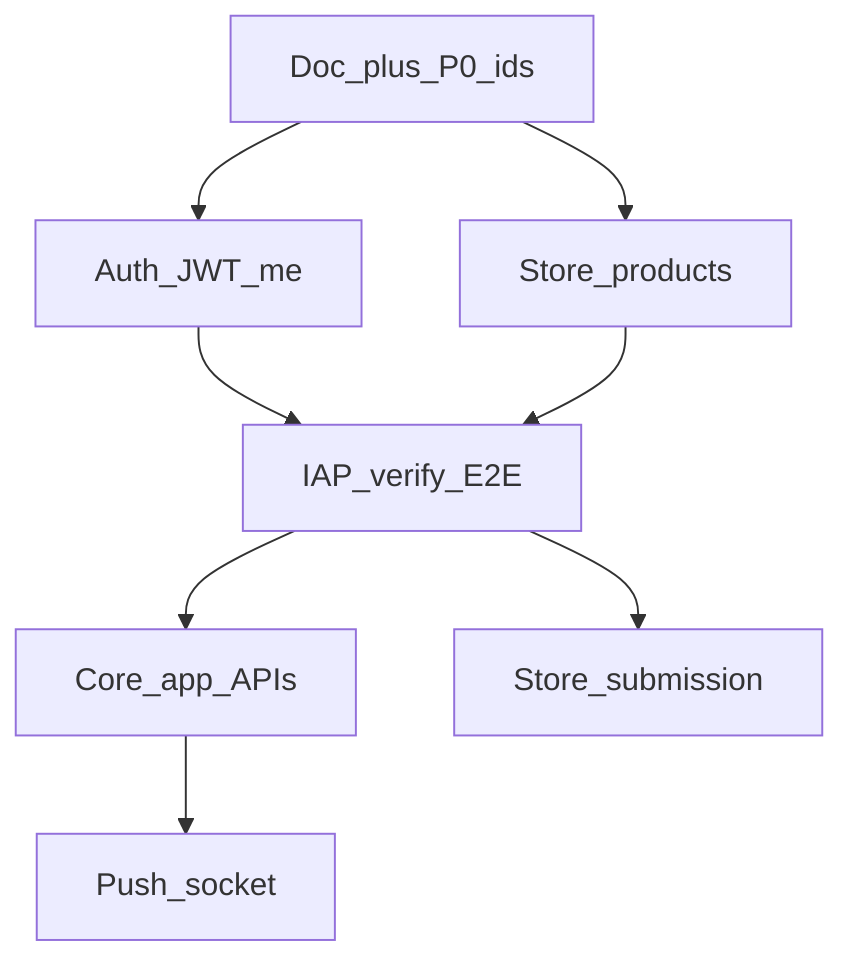

- **P0 auth bilgileri** olmadan prod OAuth smoke anlamlı değildir.
- **P2 store ürünleri** olmadan verify E2E tamamlanamaz (`product_mismatch`).
- **P3 verify yeşil** olmadan store submission (P6) risklidir.
- Web Garanti aboneliği **okuma** (`/me`) P1’den itibaren mümkündür; uygulama içi **satış** kanalı yine IAP’tir.

Kimlik anahtarı katmanları özeti: **§0.7**. Mobil ekipten istenen bilgi listesi: **§26**.
